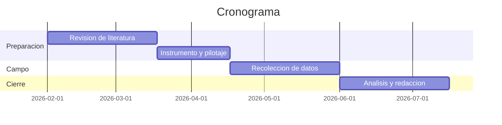

<strong>[Título: qué se estudia, en quién y dónde. Máximo unas 15 palabras]</strong>

[Nombre y apellidos]

[Escuela o departamento], [Universidad]

[Código] [Nombre del curso o seminario de tesis]

[Título y nombre del asesor o docente]

[Día de mes de año de entrega]

> [!NOTE]
> Portada de estudiante de APA 7. En APA los títulos **no van numerados**; si tu facultad
> exige la numeración clásica (1., 1.1, 1.1.1), añádela al texto de cada título y mantén el
> mismo criterio en todo el documento.

# Planteamiento del problema

Tres movimientos, en este orden y sin adornos:

**Qué pasa.** El hecho observable, con datos y con fuente. "El 43 % de los estudiantes de
primer ingreso abandona antes del segundo año (Ministerio de Educación [MINEDUC], 2023)."
Nada de "desde siempre el ser humano". La sigla completa va la primera vez que se cita esa
fuente; de ahí en adelante, ya basta con "(MINEDUC, 2023)".

**Por qué es un problema.** A quién perjudica y con qué consecuencia medible. Si nadie sale
perjudicado, no hay problema que investigar.

**Qué no se sabe.** El vacío concreto: qué han respondido otros y qué han dejado sin
responder. Esta frase es el corazón del anteproyecto y de ella salen las preguntas, los
objetivos y las hipótesis. Si no la tienes clara, nada de lo que sigue va a encajar.

Cierra delimitando: **qué** población, **dónde** y **en qué periodo**.

# Preguntas de investigación

**Pregunta general.** Una sola, y tiene que ser la traducción exacta del vacío que acabas de
describir.

> ¿[Qué relación existe entre X e Y en (población), durante (periodo)]?

**Preguntas específicas.** Entre tres y cinco, cada una respondible con un dato que puedas
recoger de verdad.

1. ¿[…]?
2. ¿[…]?
3. ¿[…]?

> [!TIP]
> Prueba de realidad: para cada pregunta, di en voz alta con qué instrumento la vas a
> responder. Si no sabes contestar, la pregunta es un tema, no una pregunta.

# Objetivos

## Objetivo general

> [Verbo en infinitivo] [el qué] [en quién] [dónde y cuándo].

Ejemplo: *Determinar la relación entre la carga académica y el abandono estudiantil en los
alumnos de primer ingreso de la Facultad de Ingeniería durante el ciclo 2026.*

## Objetivos específicos

1. [Verbo en infinitivo] […]
2. [Verbo en infinitivo] […]
3. [Verbo en infinitivo] […]

## Cómo se redactan

- **Un solo verbo en infinitivo por objetivo**, al principio. Nada de "analizar y evaluar":
  son dos objetivos.
- El general se corresponde con la pregunta general; cada específico, con una pregunta
  específica. **Misma cantidad y mismo orden.**
- Los específicos, sumados, tienen que dar el general. Ni más ni menos.
- Cada objetivo específico terminará siendo **un apartado de tus resultados**. Si no ves qué
  tabla o qué hallazgo produce, sobra.

| Verbos que sirven | Verbos que no |
| :--- | :--- |
| Determinar, identificar, describir, comparar, analizar, evaluar, establecer, diseñar, validar, medir, caracterizar | Conocer, saber, entender, comprender, estudiar, profundizar, concienciar, mejorar |

Los de la derecha no sirven porque no se puede demostrar que los cumpliste.

# Justificación

Cuatro preguntas, un párrafo cada una:

**Conveniencia.** ¿Para qué sirve esto? ¿Quién usa el resultado?

**Relevancia social o práctica.** ¿A quién beneficia y de qué forma concreta?

**Valor teórico.** ¿Qué aporta a lo que ya se sabe? ¿Llena un vacío, pone a prueba una teoría
en otro contexto, propone algo nuevo?

**Viabilidad.** ¿Tienes acceso a la población, tiempo, presupuesto y permisos? Sé honesto:
un anteproyecto inviable se cae en la defensa.

# Marco teórico y antecedentes

## Antecedentes

Estudios previos sobre tu mismo problema, ordenados **de lo general a lo cercano**:
internacionales, nacionales y locales. De cada uno: autor y año, qué hizo, con quién, qué
encontró y **qué te deja a ti**. Un párrafo por estudio, no una ficha bibliográfica.

Últimos cinco años, salvo los clásicos fundacionales.

## Bases teóricas

La teoría o el modelo desde el que miras el problema, y **por qué ese y no otro**. Aquí se
define cada concepto que vas a usar, siempre con su cita. Organiza por conceptos, no por
autores.

## Definición de términos

Términos técnicos o locales que quien lee podría no compartir contigo.

Deserción estudiantil
: [La definición operativa que vas a usar en este trabajo, con su cita.]

[Otro término]
: [Su definición.]

# Hipótesis y variables

## Hipótesis

**H1.** [Predicción concreta, direccional y falsable: "A mayor X, menor Y en (población)".]

**H0.** [La hipótesis nula: no existe relación entre X e Y.]

> [!NOTE]
> No todos los estudios llevan hipótesis. En investigación **cualitativa** y en estudios
> **descriptivos** normalmente no se plantean: se sustituyen por supuestos o directamente se
> trabaja solo con las preguntas. Si tu alcance es exploratorio, dilo y sigue adelante.

## Operacionalización de las variables

Es la tabla que convierte una idea abstracta en algo que se puede medir. Si no puedes
llenarla, todavía no tienes un proyecto de investigación.

| Variable | Definición conceptual | Definición operacional | Indicadores | Escala |
| :--- | :--- | :--- | :--- | :--- |
| [Independiente] | [Qué es, según la teoría, con cita] | [Cómo la vas a medir en la práctica] | [Qué observas: ítems, conductas, registros] | [Nominal / ordinal / de intervalo / de razón] |
| [Dependiente] |  |  |  |  |
| [Interviniente o de control] |  |  |  |  |

Cómo se llena cada columna:

- **Definición conceptual:** la que da la teoría. Va **citada**, no inventada.
- **Definición operacional:** el puente. "Puntaje total del cuestionario X, de 0 a 40 puntos."
- **Indicadores:** las señales concretas que observas o preguntas. Los ítems del instrumento
  salen de aquí.
- **Escala:** determina qué pruebas estadísticas podrás usar después. Elígela ahora, no
  cuando ya tengas los datos.

Si tu instrumento es un cuestionario, añade una columna **Ítems** con los números.

# Metodología

## Enfoque

[Cuantitativo, cualitativo o mixto], **porque** [la razón viene de tu pregunta, no de tu
comodidad]. Las preguntas de "cuánto" y "qué relación" piden cuantitativo; las de "cómo" y
"por qué vivido" piden cualitativo.

## Alcance

[Exploratorio, descriptivo, correlacional o explicativo]. El alcance tiene que ser el mismo
que prometen tus objetivos: si el objetivo dice "determinar la relación", el alcance es
correlacional, y entonces no puedes concluir causalidad.

## Diseño

[Experimental (preexperimental, cuasiexperimental o experimental puro) o no experimental
(transversal o longitudinal). En cualitativo: fenomenológico, etnográfico, teoría
fundamentada, estudio de caso o investigación-acción.]

Describe qué implica ese diseño en tu caso concreto, no lo que dice el manual.

## Población y muestra

**Población.** [Quiénes son, cuántos son y de dónde sale ese número. Cita la fuente.]

**Criterios de inclusión.** [Quién entra.]

**Criterios de exclusión.** [Quién queda fuera y por qué.]

**Muestra.** [Tamaño, y cómo llegaste a él: fórmula, cálculo de potencia, saturación teórica
o criterio del asesor. Di cuál.]

**Tipo de muestreo.**

| Familia | Tipos | Cuándo se usa |
| :--- | :--- | :--- |
| Probabilístico | Aleatorio simple, sistemático, estratificado, por conglomerados | Quieres generalizar a la población |
| No probabilístico | Por conveniencia, por cuotas, bola de nieve, por criterio o teórico | No hay marco muestral, o el estudio es cualitativo |

Si usas muestreo no probabilístico, **dilo claramente y asume la consecuencia**: los
resultados no se generalizan. Es preferible a fingir que sí.

## Técnicas e instrumentos

| Técnica | Instrumento | A quién se aplica | Qué objetivo responde |
| :--- | :--- | :--- | :--- |
| Encuesta | Cuestionario de [nombre] | [Muestra] | Objetivo específico 1 |
| Entrevista | Guion semiestructurado | [Informantes clave] | Objetivo específico 2 |
| Observación | Lista de cotejo | [Contexto] | Objetivo específico 3 |

De cada instrumento: autoría y año si es prestado, número de ítems, escala de respuesta y
**cómo garantizas su validez y su confiabilidad** (juicio de expertos, prueba piloto, alfa de
Cronbach). Si lo construyes tú, dedica un párrafo entero a esto.

## Procedimiento

Las fases en el orden en que van a ocurrir, con lo que se produce en cada una.

1. **Gestión de permisos.** [Autoridades, comité de ética, cartas.]
2. **Validación del instrumento.** [Expertos y prueba piloto con n = …]
3. **Recolección de datos.** [Cómo, dónde, en cuánto tiempo.]
4. **Depuración y codificación.** [Qué haces con los casos incompletos.]
5. **Análisis.** […]
6. **Redacción del informe final.** […]

## Plan de análisis de datos

**Cuantitativo.** Qué estadísticos descriptivos, qué pruebas de contraste y para qué
hipótesis, con qué nivel de significación y en qué programa. Ejemplo: *frecuencias y medias
para el objetivo 1; correlación de Pearson para H1, con alfa de 0,05, en jamovi 2.5.*

**Cualitativo.** Cómo transcribes, cómo codificas (abierta, axial, selectiva), cómo llegas a
las categorías y cómo aseguras el rigor (triangulación, verificación con los participantes,
auditoría del asesor).

# Consideraciones éticas

- **Consentimiento informado** por escrito, explicando objetivo, uso de los datos y derecho a
  retirarse en cualquier momento sin consecuencias. El formato va en anexos.
- **Menores de edad:** consentimiento del padre, madre o tutor **y asentimiento del menor**.
  Las dos cosas.
- **Confidencialidad y anonimato.** Cómo se sustituyen los nombres, quién tiene acceso a los
  datos crudos, dónde se guardan y cuándo se destruyen.
- **Aval institucional.** Comité de ética o autoridad de la institución donde recojas datos.
- **Riesgos y beneficios.** Qué riesgo corre el participante y qué se hace si aparece un caso
  que requiera derivación.
- **Devolución de resultados.** Qué reciben los participantes y la institución al terminar.
- **Conflicto de interés y financiamiento.** Decláralo aunque sea "ninguno".
- **Integridad académica.** Citas correctas, y declaración del uso de herramientas de IA si tu
  universidad lo exige.

# Cronograma

Marca con **X** las semanas o los meses de cada actividad. Deja siempre holgura: el trabajo de
campo se atrasa, no es una posibilidad, es una certeza.

| Actividad | M1 | M2 | M3 | M4 | M5 | M6 |
| :--- | :-: | :-: | :-: | :-: | :-: | :-: |
| Revisión de literatura | X | X |  |  |  |  |
| Elaboración del instrumento |  | X |  |  |  |  |
| Validación y prueba piloto |  |  | X |  |  |  |
| Permisos y consentimientos |  |  | X |  |  |  |
| Recolección de datos |  |  |  | X | X |  |
| Procesamiento y análisis |  |  |  |  | X | X |
| Redacción del informe |  |  |  |  |  | X |
| Entrega y defensa |  |  |  |  |  | X |

> [!TIP]
> Si prefieres un diagrama de Gantt en vez de la tabla, este documento admite bloques
> `mermaid`. Cambia las fechas y borra la tabla de arriba.

# Presupuesto

Pon la moneda en el encabezado de la columna (Q, EUR, USD) y no la repitas en cada fila.

| Rubro | Cantidad | Costo unitario (Q) | Total (Q) |
| :--- | ---: | ---: | ---: |
| Impresión de instrumentos |  |  |  |
| Transporte y viáticos |  |  |  |
| Licencias de software |  |  |  |
| Incentivos a participantes |  |  |  |
| Transcripción de entrevistas |  |  |  |
| Imprevistos (10 %) |  |  |  |
| **Total** |  |  |  |

Di también **quién paga**: fondos propios, beca, financiamiento institucional. Y si algo es
aportado en especie, ponlo con valor cero pero ponlo.

# Referencias

Orden alfabético, sangría francesa y formato APA 7. Solo lo citado en el texto.

Apellido, A. A. (2023). Título del artículo en minúscula salvo la primera palabra.
*Nombre de la Revista, 12*(3), 45-67. https://doi.org/10.xxxx/xxxxx

Apellido, B. B. y Apellido, C. C. (2021). *Título del libro en cursiva* (2.ª ed.). Editorial.

Institución. (2023). *Título del informe en cursiva*. https://ejemplo.org/informe

The jamovi project. (2024). *jamovi* (Versión 2.5) [Software]. https://www.jamovi.org

> [!TIP]
> Ese `
` es lo que le da la **sangría francesa**: la primera línea
> al margen y las siguientes metidas. Escribe cada referencia dentro, separada por una línea
> en blanco.

# Anexos

Uno por página, en el orden en que se mencionan en el texto. Menciónalos: "(ver Anexo A)".

- **Anexo A.** Formato de consentimiento informado
- **Anexo B.** Instrumento completo
- **Anexo C.** Guion de entrevista
- **Anexo D.** Constancia de validación por expertos
- **Anexo E.** Carta de autorización de la institución

# Antes de entregar

*Esta lista es para ti, no para quien evalúa: bórrala antes de entregar el anteproyecto.*

- [ ] La pregunta general, el objetivo general y la hipótesis hablan de **las mismas
      variables** y de la misma población
- [ ] Hay tantos objetivos específicos como preguntas específicas, en el mismo orden
- [ ] Todos los objetivos empiezan con un verbo en infinitivo demostrable
- [ ] Cada variable de la hipótesis aparece en la tabla de operacionalización
- [ ] Cada objetivo específico tiene un instrumento que lo responde
- [ ] El alcance declarado no promete más de lo que el diseño puede demostrar
- [ ] El cronograma cabe en el tiempo real que te queda
- [ ] Todas las citas del texto están en las referencias, y al revés
- [ ] Interlineado doble, márgenes de 2,54 cm y sangría de 1,27 cm: en esta app eso se
      aplica **al imprimir**, no se escribe en el texto
