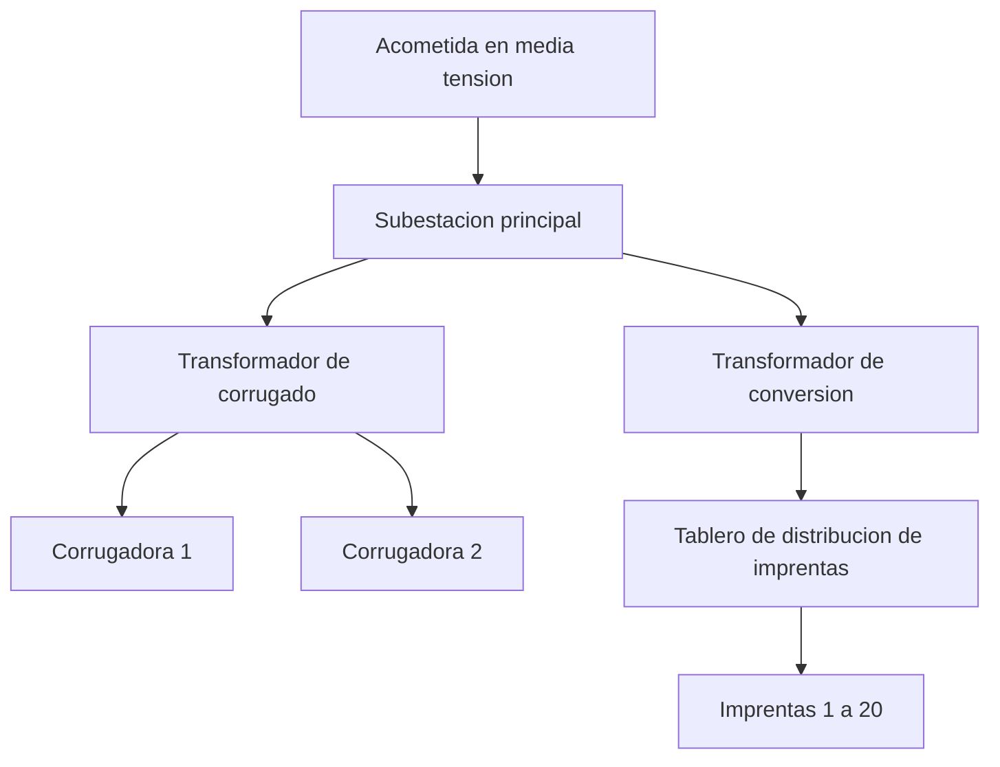
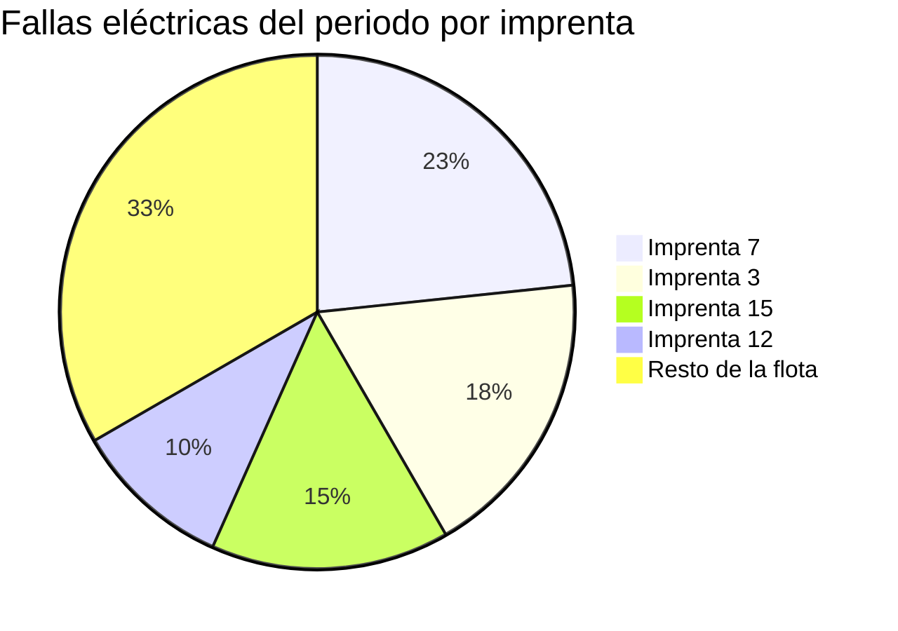
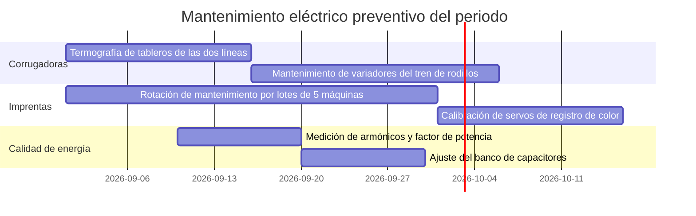

# Mantenimiento eléctrico de la planta de cartón corrugado

[Planta] · [periodo] · [Tu nombre], gerente de mantenimiento eléctrico

---

## Agenda

- Panorama de la planta: dos corrugadoras, veinte imprentas
- Disponibilidad eléctrica de las corrugadoras
- MTBF, MTTR y el ranking de la flota de imprentas
- Calidad de energía: factor de potencia y armónicos
- Plan de mantenimiento eléctrico preventivo del periodo
- Seguridad eléctrica: LOTO y estudio de arco
- Próximos pasos e inversión propuesta

---

## Panorama de la planta

Dos procesos bajo un mismo techo, y dos maneras distintas de medirlos.

| Área | Equipos | Su papel en la planta | Cómo la mido |
| --- | --- | --- | --- |
| Corrugado | 2 corrugadoras | Producen la lámina que alimenta a toda la planta; una hora parada aquí para río abajo a las veinte imprentas | Disponibilidad eléctrica, línea por línea |
| Conversión | 20 imprentas (flexográficas impresoras-troqueladoras) | Convierten la lámina en caja terminada; cada máquina es independiente de las demás | MTBF/MTTR de la flota y ranking de las peores máquinas |

Así se reparte la energía entre las dos áreas:

Misma acometida, mismos armónicos de fondo — pero dos perfiles de falla completamente distintos.

---

## Disponibilidad eléctrica de las corrugadoras

Es la cifra que más le importa a dirección: no hay lámina, no hay imprenta que trabaje.

| Línea | Disponibilidad eléctrica | Meta | Horas de paro eléctrico del periodo | Principal causa eléctrica |
| --- | ---: | ---: | ---: | --- |
| Corrugadora 1 | [Valor] | [Meta] | [Horas] | [Causa] |
| Corrugadora 2 | [Valor] | [Meta] | [Horas] | [Causa] |

Las publico separadas a propósito: un promedio de las dos esconde cuál me está costando el trimestre. Donde más se me va el tiempo es en los variadores del tren de rodillos, la instrumentación de las resistencias y válvulas de vapor, y el PLC que sincroniza single facer, encolador y doble respaldo.

---

## MTBF, MTTR y el ranking de la flota de imprentas

Con veinte máquinas, ninguna falla sola para la planta — pero juntas, sí. Aquí el promedio de flota importa más que cualquier máquina suelta, y el Pareto me dice dónde poner a la cuadrilla esta semana. Estas cinco categorías son el top 5 de las 20 imprentas.

| Indicador de la flota de imprentas | Valor | Meta |
| --- | ---: | ---: |
| MTBF eléctrico de la flota (h) | [Valor] | [Meta] |
| MTTR eléctrico de la flota (h) | [Valor] | [Meta] |
| Tiempo de respuesta a falla eléctrica (min) | [Valor] | [Meta] |

Son máquinas más simples que una corrugadora: servo de registro de color, secado por aire caliente o UV/LED, sensor de registro, PLC de máquina. Por eso el tiempo de respuesta se mide en minutos, no en horas, y la 7, la 3 y la 15 son las que se llevan la conversación de este mes.

---

## Calidad de energía: factor de potencia y armónicos

Dos corrugadoras y veinte imprentas significan un variador de frecuencia por motor grande, casi todos colgados de la misma red. Ahí es donde se cuecen los armónicos, y por eso esto ya no es un tema solo de la factura.

| Indicador de calidad de energía | Valor | Meta |
| --- | ---: | ---: |
| Factor de potencia promedio | [Valor] | [≥0,95] |
| THD de corriente en el tablero principal | [Valor] | [según IEEE 519 para tu punto de acople] |
| Transformadores con temperatura por encima de placa | [Cantidad] | [0] |

Un factor de potencia bajo penaliza la factura; un THD alto calienta transformadores y variadores que no lo tenían presupuestado. Antes de agrandar el banco de capacitores mido la distorsión: con tantos variadores en la misma red, un banco mal dimensionado puede entrar en resonancia en vez de corregir nada.

---

## Plan de mantenimiento eléctrico preventivo del periodo

Dos calendarios, porque dos activos muy distintos no se mantienen igual: la corrugadora no se toca fuera de su ventana programada; la imprenta se rota por lotes sin parar la línea completa.

---

## Seguridad eléctrica

El estudio de arco eléctrico y el permiso de LOTO de esta planta viven en sus propios documentos; aquí solo el estado del periodo.

| Indicador de seguridad eléctrica | Valor | Meta |
| --- | ---: | ---: |
| Tableros con etiqueta de arco vigente | [Cantidad] / [Total] | [100 %] |
| Permisos de LOTO con puntos de bloqueo verificados en campo | [Valor] | [100 %] |
| Trabajos con tensión ejecutados sin permiso firmado | [Cantidad] | [0] |

Las cifras de energía incidente, categoría de EPP y la secuencia de bloqueo por equipo salen de esos dos documentos — aquí solo confirmo que las etiquetas están vigentes y que lo que se firma en el permiso es lo que se encuentra en campo.

---

## Próximos pasos e inversión propuesta

1. [Estandarizar repuestos de variadores entre las 20 imprentas — fecha]
2. [Actualizar el tablero de [nombre del tablero] — fecha]
3. [Corregir factor de potencia con banco de capacitores en [ubicación] — fecha]

---

## Gracias

[Tu nombre], gerente de mantenimiento eléctrico · [correo o usuario de contacto]
