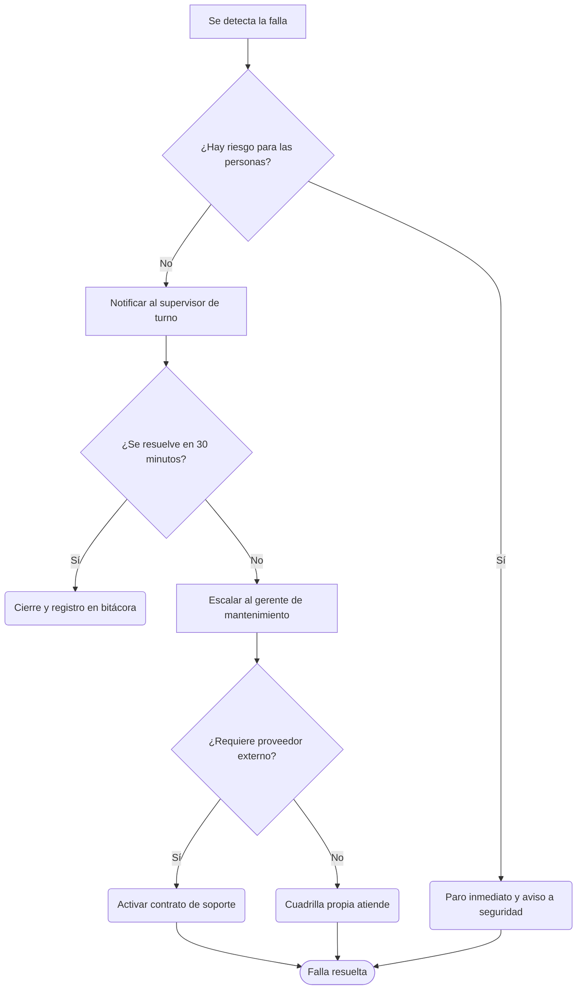
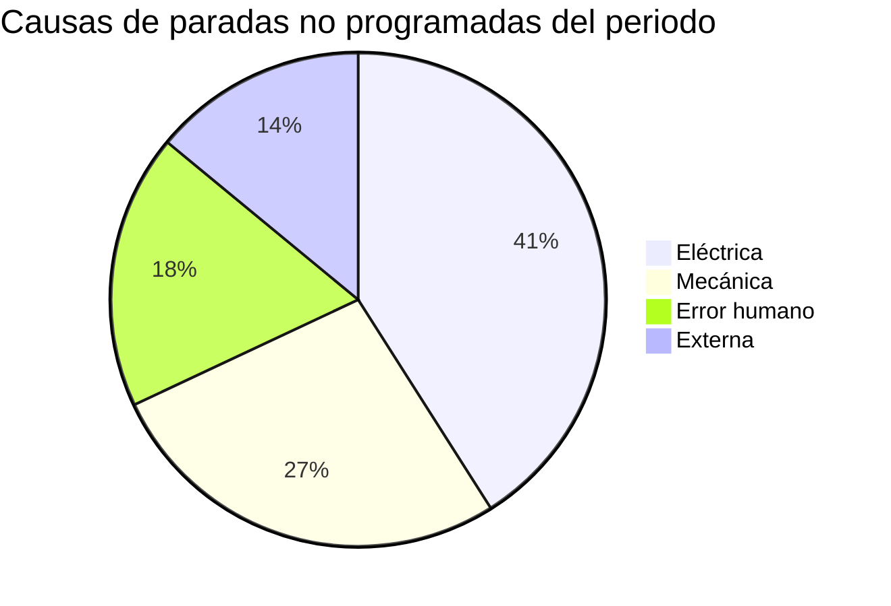
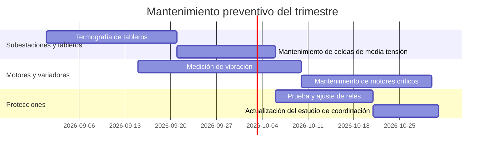
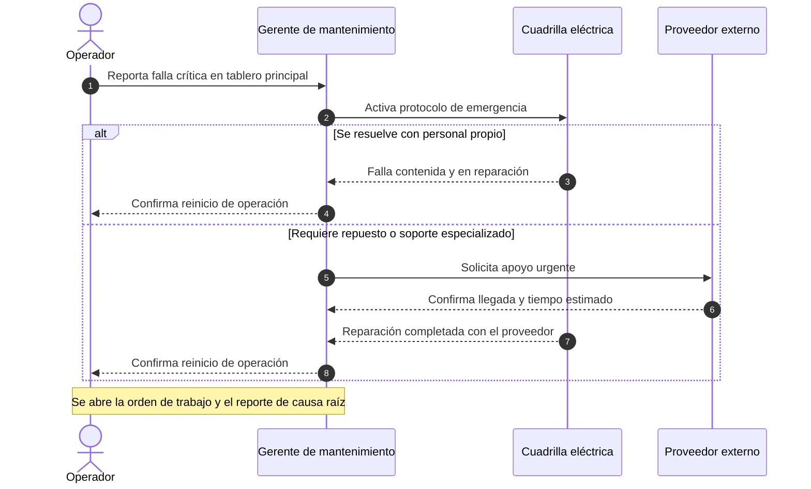
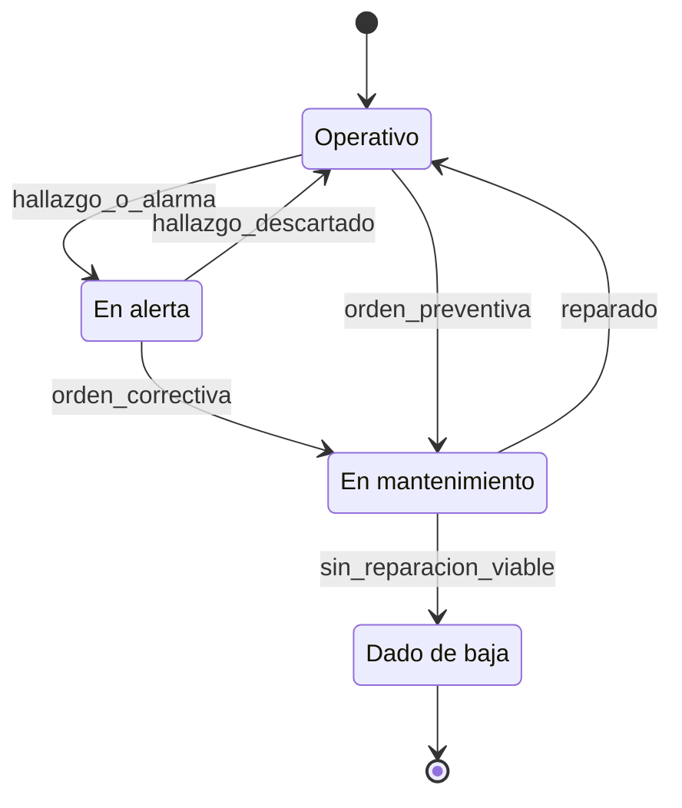
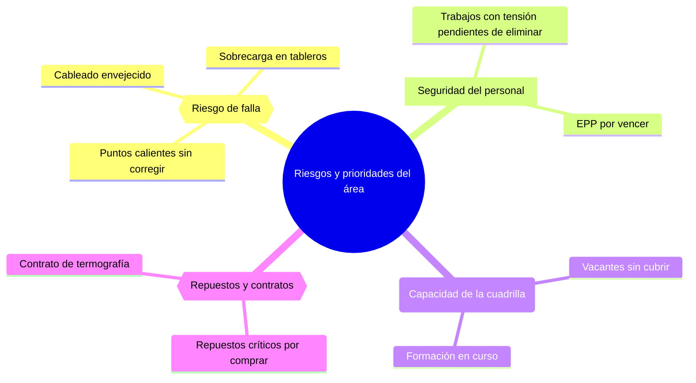
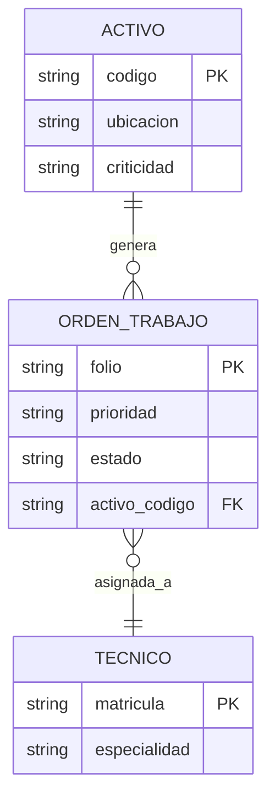
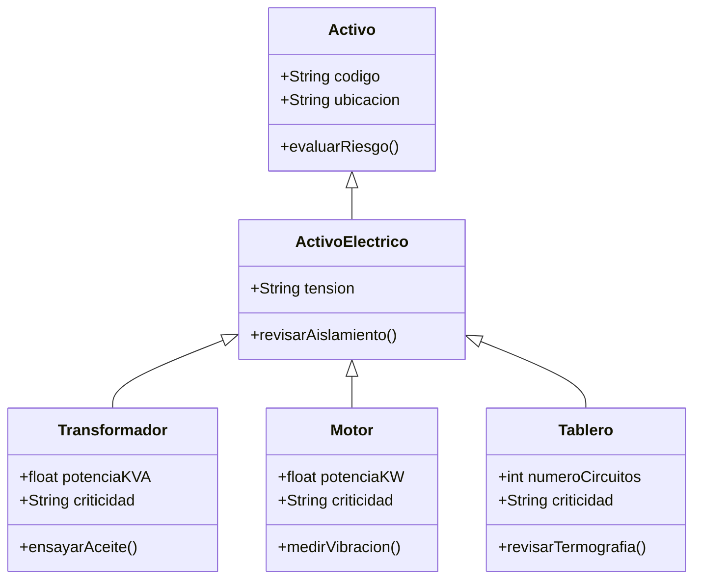

# Estado del mantenimiento eléctrico

[Área o planta] · [periodo] · [Tu nombre], gerente de mantenimiento eléctrico

---

## Agenda

- Cifras clave del periodo
- Protocolo de escalamiento ante una falla
- Causas de las paradas no programadas
- Plan de mantenimiento preventivo del trimestre
- Respuesta ante una falla crítica
- Ciclo de vida de un activo
- Riesgos y prioridades del área
- Cómo se relacionan activo, orden y técnico
- Taxonomía de los activos eléctricos
- Próximos pasos

---

## Cifras clave del periodo

Antes de entrar en diagramas, los números que sostienen esta reunión.

| Indicador | Valor | Meta |
| --- | ---: | ---: |
| [Indicador 1] | [Valor] | [Meta] |
| [Indicador 2] | [Valor] | [Meta] |
| [Indicador 3] | [Valor] | [Meta] |
| [Indicador 4] | [Valor] | [Meta] |

---

## Protocolo de escalamiento ante una falla eléctrica

Así decidimos en el momento si el turno resuelve solo o si el asunto sube hasta mí.

---

## Causas de las paradas no programadas

La eléctrica sigue siendo la que más nos pesa este periodo; ahí está el foco del próximo trimestre.

---

## Plan de mantenimiento preventivo del trimestre

Esto es lo que tiene agendado la cuadrilla antes de que termine [periodo].

---

## Respuesta ante una falla crítica

Cuando algo se pone serio, así se coordinan operador, cuadrilla, yo y el proveedor.

---

## Ciclo de vida de un activo

De operativo a dado de baja: por aquí pasa cada equipo que seguimos de cerca.

---

## Riesgos y prioridades del área

Esto es lo que me quita el sueño esta semana, ordenado por dónde vive el riesgo.

---

## Cómo se relacionan activo, orden y técnico

Así organiza el sistema lo que ustedes ven como una simple orden de trabajo.

---

## Taxonomía de los activos eléctricos

Todo transformador, motor o tablero hereda las mismas reglas base de riesgo y criticidad.

---

## Próximos pasos

1. [Acción, con fecha]
2. [Acción, con fecha]
3. [Acción, con fecha]

---

## Gracias

[Tu nombre], gerente de mantenimiento eléctrico · [correo o usuario de contacto]
