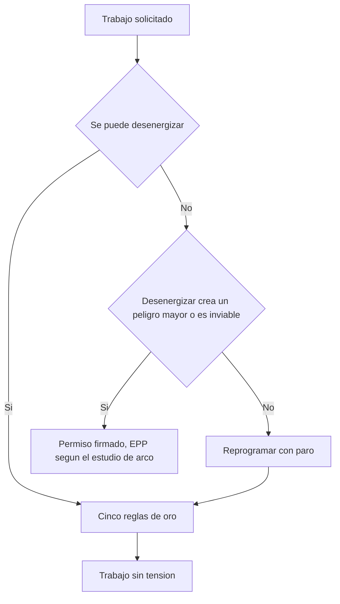

## Datos del trabajo y del equipo

Se llena antes del trabajo, se lee en voz alta en la charla previa y se firma en el sitio. Si cambia el alcance, el equipo o la cuadrilla, se llena otra hoja. Un hueco sin rellenar es un riesgo sin medir.

| Campo | Dato |
| --- | --- |
| N.º de análisis, OT y ventana | [ATS-2026-0112, OT-2026-0417 — dd/mm/aaaa, de hh:mm a hh:mm] |
| Descripción del trabajo | [una frase: qué se va a hacer y por qué] |
| Jefe de trabajo y cuadrilla | [quién dirige y cuántos entran a la zona] |
| Equipo, TAG y ubicación | [arrancador de la bomba MTR-2103, CCM-4 celda 7, subestación 2] |
| Tensión nominal en el punto de trabajo | [V entre fases; di si es baja o media tensión] |
| Sistema de puesta a tierra | [sólidamente aterrizado / por resistencia / aislado] |
| Corriente de cortocircuito disponible | [kA en ese punto, del estudio de cortocircuito; si no la tienes, escribe que no la tienes] |
| Protección aguas arriba y su ajuste | [interruptor o fusible que despeja esa falla, TAG, curva y ajuste actual] |
| Tiempo de despeje | [ms o s del estudio de coordinación; de este dato depende la energía incidente] |
| Otras fuentes de tensión y energía almacenada | [respaldo, UPS, generador, retroalimentación de otro tablero, tensión de control auxiliar, capacitores, bus de CD del variador, resortes del interruptor] |
| Estudio y etiqueta de arco | [fecha del estudio vigente; la etiqueta del equipo existe y es legible / ilegible / no hay] |

Sustituye la norma por la que te aplique: NFPA 70E y NEC (NFPA 70) en buena parte de América, IEC 60364 en el ámbito internacional, y la local que te obligue: NOM-001-SEDE y NOM-029-STPS (México), RETIE (Colombia), normas de la CNEE (Guatemala), AEA/IRAM (Argentina).

## Se hace desenergizado, salvo prueba en contrario

Contesta esto antes de discutir EPP. Si el trabajo se puede hacer sin tensión, se hace sin tensión y no hay más que hablar.

- [ ] Se puede desenergizar: se desenergiza. Sigue con las cinco reglas y deja la tabla siguiente vacía.
- [ ] No se puede: llena la tabla. Si un renglón queda en blanco, el trabajo se reprograma con paro.

| Punto | Respuesta |
| --- | --- |
| Motivo | [desenergizar crea un peligro mayor / es inviable por diseño del equipo o del proceso] |
| Por qué no sirve reprogramar con paro | [explícalo; la producción por sí sola no es motivo] |
| Permiso de trabajo energizado N.º | [número y vigencia; el permiso y los puntos de bloqueo viven en la hoja de LOTO, no aquí] |
| Quién autoriza | [nombre y cargo; no puede ser quien ejecuta] |

> [!WARNING]
> La prisa, la costumbre y la falta de ventana de paro no son justificaciones. Lo único que se admite es que desenergizar cree un peligro mayor o sea inviable por el diseño del equipo. Sin permiso firmado y sin este análisis, la tarea se reprograma aunque cueste producción.

Cinco reglas de oro, en este orden y sin saltarse ninguna. Se marcan a medida que se ejecutan:

- [ ] 1. Cortar todas las fuentes de tensión, incluidas las de respaldo, las alternas y las de control.
- [ ] 2. Bloquear cada medio de corte y etiquetarlo: un candado por cada persona que entra.
- [ ] 3. Verificar ausencia de tensión en el punto exacto que vas a tocar, fase a fase y fase a tierra. La hace persona calificada, con el EPP puesto y con el método probado, comprobado, probado: instrumento en una fuente conocida, medición del punto de trabajo y otra vez el instrumento en la fuente conocida.
- [ ] 4. Poner a tierra y en cortocircuito donde el procedimiento lo exija.
- [ ] 5. Señalizar y delimitar la zona, y cubrir las partes con tensión que queden cerca.

## Peligro 1: choque eléctrico

Mata con corrientes muy por debajo de las que hacen actuar una protección. Se controla con distancia, aislamiento y verificación.

| Punto | Dato y control |
| --- | --- |
| Tensión a la que puede quedar expuesto el trabajador | [V] |
| Fronteras de aproximación limitada y restringida | [según la tabla de fronteras de aproximación de la NFPA 70E vigente para esa tensión; dentro de la restringida solo entra persona calificada, con EPP y permiso] |
| Partes vivas expuestas y cómo se cubren | [barras, terminales de entrada del principal, borneras de control; mantas y cubiertas aislantes de la clase que corresponda a la tensión, o barrera rígida] |
| Guantes aislantes | [clase que corresponda a la tensión de trabajo, con protector de cuero; fecha de la última prueba dieléctrica] |
| Instrumento de verificación | [marca, modelo, categoría de medición apropiada al punto de medida, fecha de calibración] |

## Peligro 2: arco eléctrico

Es otro peligro y necesita otro EPP. El guante aislante no protege de una quemadura por arco y la ropa de arco no aísla del choque. Se evalúan por separado, siempre.

| Punto | Dato y control |
| --- | --- |
| Energía incidente y distancia de trabajo | [cal/cm² de la etiqueta del equipo o del estudio de la planta, con la distancia a la que se calculó; no la estimes] |
| Frontera de arco eléctrico | [de la etiqueta o del estudio, no de memoria] |
| EPP de arco requerido | [de la etiqueta, o la categoría que indique la tabla de EPP de la NFPA 70E vigente para esta tarea] |
| Prendas entregadas y su estado | [ropa de arco, capucha o careta con protección de cuello, casco, guantes, calzado; sin aceite, sin rasgaduras, sin sintéticos debajo] |
| Maniobra a distancia | [pértiga, mando remoto, operar con la puerta cerrada, salir de la línea de expulsión de gases] |

> [!CAUTION]
> El EPP de arco no se elige a ojo ni por costumbre. La energía incidente se calcula con IEEE 1584 y queda escrita en el estudio y en la etiqueta del equipo; con esa cifra eliges el EPP según la norma que te aplique. Ese estudio se rehace cuando cambia la instalación, y un cambio aguas arriba no se ve por fuera del tablero.[^1]

[^1]: IEEE 1584 calcula la corriente de arco, la energía incidente y la frontera de arco a partir de la corriente de falla disponible y del tiempo que tarda la protección en despejarla. Cambia el transformador, el alimentador, un ajuste de protección o entra generación propia, y la etiqueta impresa deja de ser cierta aunque el equipo se vea igual. La guía calcula la exposición; no recomienda EPP.

## Análisis paso a paso

Una fila por tarea, en el orden en que se ejecuta. Para elegir cada control baja por esta escalera y párate en el primer escalón que resuelva: eliminar el peligro (desenergizar), sustituirlo (menos tensión, mando a distancia), controlarlo por ingeniería (barrera, enclavamiento, ventana de inspección), fijar procedimiento, permiso y formación, y en último lugar el EPP, que no evita el accidente: solo limita el daño. Si una fila no tiene control concreto y verificador con nombre, esa tarea no se hace.

| # | Tarea | Qué puede salir mal | Consecuencia | Control | Quién verifica |
| :---: | --- | --- | --- | --- | --- |
| 1 | [abrir el interruptor de la celda 7] | [el tablero sigue con tensión por retroalimentación] | [choque al abrir la puerta] | [abrir también el origen de respaldo y verificar ausencia de tensión] | [nombre] |
| 2 |  |  |  |  |  |
| 3 |  |  |  |  |  |

## Herramientas e instrumentos

Se revisan delante de todos en la charla previa. Herramienta dudosa se retira, no se usa "con cuidado".

| Elemento | Identificación | Qué se revisa | Estado |
| --- | --- | --- | --- |
| Herramienta aislada | [juego N.º; marcado hasta 1000 V CA conforme a IEC 60900, que es su límite: en media tensión se trabaja con pértiga y equipo para esa tensión] | [sin cortes, sin quemaduras, aislamiento adherido] | [apto / retirado] |
| Guantes, mantas y cubiertas aislantes | [clase y número de serie] | [inspección visual, prueba de aire en guantes, sin perforaciones ni grasa; prueba dieléctrica vigente] | [apto / retirado] |
| Detector e instrumento de medida | [modelo y categoría de medición] | [puntas sanas, fusibles correctos, calibración vigente] | [apto / retirado] |
| Puesta a tierra temporal, pértiga y extintor | [calibre y capacidad acordes a la corriente de falla; longitud de la pértiga; clase del extintor] | [sin hilos rotos, mordazas limpias, pértiga seca y sin fisuras, extintor con presión vigente] | [apto / retirado] |

## Zona de trabajo: señalización y delimitación

Se delimita antes de abrir, no después. Quien pasa por ahí no sabe lo que hay dentro.

- [ ] Barreras sobre la mayor de las fronteras que apliquen, con un solo paso controlado.
- [ ] Barreras no conductoras. Nada de tubo, cadena ni cinta metálica cerca de partes vivas.
- [ ] Señales de peligro legibles desde fuera, con la tarea y el nombre del jefe de trabajo.
- [ ] Vigía asignado cuando la señal y la barrera no alcanzan: [nombre]; acceso controlado y ruta de salida despejada, iluminada y sin cables ni escaleras cruzados.

## Plan de emergencia

Se lee en voz alta antes de empezar. Nadie improvisa un rescate.

| Punto | Dato |
| --- | --- |
| A quién se llama primero | [extensión de emergencias de planta y número externo de ambulancia] |
| Quién corta la energía y desde dónde | [nombre; el corte de emergencia está en [ubicación]] |
| Dónde está el desfibrilador | [ubicación exacta y minutos que se tarda en traerlo] |
| Quién sabe RCP en este turno | [nombres y vencimiento de la certificación] |
| Punto de encuentro, ruta de camilla y botiquín | [dónde espera la ambulancia, por dónde entra, dónde está la manta para quemaduras] |

> [!CAUTION]
> Si alguien queda pegado al circuito, no lo toques. Corta la energía primero; si no puedes cortarla, sepáralo con un elemento aislante y seco, nunca con la mano ni con algo metálico o húmedo. Después llama y empieza RCP: el paro cardíaco por electricidad se revierte si la reanimación empieza en los primeros minutos. Un rescatista electrocutado son dos víctimas y ningún socorro.

## Parar el trabajo

Cualquiera para el trabajo. No hace falta pedir permiso ni tener razón: basta con la duda. Parar no se sanciona; seguir cuando había que parar, sí.

- [ ] Todos los firmantes saben que pueden decir "paro" y que el trabajo se detiene sin discusión.
- Se para siempre que cambie el alcance, aparezca un peligro que no está en esta hoja, falte alguien de la cuadrilla, falle una herramienta o un instrumento, cambie el clima a la intemperie, o alguien no tenga claro el paso siguiente. Al reanudar se repite la charla previa completa: [quién paró, por qué y qué se cambió antes de seguir].

## Personal, calificación y firmas

Calificado no es antiguo: es quien fue formado para reconocer las partes vivas, respetar las distancias y usar el EPP y las herramientas de este trabajo. Se firma después de la charla previa, en el sitio y antes de empezar.

| Nombre | Papel | Calificación y vencimiento | RCP vigente | Entendió el análisis y tiene su EPP | Firma |
| --- | --- | --- | :---: | :---: | --- |
|  | [jefe de trabajo] |  |  |  |  |
|  | [ejecutante] |  |  |  |  |
|  | [vigía] |  |  |  |  |
|  | [supervisor de mantenimiento] |  |  |  |  |
|  | [autoriza por operaciones] |  |  |  |  |

- Supervisa en sitio: [nombre y cargo; presente en el área, no localizable por teléfono]. Quien autoriza no puede ser quien ejecuta.
- Personal en formación: [nombre; solo bajo supervisión directa y nunca solo dentro de la zona].

## Referencias

*De dónde sale este formato. Borra esta sección al usar la plantilla.*

- [OSHA 1910.333 — Selection and use of work practices](https://www.osha.gov/laws-regs/regulations/standardnumber/1910/1910.333) — desenergizar es la regla; las excepciones son peligro adicional o inviabilidad, y solo persona calificada trabaja con tensión.
- [OSHA — Hazard prevention and control](https://www.osha.gov/safety-management/hazard-prevention) — la escalera de controles: primero eliminar, sustituir y la ingeniería; el EPP siempre al final.
- [IEEE 1584, Guide for Performing Arc-Flash Hazard Calculations](https://standards.ieee.org/ieee/1584/5802/) — los modelos con los que se calculan la energía incidente y la frontera de arco.
- [OSHA 1910.335 — Safeguards for personnel protection](https://www.osha.gov/laws-regs/regulations/standardnumber/1910/1910.335) — EPP inspeccionado, herramientas aisladas, señales, barreras no conductoras y vigía cuando no bastan.
- [IEC 60900:2018, Live working — Hand tools for use up to 1 000 V AC and 1 500 V DC](https://webstore.iec.ch/en/publication/27266) — la norma de las herramientas aisladas: categorías, ensayos y marcado.
- [OSHA eTool — 4-minute rescue requirement](https://www.osha.gov/etools/electric-power/medical-services-first-aid/4-minute-rescue-requirements) — por qué la RCP tiene que empezar en minutos y cómo se dimensiona el personal formado.
