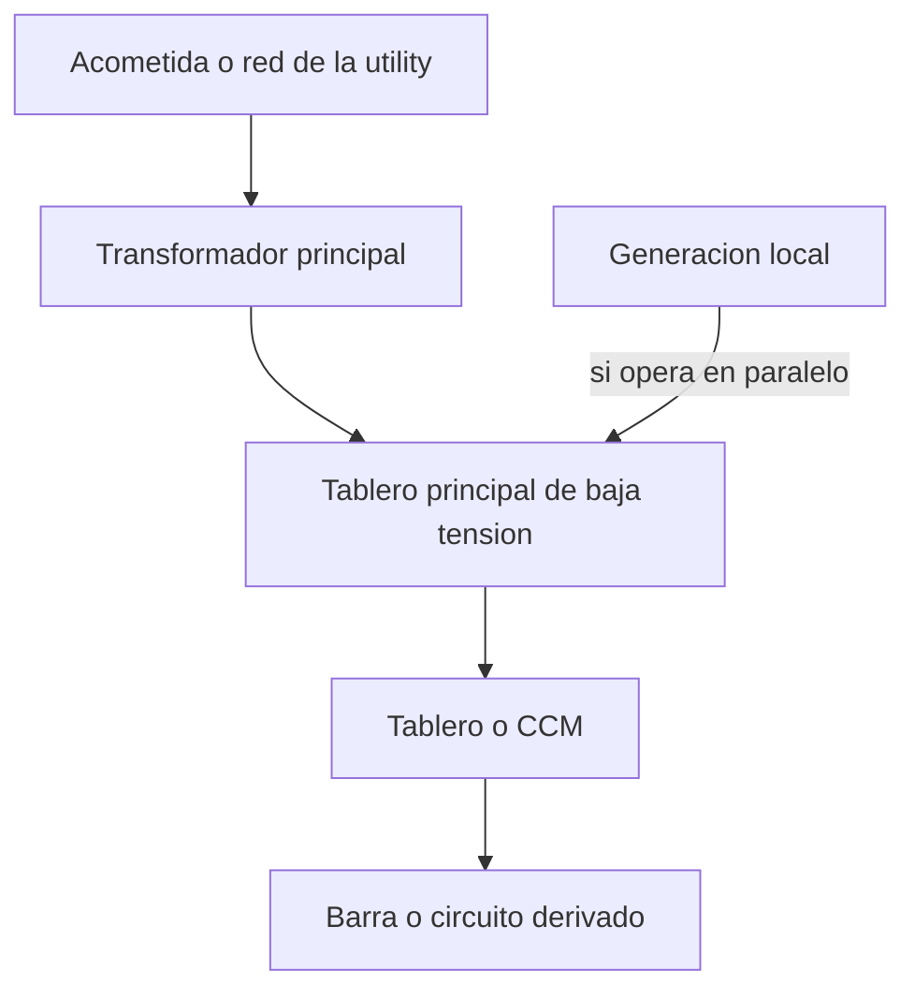
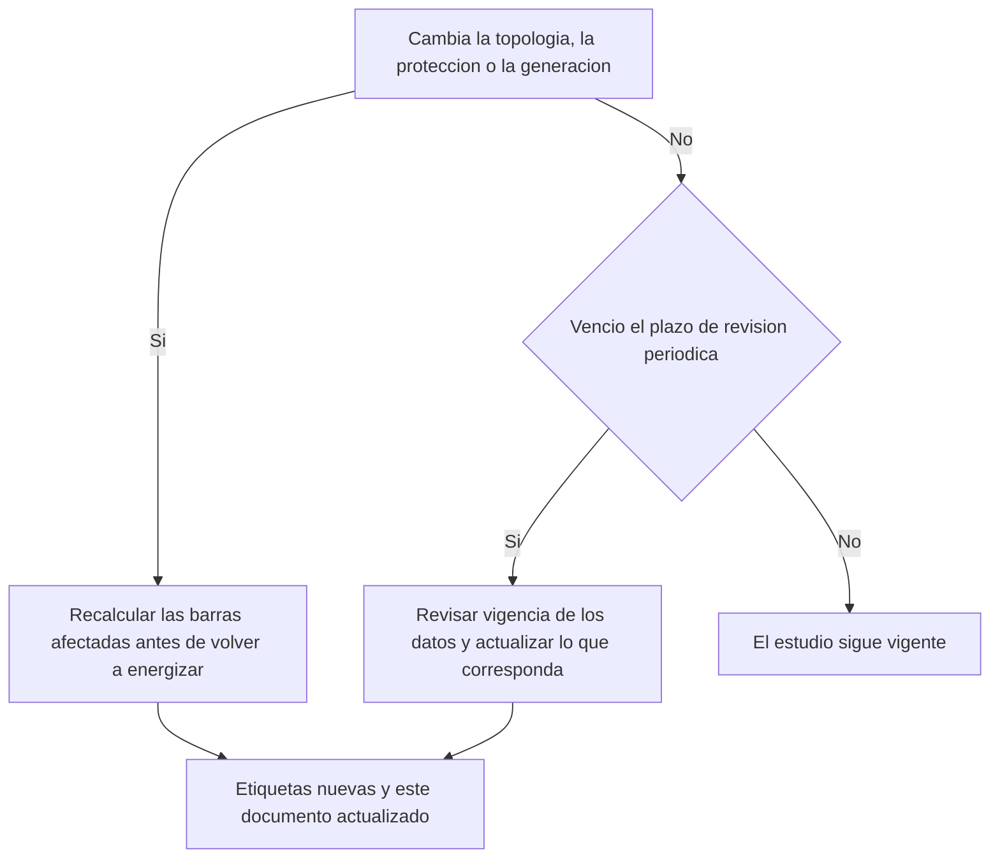

## Qué es este documento y qué no es

Esto no calcula un estudio de arco eléctrico: lo estructura, lo guarda y lo pone a disposición de quien lo necesita en campo — LOTO, análisis de riesgo, selección de EPP, impresión de la etiqueta. Las ecuaciones de [IEEE 1584-2018](https://standards.ieee.org/ieee/1584/5802/) usan logaritmos y exponentes sobre variables categóricas (configuración de electrodos, distancia entre conductores, tipo de caja); no son una regla de tres y no caben en una hoja de cálculo sencilla, así que esta plantilla no las reproduce ni las aproxima.

Quien llena las tablas de resultados es la persona o la empresa que hizo el estudio, con software especializado (SKM Power*Tools, EasyPower, ETAP o equivalente) o por cálculo manual firmado por un ingeniero calificado en sistemas de potencia. Mantenimiento y seguridad reciben este documento ya lleno, lo archivan junto al unifilar y lo usan como fuente única de las cifras que otros procedimientos citan de memoria: "el estudio de arco de la planta" que mencionan el permiso de LOTO y el análisis de riesgo antes del trabajo es este archivo.

> [!WARNING]
> Ninguna cifra de esta plantilla —corriente de falla, energía incidente, categoría de EPP, frontera de arco— se calcula en este documento ni en ninguna hoja de Cálculos de esta app. El motor de Cálculos de esta app solo resuelve `+ - * /`, paréntesis y funciones como `SUMA` o `PROMEDIO`; no tiene logaritmos ni potencias, que es justo lo que exigen las ecuaciones de energía incidente y corriente de arco de IEEE 1584-2018. Escribir aquí un número que no salga de un estudio de ingeniería certificado es fabricar una cifra de seguridad falsa. Si una barra todavía no tiene estudio, la fila se deja en blanco con la palabra "pendiente" — nunca con un valor estimado a ojo.

## Datos generales del estudio

| Campo | Dato |
| --- | --- |
| Instalación, planta o área | [nombre completo, igual al del unifilar] |
| Alcance: qué cubre y qué queda fuera | [tableros, celdas y niveles de tensión incluidos; qué circuitos quedaron fuera y por qué] |
| Empresa o persona que ejecutó el estudio | [razón social o nombre] — [n.º de licencia o matrícula profesional del ingeniero que firma] |
| Software o método usado | [SKM Power*Tools / EasyPower / ETAP / cálculo manual, con versión] |
| Norma aplicada y edición | IEEE 1584-[año de la edición], NFPA 70E edición [año] o [la norma local que te obligue] |
| Fecha del estudio | [dd/mm/aaaa] |
| Motivo de este estudio | [primer estudio / actualización por cambio de qué / revisión de vigencia a los 5 años] |
| Próxima revisión programada | [dd/mm/aaaa, según la política de la planta o el máximo que fije la norma] |
| Custodia del informe completo | [dónde está el informe de ingeniería con la memoria de cálculo completa: ruta y responsable] |

Sustituye la norma por la que te aplique: NFPA 70E y NEC (NFPA 70) en buena parte de América, IEC 60364 en el ámbito internacional, y la local que te obligue: NOM-001-SEDE y NOM-029-STPS (México), RETIE (Colombia), normas de la CNEE (Guatemala), AEA/IRAM (Argentina).

## Modelo del sistema

La energía incidente de una barra depende de toda la red aguas arriba, no solo del equipo donde se mide: cambia el transformador, cambia el ajuste de un relé, entra un generador en paralelo, y el número deja de ser cierto aunque la etiqueta siga pegada en el mismo sitio. Esta sección resume el modelo que usó el software; el detalle completo — impedancias, curvas y memoria de cálculo — vive en el informe de ingeniería, no aquí.

| Elemento | Dato |
| --- | --- |
| Origen de la red o acometida | [utility o generación propia; kA de cortocircuito disponible en el punto de acometida, con fecha del dato de la empresa eléctrica; relación X/R] |
| Transformador principal 1 | [TAG] — [kVA] — [tensión primaria/secundaria] — [%Z a su base] — [grupo de conexión, p. ej. Dyn11] |
| Transformador principal 2 | [TAG] — [kVA] — [tensión primaria/secundaria] — [%Z a su base] — [grupo de conexión] |
| Generación local | [generador o cogeneración: capacidad, modo de operación — en paralelo con la red, en isla, o solo respaldo — y si el estudio la modeló energizada] |
| Sistema de puesta a tierra | [sólidamente aterrizado / por resistencia / aislado, por cada nivel de tensión] |
| Revisión del unifilar usada como base | [n.º de plano y revisión; si el unifilar de campo no coincide con este, el estudio no es confiable] |

*(Ajusta el diagrama a tu topología real: es solo el esqueleto de una línea principal. El unifilar completo, con cada barra y cada protección, va aparte.)*

## Corriente de falla y despeje, por barra o tablero

Una fila por barra o tablero incluido en el alcance. La corriente de arco y el resto de la memoria de cálculo quedan en el informe completo del estudio; aquí se transcriben los datos de entrada que usó el software y que cualquiera necesita para entender de dónde sale el resultado.

| Bus / tablero y TAG | Tensión nominal | Config. de electrodos[^1] | Corriente de falla trifásica disp. | Dispositivo aguas arriba y ajuste | Tiempo de despeje |
| --- | --- | :---: | ---: | --- | ---: |
| [[Bus / tablero y TAG]] | [[Tensión nominal (V)]] | [[Configuración =texto]] | [[Corriente de falla (kA) =numero]] | [[Dispositivo aguas arriba]] | [[Tiempo de despeje (s) =numero]] |
| [[Bus / tablero y TAG]] | [[Tensión nominal (V)]] | [[Configuración =texto]] | [[Corriente de falla (kA) =numero]] | [[Dispositivo aguas arriba]] | [[Tiempo de despeje (s) =numero]] |
| [[Bus / tablero y TAG]] | [[Tensión nominal (V)]] | [[Configuración =texto]] | [[Corriente de falla (kA) =numero]] | [[Dispositivo aguas arriba]] | [[Tiempo de despeje (s) =numero]] |

## Energía incidente y fronteras, por barra o tablero

Mismas filas que la tabla anterior, en el mismo orden: es el resultado que entrega el software para esa barra, con la distancia a la que se calculó.

| Bus / tablero y TAG | Distancia de trabajo | Energía incidente | Categoría de PPE | Frontera de arco eléctrico | Frontera de aprox. restringida |
| --- | ---: | ---: | :---: | ---: | ---: |
| [[Bus / tablero y TAG]] | [[Distancia de trabajo (mm) =numero]] | [[Energía incidente (cal/cm²) =numero]] | [[Categoría de PPE =texto]] | [[Frontera de arco (mm) =numero]] | [[Frontera restringida (mm) =numero]] |
| [[Bus / tablero y TAG]] | [[Distancia de trabajo (mm) =numero]] | [[Energía incidente (cal/cm²) =numero]] | [[Categoría de PPE =texto]] | [[Frontera de arco (mm) =numero]] | [[Frontera restringida (mm) =numero]] |
| [[Bus / tablero y TAG]] | [[Distancia de trabajo (mm) =numero]] | [[Energía incidente (cal/cm²) =numero]] | [[Categoría de PPE =texto]] | [[Frontera de arco (mm) =numero]] | [[Frontera restringida (mm) =numero]] |

[^1]: Configuración de electrodos según IEEE 1584-2018: VCB (verticales en caja metálica), VCBB (verticales terminados en barrera, dentro de caja), HCB (horizontales en caja), VOA (verticales en aire libre) u HOA (horizontales en aire libre). La elige el software o el ingeniero según cómo están dispuestos los conductores dentro del equipo real, nunca por defecto: cambia el resultado tanto como la corriente de falla.

## Contenido de la etiqueta de advertencia por equipo

Lo que exige NFPA 70E 130.5(H) en la etiqueta física de cada equipo, para transcribir directo a la orden de impresión. La norma exige siempre tensión nominal y frontera de arco, y **un solo método** de los tres siguientes — nunca dos combinados en la misma etiqueta: energía incidente con su distancia de trabajo, o categoría de PPE, o el EPP mínimo específico del sitio.

| TAG del equipo | Tensión nominal | Frontera de arco | Método de la etiqueta | Valor (energía + distancia, o categoría) | EPP mínimo descrito |
| --- | --- | ---: | :---: | --- | --- |
| [[TAG del equipo]] | [[Tensión nominal (V)]] | [[Frontera de arco (mm) =numero]] | [[Método =texto]] | [[Valor]] | [[EPP mínimo]] |
| [[TAG del equipo]] | [[Tensión nominal (V)]] | [[Frontera de arco (mm) =numero]] | [[Método =texto]] | [[Valor]] | [[EPP mínimo]] |
| [[TAG del equipo]] | [[Tensión nominal (V)]] | [[Frontera de arco (mm) =numero]] | [[Método =texto]] | [[Valor]] | [[EPP mínimo]] |

| Dato adicional de la etiqueta | Valor |
| --- | --- |
| Fecha del estudio y próxima revisión | [[Fecha del estudio =fecha]] — [[Próxima revisión =fecha]] |
| Norma y edición citada en la etiqueta | [IEEE 1584-[año] / NFPA 70E [año]] |
| Instaló la etiqueta | [[Instaló =texto]] — [[Fecha =fecha]] |
| Responsable de reemplazarla si se daña o queda ilegible | [nombre y cargo] |

> [!CAUTION]
> Una etiqueta sin frontera de arco, sin tensión nominal, o con energía incidente y categoría de PPE juntas en el mismo rótulo, no cumple 130.5(H) y no sirve para elegir EPP. El propietario del equipo responde por que la etiqueta exista, esté legible y sea la del estudio vigente — no la de una edición anterior que nadie retiró.

## Vigencia y revalidación

El estudio no vence solo por calendario: vence también el día que cambia algo que alimenta el cálculo, aunque falten años para la fecha de revisión programada.

Dispara una revisión, aunque no haya pasado el plazo:

- [ ] Transformador nuevo, reemplazado o con cambio de tomas o de %Z
- [ ] Cambio en el alimentador de la utility o en su corriente de falla disponible
- [ ] Ajuste nuevo de protección, relé reprogramado o cambio de curva de disparo
- [ ] Generación local nueva, o cambio en su modo de operación (paralelo / isla)
- [ ] Ampliación de carga, cable nuevo o tablero nuevo derivado de una barra ya estudiada
- [ ] Un hallazgo de falla real que no coincida con lo que predecía el estudio

Si ninguno de esos puntos ocurrió, el estudio igual se revisa —no necesariamente se recalcula entero— cuando se cumpla [el plazo máximo que fije la norma vigente, cinco años en NFPA 70E, o el intervalo más corto que fije la política de tu planta]: se confirma que los datos de la red siguen siendo ciertos y se deja constancia escrita de esa revisión, aunque el número final no cambie.

| Revisión | Fecha | Qué se verificó | Cambió algo | Firma |
| --- | :---: | --- | :---: | --- |
| [[N.º de revisión =numero]] | [[Fecha =fecha]] | [[Qué se verificó =larga]] | [[Cambió algo =texto]] | [[Firma =firma]] |
| [[N.º de revisión =numero]] | [[Fecha =fecha]] | [[Qué se verificó =larga]] | [[Cambió algo =texto]] | [[Firma =firma]] |

## Antes de dar por vigente este estudio

- [ ] Cada barra del alcance tiene fila completa en las dos tablas de resultados; ninguna quedó en blanco sin decir "pendiente"
- [ ] El informe completo de ingeniería, con memoria de cálculo, está archivado y localizable desde el campo "Custodia del informe completo"
- [ ] Las etiquetas físicas ya impresas coinciden con la tabla de contenido de etiqueta, equipo por equipo
- [ ] El unifilar usado como base es el vigente, con su revisión anotada
- [ ] Quien firmó el estudio está identificado con nombre y matrícula, no solo con el logo de la empresa
- [ ] La fecha de próxima revisión está en el calendario de mantenimiento, no solo en este documento

## Referencias

*De dónde sale este formato. Borra esta sección al usar la plantilla.*

- [IEEE 1584-2018, Guide for Performing Arc-Flash Hazard Calculations](https://standards.ieee.org/ieee/1584/5802/) — los modelos con los que se calcula la corriente de arco, la energía incidente y la frontera de arco; exigen software o cálculo manual especializado, no una hoja de cálculo simple.
- [NFPA 70E, Standard for Electrical Safety in the Workplace](https://www.nfpa.org/product/nfpa-70e-standard/p0070ecode) — ficha oficial de la norma: confirma la edición vigente antes de citarla; el articulado trae las tablas de EPP y los requisitos de la etiqueta.
- [130.5(H) Equipment Labels — Tyndale](https://tyndaleusa.com/fr-safety-resources/technical-library/standards-and-test-methods/arc-flash-standards/nfpa-70e/130-5-h-equipment-labels/) — qué exige la etiqueta física: tensión nominal, frontera de arco y un solo método de EPP, nunca dos combinados.
- [When Should an Arc Flash Study Be Updated? NFPA 70E 5-Year Rule Explained — Zech Engineering](https://www.zechengineers.com/blog/when-to-update-arc-flash-study/) — el máximo de cinco años es un techo, no una meta, y qué cambios de sistema obligan a recalcular antes de esa fecha.
- [Let's Consider Incident Energy: Electrode Configuration in 2018 IEEE 1584 — Electrical Contractor Magazine](https://www.ecmag.com/magazine/articles/article-detail/safety-lets-consider-incident-energy-electrode-configuration-2018-ieee-1584-part-2) — qué son VCB, VCBB, HCB, VOA y HOA, y por qué la configuración de electrodos cambia el resultado tanto como la corriente de falla.
- [OSHA 1910.335 — Safeguards for personnel protection](https://www.osha.gov/laws-regs/regulations/standardnumber/1910/1910.335) — EPP, herramientas y señalización que dependen de las cifras de este estudio para elegirse correctamente.
