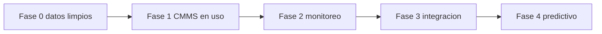

## Cómo se usa esta hoja de ruta

Se rellena una vez con el equipo y se revisa al cerrar cada fase. No es un catálogo de tecnología: es el orden en que vas a gastar el dinero y el criterio con el que sabrás si sirvió. La regla que manda sobre todo lo demás: no se compra una capa nueva hasta que la anterior entrega datos que alguien usa para decidir. Anota arriba el alcance real ([n.º de activos con TAG], [presupuesto y moneda], [patrocinador en dirección]) antes de seguir.

Sustituye la norma por la que te aplique: NFPA 70E y NEC (NFPA 70) en buena parte de América, IEC 60364 en el ámbito internacional, y la local que te obligue: NOM-001-SEDE (México), RETIE (Colombia), normas de la CNEE (Guatemala), AEA/IRAM (Argentina).

## Dónde estás hoy

Marca un nivel por familia de activo, no uno para toda la planta: es normal estar en 3 con motores y en 1 con tableros de distribución.

| Nivel | Cómo se ve | Con qué decides | Qué falla |
| :---: | --- | --- | --- |
| 1. Papel y memoria | Bitácora en cuaderno, historial en la cabeza del técnico veterano | Experiencia personal | El historial se va con quien renuncia |
| 2. Hojas de cálculo | Un archivo por área, versiones que viajan por correo | Lo que alguien recuerda actualizar | Nadie sabe cuál archivo es el bueno |
| 3. CMMS con historial fiable | Órdenes abiertas y cerradas con TAG, causa y horas reales | Historial propio: MTBF, MTTR, backlog | Órdenes cerradas sin código de falla |
| 4. Monitoreo en línea | Sensores que avisan sin que nadie ronde el equipo | Alarmas por umbral y por tendencia | Alarmas que nadie atiende |
| 5. Análisis predictivo | Modelos con historial suficiente para estimar cuánto falta | Aviso con semanas de anticipación | Modelos sin validar contra fallas reales |
| 6. Decisiones automatizadas | El sistema genera la orden y reserva el repuesto | Reglas auditables aprobadas por ti | Automatizar un proceso que estaba mal |

Preguntas honestas para ubicarte. Si respondes "más o menos", cuenta como no:

- [ ] ¿Puedes decir en cinco minutos cuántas fallas tuvo el motor [TAG] en 24 meses?
- [ ] ¿El último informe que llevaste a dirección salió de un sistema o lo armaste a mano?
- [ ] ¿Los datos de tus medidores llegan a algún lado o se quedan en la pantalla del equipo?
- [ ] ¿Si mañana renuncia [nombre del técnico con más antigüedad], se pierde algo que no está escrito?

## El requisito previo que casi nadie cumple

Sin esto, cualquier analítica que compres producirá números convincentes y falsos. Es la parte más aburrida y la única que no se puede saltar.

| Requisito | Qué significa en concreto | Cómo se comprueba | Estado |
| --- | --- | --- | :---: |
| TAG único y jerarquía | Un código por activo, con padre e hijo: subestación → tablero → arrancador → motor | Tomas [30] activos al azar y el TAG del campo aparece igual en el sistema | [ ] |
| Ficha técnica mínima | Placa, potencia, tensión, corriente, ubicación, criticidad, fabricante | Ningún activo crítico con campos vacíos | [ ] |
| Órdenes bien cerradas | Horas reales, repuestos, qué se encontró, qué se hizo y sellos de hora del paro | Auditas [20] órdenes del mes: cuántas se entienden sin llamar a quien las hizo | [ ] |
| Códigos de falla | Lista cerrada: qué falló, por qué falló y cómo se detectó | El técnico elige de una lista, nunca escribe texto libre | [ ] |
| Criticidad pactada | Cada activo con su nivel, firmado con producción | Producción reconoce la lista como suya | [ ] |

La lista de códigos de falla se acuerda una vez y se congela: si cada técnico inventa la suya, dentro de dos años no podrás sumar nada. Apóyate en una taxonomía de fallas ya publicada, [la norma de recolección de datos de confiabilidad que te aplique o la lista que ya trae tu GMAO], en lugar de inventar la tuya. Antes de cotizar plataforma, limpia el maestro de tus [50] activos más críticos: es barato, lo hace tu propia gente y decide si el resto del plan tiene sentido.

## El CMMS o GMAO

Qué tiene que resolver, en este orden: dónde está cada activo, qué se le hizo, qué le falta y cuánto costó. Lo demás es extra.

| Pregunta | Qué exigir en la demostración, con tus datos |
| --- | --- |
| ¿Qué resuelve? | Órdenes con TAG cerradas en el tablero desde el móvil, plan preventivo con ruta, historial y costo por activo |
| ¿Qué datos exige? | Maestro de activos, jerarquía, plan preventivo, repuestos, personal y tarifas |
| ¿Cómo se migra? | Activos vivos y críticos primero; el historial viejo se migra si está limpio, si no se archiva aparte |
| ¿Se puede salir? | Exportación completa de tus datos, en formato abierto, sin pedir permiso al proveedor |

Por qué fracasan las implantaciones, casi siempre por el mismo sitio: se migra basura y se cree que el sistema la limpiará; se compra antes de definir la jerarquía de activos; se cierra la orden con un "listo" que no dice qué falló; nadie tiene la administración del sistema entre sus tareas oficiales; y se mide al técnico por cuántas órdenes cierra, no por cuánto sirve lo que escribe. Si el sistema no captura el modo de falla en un campo con lista cerrada, lo que compraste es un despachador de tickets, no una fuente de análisis.

## Medición y monitoreo en línea, por familia de activo

Una fila por tecnología. Cotiza por punto instalado, no por sensor: el cableado, la ingeniería y la puesta en marcha suelen costar más que el aparato. Ninguna de estas tecnologías da un veredicto sola: un punto caliente que además muestra corriente desbalanceada y descargas parciales crecientes es una intervención programada, no una discusión de pasillo.

| Qué mides | Dónde aplica | Qué te avisa | Costo a estimar | Qué NO hace |
| --- | --- | --- | --- | --- |
| Temperatura de tableros y empalmes | Barras, empalmes, terminales de interruptor, celdas cerradas | Conexión floja, desbalance, sobrecarga, contacto degradado | [por punto instalado y por celda] | No sustituye la termografía periódica ni su criterio de severidad |
| Descargas parciales | Celdas y cables de media tensión, motores de MT | Degradación del aislamiento antes de la falla franca | [por celda, más el estudio inicial] | No te dice la vida restante en meses |
| Corriente y firma eléctrica de motores | Motores críticos, arrancadores, variadores | Barras de rotor, excentricidad, degradación del devanado, problemas de la carga acoplada | [por motor, con sus transformadores de corriente] | No reemplaza la prueba de aislamiento con el motor parado |
| Vibración | Motores, ventiladores y bombas acoplados | Rodamientos, desalineación, desbalance, soltura | [por punto, en línea o con ronda] | No detecta fallas puramente eléctricas |
| Medidores de energía y calidad | Acometida, punto de acople común, tableros principales | Consumo, factor de potencia, armónicos, huecos y transitorios | [por medidor y por su comunicación] | No equivale a un estudio de calidad de energía |
| Nivel, humedad y puerta en sala eléctrica | Sótanos de cables, fosas, salas de tableros | Agua, condensación, acceso no autorizado, aire acondicionado caído | [por sala, sensores sencillos] | No arregla la causa: sella y drena |

> [!WARNING]
> Instalar sensores en equipo en servicio es trabajo eléctrico y lo ejecuta personal calificado, nunca el proveedor del software ni un integrador sin formación eléctrica. Desenergizar es la regla; trabajar con tensión es la excepción y exige justificación escrita, análisis de riesgo, permiso firmado y el EPP que fije el estudio de arco eléctrico de tu planta. En cada montaje se aplican las cinco reglas de oro: cortar, bloquear, verificar ausencia de tensión, poner a tierra y en cortocircuito, señalizar y delimitar la zona. Ningún proyecto de digitalización justifica una maniobra improvisada dentro de una celda energizada.

## Integración y protocolos

Lo que decides aquí te ata o te libera durante diez años. La pregunta útil no es cuál protocolo es mejor, sino cuál habla tu equipo instalado y cuál te deja sacar los datos.

| Protocolo | Dónde lo encuentras | Qué te da | Qué vigilar |
| --- | --- | --- | --- |
| Modbus (RTU y TCP) | Medidores, relés, variadores, arrancadores | Abierto, viejo, universal, fácil de integrar | Sin seguridad en su forma clásica; existe una variante con TLS y certificados |
| IEC 61850 | Subestaciones, relés de protección, IED | Modelo de datos común y configuración descrita en archivo | Exige ingeniería especializada y disciplina de configuración |
| OPC UA | Capa entre planta y sistemas superiores | Estándar abierto, independiente de plataforma, con cifrado, certificados y modelo de información | Necesita quien lo administre; no es conectar y listo |
| MQTT | Sensores, pasarelas, envío a servidor propio o a la nube | Ligero, publicación y suscripción, tolera enlaces malos | Sin diseño de temas y de permisos se vuelve un desorden |

Para no quedar atrapado con un proveedor, pon esto por escrito antes de firmar: los datos crudos son tuyos y se exportan completos en formato abierto cuando quieras; los protocolos son estándar, no propietarios; la documentación de la integración se entrega a la planta; la licencia no muere si dejas de pagar el servicio en la nube; y otro contratista puede mantener la instalación sin comprarle una llave a nadie.

## Analítica y mantenimiento predictivo

Se anticipa la degradación que tiene firma medible y desarrollo lento. Lo demás es folleto.

| Se puede anticipar | Con qué datos | Historial mínimo antes de creerle |
| --- | --- | --- |
| Degradación del aislamiento en media tensión | Tendencia de descargas parciales, humedad, temperatura | [meses de tendencia estable y al menos un caso confirmado] |
| Falla de rodamientos | Vibración, corriente, temperatura, horas de marcha | [ciclos suficientes para ver el desarrollo completo] |
| Conexión floja o sobrecargada | Temperatura del mismo punto contra la carga del momento | [un año, para separar el efecto de la estación] |
| Falla súbita por evento externo (rayo, maniobra, animal) | No se predice: se protege, se registra y se aprende | — |

Cómo se valida un modelo antes de creerle: se entrena con un periodo y se prueba con otro que no vio; se cuentan los aciertos y también las falsas alarmas, que son las que matan la confianza de la cuadrilla; se compara contra la regla simple de siempre, porque si un umbral fijo acierta igual, el modelo sobra; y se deja [los meses que tarde en aparecer al menos una falla real de ese tipo] en sombra, avisando sin que nadie actúe, para contar cuántas veces habría tenido razón. Recién entonces se le permite generar una orden.

## Ciberseguridad de la red industrial

Conectar la subestación a internet sin segmentar convierte un problema de mantenimiento en un problema de continuidad de planta. La red que opera equipo no es la red de la oficina y no se administra igual.

- Segmenta en zonas por función y criticidad, comunicadas solo por conductos vigilados: es el enfoque de la serie IEC 62443 para sistemas de automatización y control industrial. Entre la red de planta y la corporativa va una zona intermedia, y nada de tráfico directo desde la oficina hasta el relé de protección.
- Acceso remoto del proveedor: por sesión pedida y aprobada, con testigo de tu lado y registro de lo que hizo. Nunca un enlace permanente que nadie mira.
- Inventario de lo conectado, credenciales por persona, retiro al salir de la empresa y respaldo de las configuraciones de relés y variadores fuera de la máquina que las usa.
- La protección eléctrica y los enclavamientos de seguridad no dependen de la red: si el enlace cae, el equipo queda seguro por sí solo.

> [!CAUTION]
> Un sensor con conexión propia a internet, instalado por un contratista para "ver los datos", es una puerta abierta a tu red industrial. Ninguna instalación entra en servicio sin que el responsable de la red revise por dónde sale el tráfico y quién puede alcanzarlo desde afuera.

## Personas

La tecnología no se cae sola: se cae porque nadie la sostiene. Pon nombre a cada papel, con horas asignadas.

- Dueño de los datos — [nombre] — responde de que el TAG, la jerarquía y los códigos de falla se respeten.
- Administrador del sistema — [nombre, con horas semanales] — usuarios, planes, reportes y respaldos.
- Referente técnico — [nombre] — interpreta tendencias y decide qué hallazgo se atiende y cuándo.
- Enlace con tecnología de información — [nombre] — red, accesos, respaldos y acceso remoto de proveedores.

Sobre la resistencia al cambio: casi nunca es pereza. El técnico ha visto llegar tres sistemas que nadie usó y sospecha que este sirve para vigilarlo. Se contesta con hechos: la orden se cierra en el móvil sin repetir datos que el sistema ya tiene, el historial le sirve a él en la próxima falla y ningún indicador del tablero se usa para calificar personas. Formación por rol, corta y sobre el equipo real, no un curso de ocho horas en un salón.

## Hoja de ruta por fases

| Fase | Objetivo | Criterio de éxito medible | Costo aproximado | Plazo |
| :---: | --- | --- | ---: | --- |
| 0 | Maestro de activos limpio y códigos de falla acordados | [%] de activos críticos con TAG, ficha y criticidad firmada | [monto] | [meses] |
| 1 | GMAO en uso real por la cuadrilla | [%] de órdenes cerradas con causa y horas reales; backlog visible | [monto] | [meses] |
| 2 | Monitoreo en línea en los activos críticos | [n.º] de activos instrumentados y [n.º] de hallazgos atendidos antes de la falla | [monto] | [meses] |
| 3 | Datos integrados en un solo tablero de indicadores | El informe mensual a dirección sale del sistema, sin trabajo manual | [monto] | [meses] |
| 4 | Predictivo validado en [familia de activo] | [n.º] de avisos correctos contra [n.º] de falsas alarmas en [el periodo en sombra que fijaste] | [monto] | [meses] |

Regla de avance: una fase no arranca mientras la anterior no cumpla su criterio. Si la fase 1 no llega a órdenes bien cerradas, la fase 2 solo agrega alarmas que nadie va a mirar.

## Cómo se justifica cada fase con dinero

Dirección no compra madurez digital: compra horas de paro que no ocurren. Trae el número desde tu propio historial, no desde el folleto del proveedor.

- Costo de la hora de paro = unidades no producidas en una hora × margen de contribución por unidad. Pídeselo a finanzas y déjalo firmado; si ya lo firmaste en una justificación de inversión, usa esa misma cifra y no la recalcules.
- Beneficio anual de la fase = (horas de paro evitadas × costo de la hora) + (correctivos convertidos en programados × diferencia de costo) + [ahorro de energía o de penalización por factor de potencia].
- Periodo de recuperación = inversión total ÷ beneficio anual neto. Si pasa de [los meses que tolera tu dirección], parte la fase en trozos más chicos.
- Lo que no se monetiza: el riesgo a las personas y el incumplimiento de la norma que te aplica. Eso no compite por presupuesto, se corrige.

## Señales de que te están vendiendo humo

- Promete predecir fallas sin preguntar qué historial tienes ni en qué estado está.
- Habla de inteligencia artificial y no sabe decirte qué variable mide el sensor.
- El precio no incluye ingeniería, cableado, puesta en marcha ni formación.
- Tus datos quedan en su plataforma y la exportación completa "se puede ver más adelante".
- Ofrece instalar sensores en celdas energizadas sin parar nada, "porque es rapidito".

## Referencias

*De dónde sale este formato. Borra esta sección al usar la plantilla.*

- [Without Accurate Failure Data All You Have Is a Work Order Ticket System](https://reliabilityweb.com/articles/entry/without-accurate-failure-data-all-you-have-is-a-work-order-ticket-system) — por qué el modo de falla es el dato que casi ningún CMMS captura.
- [NIST SP 800-82 Rev. 3, Guide to Operational Technology (OT) Security](https://csrc.nist.gov/pubs/sp/800/82/r3/final) — la guía de referencia para asegurar redes industriales sin romper la operación.
- [IEC 62443-3-2:2020, Security risk assessment for system design](https://webstore.iec.ch/en/publication/30727) — de dónde salen las zonas y los conductos, y el nivel de seguridad objetivo de cada zona.
- [OPC Unified Architecture](https://opcfoundation.org/about/opc-technologies/opc-ua/) — estándar abierto e independiente de plataforma, con cifrado, autenticación por certificados X509 y modelo de información.
- [Modbus Specifications](https://www.modbus.org/modbus-specifications) — las especificaciones vigentes, incluida la variante con TLS y certificados.
- [IEC 60270:2025, Charge-based measurement of partial discharges](https://webstore.iec.ch/en/publication/65087) — qué mide y con qué circuitos se mide la descarga parcial.
