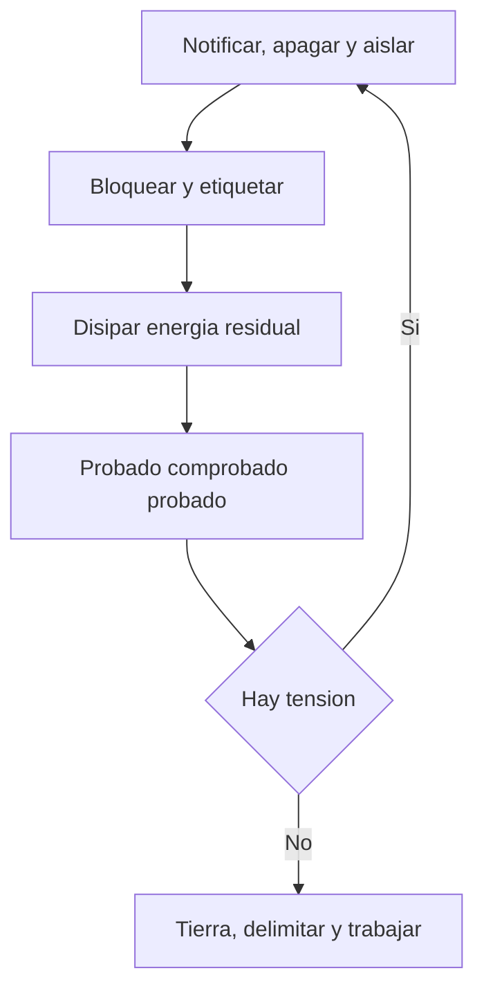

## Cómo se usa este permiso

Uno por equipo y por intervención. Se rellena en sitio, antes de tocar nada, y se cierra al entregar el equipo.

- No se hereda del turno anterior ni se firma por adelantado. Si cambia el alcance, se cierra este y se abre otro.
- Desenergizar es la regla. Trabajar con tensión es la excepción, tiene su propia sección y exige justificación escrita.
- Sustituye la norma por la que te aplique: NFPA 70E y NEC (NFPA 70) en buena parte de América, IEC 60364 en el ámbito internacional, y la local que te obligue: NOM-001-SEDE y NOM-029-STPS (México), RETIE (Colombia), normas de la CNEE (Guatemala), AEA/IRAM (Argentina).

## Ficha del trabajo y responsables

Nombres, no cargos genéricos. Quien no está en esta tabla no entra a la zona delimitada.

| Campo | Valor |
| --- | --- |
| Permiso n.º | [correlativo del libro de permisos] |
| Equipo, TAG y ubicación | [motor, tablero, celda o variador — TAG único — subestación o área] |
| Trabajo a ejecutar | [qué se va a hacer, en una línea] |
| Tensión nominal y cortocircuito disponible | [V] — [kA del estudio, no de memoria] |
| Inicio y fin previstos | [dd/mm hh:mm] — [dd/mm hh:mm] |
| Unifilar y estudio de arco consultados | [revisión y fecha del plano; fecha del estudio] |
| Autoriza el permiso | [nombre y cargo; firma que el trabajo procede y que hay recursos] |
| Responsable del bloqueo | [nombre; firma la tabla de puntos y custodia la caja de candados] |
| Ejecutantes | [nombres; cada uno pone y quita su propio candado] |
| Operación o producción | [nombre; libera el equipo y avisa a los afectados] |
| Vigilante o apoyo | [nombre; presencia en zona, capacidad de aviso y rescate] |

## Secuencia obligatoria

Nueve pasos en este orden. No se combinan, no se saltan y no se hacen por teléfono.

1. **Planificar.** Lee el unifilar, identifica todas las fuentes y define los puntos de corte. Sin plano actualizado no se empieza.
2. **Notificar.** Avisa a operación y a todo el personal afectado por la parada, incluidos contratistas y el turno siguiente.
3. **Apagar.** Detén el equipo con su secuencia normal de paro, no abriendo el interruptor bajo carga.
4. **Aislar.** Opera cada medio de corte de fuerza, de control y de las alimentaciones alternas hasta dejar el equipo sin ninguna vía de energía.
5. **Bloquear y etiquetar.** Candado individual por persona en cada punto; si concurren varios candados, pinza multicandado o caja de bloqueo[^1].
6. **Disipar.** Descarga capacitores, purga presiones, drena, bloquea mecánicamente lo que pueda caer o girar y deja enfriar.
7. **Verificar ausencia de tensión.** Probado, comprobado, probado, en el punto exacto que vas a tocar.
8. **Poner a tierra y en cortocircuito.** Donde la tensión o el riesgo de realimentación lo exijan.
9. **Delimitar y trabajar.** Señaliza, acordona y solo entonces se toca el equipo.

## Fuentes de energía que hay que buscar

Recórrelas una por una con el unifilar en la mano. La que mata es la que nadie recordaba.

| Tipo de energía | Dónde aparece | Cómo se aísla y se comprueba | Confirmado por |
| --- | --- | --- | --- |
| Eléctrica de fuerza | Acometida, interruptor principal, celda de media tensión, arrancador | Interruptor o seccionador abierto y bloqueado, con corte visible cuando el equipo lo permita | [nombre] |
| Eléctrica de control | Circuito de mando con su propia tensión, PLC, enclavamientos, bobina de disparo | Interruptor de control propio; fusibles retirados y guardados con el permiso | [nombre] |
| Emergencia, transferencia y UPS | Planta de emergencia, transferencia automática, UPS de sala de control, banco de baterías y cargador | Bloqueo también del lado de emergencia, transferencia en manual, bypass y apertura del banco | [nombre] |
| Retorno por variador | Bus de CC, frenado regenerativo, motor arrastrado por la carga o por el proceso | Aísla entrada y salida del variador y frena la carga: un motor girando genera tensión | [nombre] |
| Capacitores cargados | Banco de compensación, filtros, bus de CC del variador y del arrancador suave | Espera de descarga y descarga forzada — [tiempo que indique la placa o el manual del equipo] | [nombre] |
| Otras entradas eléctricas | Resistencias calefactoras del tablero, alumbrado, tomacorrientes de servicio, soldadora conectada | Circuito propio, casi siempre desde otro tablero: búscalo y bloquéalo | [nombre] |
| Mecánica y por gravedad | Volantes, resortes, transmisiones, cargas suspendidas, compuertas, contrapesos | Calzo, pasador o traba hasta el reposo total; apoyo mecánico o descenso a posición segura | [nombre] |
| Neumática e hidráulica | Actuadores, frenos, acumuladores de aire, centrales, cilindros con carga | Válvula de corte bloqueada, presión purgada o drenada hasta cero y carga apoyada | [nombre] |
| Térmica | Vapor, aceite caliente, resistencias, devanados recién parados | Corte, purga y espera de enfriamiento — [tiempo del procedimiento del equipo] | [nombre] |

## Tabla de puntos de aislamiento

Una fila por punto. Si un punto no está aquí, no está bloqueado, aunque alguien diga que lo abrió.

| Equipo / TAG | Punto de aislamiento | Tipo de energía | Dispositivo de bloqueo | Candado n.º | Etiqueta n.º | Quién | Hora |
| --- | --- | --- | --- | :---: | :---: | --- | :---: |
| [M-114 bomba] | [arrancador CCM-2, celda 4] | [eléctrica de fuerza] | [pinza multicandado] | [[Candado n.º =numero]] | [[Etiqueta n.º =numero]] | [[Quién]] | [[Hora =hora]] |
| [M-114 bomba] | [mando 24 V, tablero PLC] | [eléctrica de control] | [bloqueo de interruptor] | [[Candado n.º =numero]] | [[Etiqueta n.º =numero]] | [[Quién]] | [[Hora =hora]] |
| [[Equipo / TAG]] | [[Punto de aislamiento]] | [[Tipo de energía]] | [[Dispositivo de bloqueo]] | [[Candado n.º =numero]] | [[Etiqueta n.º =numero]] | [[Quién]] | [[Hora =hora]] |

## Verificación de ausencia de tensión, tierra y cortocircuito

El paso que no se delega. Lo ejecuta persona calificada, con el EPP puesto, en el punto que va a tocar.

1. Prueba el instrumento en una fuente con tensión conocida o en un comprobador.
2. Mide el punto de trabajo: fase contra fase y cada fase contra tierra, en todos los conductores.
3. Vuelve a probar el instrumento en la misma fuente conocida. Si ahora falla, la medición no vale y se repite todo.

- Instrumento y puntas de la categoría y la tensión del punto — [CAT y tensión nominal del instrumento que usas]. Un piloto apagado, un voltímetro de tablero en cero o un enclavamiento no son verificación de nada.
- La OSHA obliga a comprobar el instrumento inmediatamente antes e inmediatamente después de la prueba cuando el circuito supera 600 V nominales — 29 CFR 1910.333(b)(2)(iv)(B). Por debajo de esa tensión, hazlo igual: probado, comprobado, probado no depende del umbral legal. Confirma qué te exige tu norma en [el apartado de verificación de ausencia de tensión de la NFPA 70E vigente, o la norma local que te obligue].
- Puesta a tierra y en cortocircuito donde la tensión, la longitud del circuito o el riesgo de realimentación lo exijan; en media y alta tensión no se discute. Juego dimensionado para la corriente de falla — [sección y capacidad según el estudio de cortocircuito y la norma que apliques]. Se conecta primero al punto de tierra y después a los conductores, con pértiga y EPP, y se retira en orden inverso; se anota en la tabla de puntos, porque un juego olvidado se convierte en la falla del arranque.

> [!CAUTION]
> Un instrumento averiado marca cero en un circuito vivo. Por eso se prueba antes y después, y por eso la verificación la hace quien va a meter las manos, no un tercero que la reporta por radio. El circuito se trata como energizado hasta que la medición demuestre lo contrario.

## Candados y firmas

Cada persona pone su candado y cada persona quita el suyo. Nadie firma por otro y nadie guarda una llave maestra.

| Nombre | Empresa | Candado n.º | Firma al poner | Hora | Firma al quitar | Hora |
| --- | --- | :---: | --- | :---: | --- | :---: |
| [[Nombre]] | [[Empresa]] | [[Candado n.º =numero]] | [[Firma al poner =firma]] | [[Hora =hora]] | [[Firma al quitar =firma]] | [[Hora =hora]] |
| [[Nombre]] | [[Empresa]] | [[Candado n.º =numero]] | [[Firma al poner =firma]] | [[Hora =hora]] | [[Firma al quitar =firma]] | [[Hora =hora]] |

## Retirada del bloqueo y reenergización

Orden inverso al aislamiento. Cada casilla la marca quien la miró, no quien la supone.

- [ ] Trabajo terminado y probado; tapas, guardas y barreras repuestas
- [ ] Herramienta, puentes, equipo de medición y tierras temporales retirados del equipo
- [ ] Recuento de personas: cada ejecutante fuera de la zona y avisado por su nombre
- [ ] Cada quien retiró su propio candado y su etiqueta; la caja de bloqueo quedó vacía
- [ ] Aviso a operación y a los afectados antes de energizar
- [ ] Reenergización punto por punto en orden inverso, empezando por la fuente principal
- [ ] Señalización y acordonamiento retirados al final, prueba funcional y entrega firmada a producción
- [ ] Permiso cerrado en el libro con hora, firma e incidencias

**Cuando hay que quitar el candado de otra persona.** Excepción registrada, nunca costumbre de fin de turno. Se cumplen las cinco filas o el candado no se toca.

| Requisito | Cómo se cumple |
| --- | --- |
| Confirmar que la persona no está en planta | [quién lo verifica: portería, lista de asistencia, jefe de turno] |
| Intentar contactarla y dejar constancia | [teléfono, hora del intento, testigo que lo presenció] |
| Revisar el equipo antes de tocar el candado | [recorrido físico completo, con una segunda persona] |
| Autorizar por escrito | [firma del responsable autorizado, distinto de quien ejecuta] |
| Avisar a la persona antes de que vuelva al equipo | [quién le avisa y dónde queda registrado] |

> [!WARNING]
> Cortar un candado ajeno es un evento que se registra, se investiga y se firma. Si se repite, el problema no es el candado: es el procedimiento de cambio de turno, y ahí se corrige.

## Trabajo con tensión: la excepción

Solo se plantea cuando desenergizar crea un riesgo mayor o es inviable por el diseño del equipo. "No hay ventana de paro", "es rápido" y "el cliente presiona" no son razones.

| Requisito | Contenido |
| --- | --- |
| Justificación escrita | Por qué desenergizar crea un riesgo adicional o es inviable, con firma de quien autoriza |
| Análisis de riesgo | Tarea paso a paso, peligro de choque y de arco, medidas y plan de emergencia |
| Personal calificado | Nombres, formación vigente y conocimiento demostrado de ese equipo |
| Fronteras de aproximación | [distancias de aproximación y frontera de arco, de la tabla correspondiente de la NFPA 70E vigente para tu tensión] |
| Energía incidente y EPP | [cal/cm² del estudio de arco o de la etiqueta del equipo, y la categoría de EPP que le corresponda en la norma vigente] |
| Herramienta y equipo | Aislada y certificada para la tensión, inspeccionada y en fecha de ensayo |
| Autorización y vigilancia | Firma de quien autoriza y de cada ejecutante antes de empezar, con hora, y segunda persona presente formada en rescate |

Las cifras de fronteras, de energía incidente y de EPP no están en esta plantilla a propósito: salen del estudio de arco eléctrico de tu instalación y de las tablas de la norma vigente. Un permiso rellenado después del trabajo no es un permiso.

## Antes de firmar

- [ ] Todas las fuentes de la tabla marcadas, aisladas y bloqueadas
- [ ] Un candado por persona; ninguna llave maestra en el bolsillo de nadie
- [ ] Ausencia de tensión verificada por quien va a trabajar
- [ ] EPP en fecha de ensayo — [fecha del último ensayo de guantes y equipo aislante]
- [ ] Plan de emergencia, ruta de evacuación y contacto de rescate a la vista

[^1]: El candado es la regla. La etiqueta sola se acepta únicamente cuando el medio de corte no admite candado y se demuestra una protección equivalente: mira el apartado de tagout de la 1910.147 antes de aceptarla y deja escrita la medida adicional que aplicaste. Todo medio de corte nuevo o modificado debe admitir candado.

## Referencias

*De dónde sale este formato. Borra esta sección al usar la plantilla.*

- [OSHA 1910.147, The control of hazardous energy (lockout/tagout)](https://www.osha.gov/laws-regs/regulations/standardnumber/1910/1910.147) — la secuencia de aplicación, la liberación de energía residual, la verificación y las reglas de retirada del bloqueo.
- [OSHA STD 01-05-019, Inspection Procedures and Interpretive Guidance](https://www.osha.gov/enforcement/directives/std-01-05-019) — bloqueo en grupo con caja de candados y la prohibición expresa de firmar o retirar el dispositivo de otra persona.
- [OSHA 1910.333, Selection and use of work practices](https://www.osha.gov/laws-regs/regulations/standardnumber/1910/1910.333) — desenergizar es la regla, solo persona calificada trabaja con tensión y el instrumento se comprueba antes y después por encima de 600 V.
- [Guide to assessing risk: energized electrical work permits](https://www.fluke.com/en-us/learn/blog/safety/energized-electrical-work-permits) — qué exige la NFPA 70E en un permiso de trabajo con tensión: fronteras, riesgo de arco, EPP y firma de la dirección; si se puede desenergizar, se desenergiza.
- [About absence of voltage testing](https://www.fluke.com/en-us/learn/blog/electrical/absence-of-voltage-testing) — el método probado-comprobado-probado y por qué un instrumento averiado marca cero en un circuito vivo.
- [NOM-029-STPS-2011, mantenimiento de las instalaciones eléctricas](https://dof.gob.mx/nota_detalle.php?codigo=5227363&fecha=29%2F12%2F2011) — la norma mexicana: autorización escrita, bloqueo con candados, comprobación de ausencia de tensión y puesta a tierra temporal.
