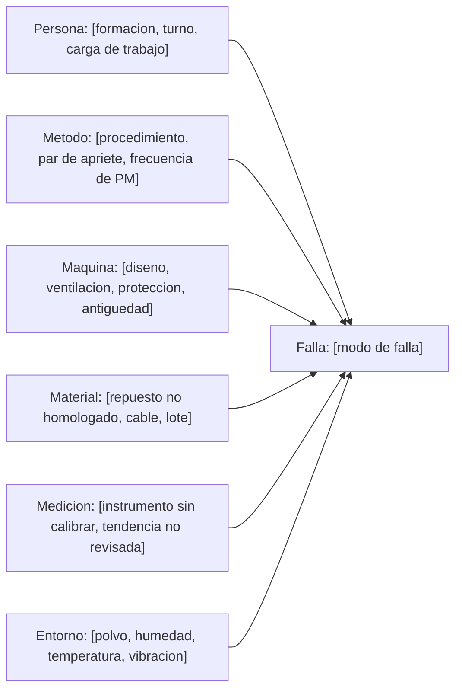

## Qué pasó y qué costó

Tres frases: qué falló, qué se perdió y qué hay que decidir. Quien solo lea esto tiene que poder aprobar o rechazar el gasto de las acciones correctivas.

| Concepto | Cifra | De dónde sale |
| --- | ---: | --- |
| Horas de paro | [h desde el disparo hasta producción estable, no hasta el arranque] | [horas de la bitácora de turno] |
| Producción perdida y daño colateral | [unidades o toneladas y su valor; materia prima echada a perder, arranque en frío] | [ritmo nominal por las horas, al precio que use finanzas] |
| Repuesto, taller y mano de obra | [material, reparación externa, horas extra, flete urgente, grupo alquilado] | [OT y facturas] |
| Riesgo para personas | [cuánta gente había en la zona, quemaduras, atenciones médicas, casi accidente] | [reporte de seguridad N.º] |
| Total | [suma] | [este es el número que va delante de dirección] |

## Datos del evento y del equipo

Se llenan antes de opinar. Un hueco aquí es una hipótesis que después nadie podrá descartar.

| Campo | Dato |
| --- | --- |
| N.º de análisis y OT, fecha y hora exacta, y quién la detectó | [RCA-2026-014, OT-2026-0881, dd/mm/aaaa hh:mm:ss, de qué reloj sale y quién dio el aviso] |
| Equipo, TAG, ubicación, función en el proceso y entorno | [arrancador de MTR-2103, CCM-4 celda 7; única bomba de alimentación, sin respaldo; humedad, polvo, vibración, obra cerca] |
| Tensión y corriente nominales, carga real y arranques del día | [V, A de placa, A o % de carga al fallar, N.º de arranques] |
| Protección que actuó, ajuste vigente y cortocircuito disponible | [relé 50/51 con la curva y el ajuste tal como estaban antes de tocarlos; kA del estudio y su fecha] |
| Antigüedad, última intervención y fallas anteriores del equipo o sus gemelos | [año de puesta en servicio y horas acumuladas; fecha, OT y qué se hizo la última vez; si es la tercera vez, dilo aquí] |

Sustituye la norma por la que te aplique: NFPA 70E y NEC (NFPA 70) en buena parte de América, IEC 60364 en el ámbito internacional, y la local que te obligue: NOM-001-SEDE (México), RETIE (Colombia), normas de la CNEE (Guatemala), AEA/IRAM (Argentina).

## Cronología, minuto a minuto

Una fila por hecho, con la hora y la fuente de la que sale. Un hecho sin fuente no entra: va a la lista de lo que falta por comprobar.

| Hora | Qué pasó | Fuente | Confianza en la hora |
| --- | --- | --- | --- |
| [08:12:03.417] | [el relé de la celda 7 dispara por sobrecorriente instantánea] | [registro de eventos del relé, TAG] | [sincronizado por GPS o NTP] |
| [08:12:03] | [hueco de tensión en la barra: profundidad en % de la nominal y duración en ms] | [analizador de red o curva de demanda] | [reloj propio, con una desviación de N segundos] |
| [08:12:04] | [alarmas en cascada del área] | [historizador del SCADA, listado exportado] | [servidor sincronizado] |
| [08:14] | [el operador reporta olor a quemado y humo en el CCM] | [testigo: nombre, entrevistado el dd/mm] | [hora estimada por la persona] |

Antes de ordenar los hechos, anota la desviación del reloj de cada fuente contra la hora de referencia de la planta: [servidor NTP o reloj patrón]. Sin ese ajuste el orden de los eventos es una opinión, y de ese orden depende saber qué causó qué.[^1]

[^1]: Los relés y los registradores guardan la oscilografía en memoria circular: cuando se llena, el registro más viejo se borra solo. Un rearme, una prueba o una falla posterior pueden llevarse el archivo que necesitas. Descárgalos el mismo día, en formato COMTRADE con su archivo de configuración, y guárdalos fuera del equipo.

## Evidencia preservada

Se recoge antes de reparar. Lo que se limpia, se tira o se rearma ya no se puede analizar.

> [!WARNING]
> No repares antes de recoger la evidencia. Cambiar la pieza, limpiar el tablero o restaurar los ajustes del relé para arrancar rápido borra el único dato que explica la falla: te quedas sin análisis, sin reclamo al fabricante o al asegurador, y con la falla intacta esperando repetirse.

> [!CAUTION]
> Recoger evidencia es trabajo dentro de un equipo que acaba de fallar y puede tener aislamiento dañado, energía almacenada o retroalimentación. Se hace desenergizado y lo hace persona calificada; con tensión es la excepción y exige justificación escrita, análisis de riesgo y permiso firmado por alguien distinto de quien ejecuta. Cinco reglas de oro antes de meter la mano: cortar todas las fuentes, bloquear y tarjetear, verificar ausencia de tensión con el método probado-comprobado-probado, poner a tierra y en cortocircuito donde el procedimiento lo exija, y señalizar y delimitar la zona. No reenergices para ver si vuelve a fallar: primero inspecciona y mide, porque reintentar sobre una falla franca repite el arco con gente delante.

| Evidencia | Dónde está y cómo se identifica | Custodia | Qué se le va a hacer |
| --- | --- | --- | --- |
| Piezas dañadas, fotos y vídeo | [contactor, cable o bobina etiquetados con TAG, fecha, hora y quién los retiró, en zona de cuarentena; fotos antes de tocar nada, con escala] | [nombre] | [corte del aislamiento, metalografía, laboratorio que la analiza] |
| Oscilografía y ajustes de protecciones | [archivos COMTRADE con su configuración y volcado del relé tal como estaba, antes de cambiar nada] | [nombre] | [corrientes, tensiones y tiempo de despeje; comparar contra el estudio de coordinación] |
| Mediciones previas | [termografías, resistencia de aislamiento, análisis de aceite, vibración, calidad de energía] | [nombre] | [buscar la tendencia, no el último valor] |
| Papeles y testigos | [OT anteriores, permiso, hoja de bloqueo, charla previa; quiénes vieron el evento] | [nombre] | [entrevistas por separado en las primeras 24 horas, buscando hechos y no culpables] |

## Modo de falla frente a por qué se llegó ahí

El modo de falla es lo que ves al abrir el equipo. La causa raíz es lo que permitió que llegara a eso. Si solo tienes la columna izquierda, todavía no tienes un análisis.

| Lo que se ve (modo de falla) | Lo que hay que explicar |
| --- | --- |
| [cortocircuito entre fases a la salida del contactor por aislamiento carbonizado; mecanismo: sobrecalentamiento, contaminación, humedad, sobretensión, esfuerzo mecánico, fatiga, corrosión o ajuste incorrecto] | [por qué se degradó el aislamiento, qué condición sostuvo ese mecanismo durante meses y por qué nadie lo detectó en los años que lleva instalado] |
| [hipótesis que se descarta: cuál era y quién la sostenía] | [con qué evidencia se descarta; descartar por escrito vale tanto como confirmar] |

## Los cinco porqués

Cada respuesta necesita evidencia; la que no la tenga se marca "por comprobar" y no se usa para decidir. Si la respuesta a un porqué es el nombre de una persona, la pregunta está mal hecha. Se para cuando la respuesta ya está bajo tu control; si hace falta un sexto porqué, añádelo.

| # | Pregunta | Respuesta | Con qué se comprueba |
| :---: | --- | --- | --- |
| 1 | ¿Por qué [paró la línea]? | [disparó el interruptor del CCM] | [registro de eventos del relé] |
| 2 | ¿Por qué [disparó]? | [hubo un cortocircuito entre fases] | [oscilografía: corriente y tiempo de despeje] |
| 3 | ¿Por qué [hubo cortocircuito]? | [el aislamiento del cable estaba carbonizado] | [inspección de la pieza y laboratorio] |
| 4 | ¿Por qué [se carbonizó]? | [conexión floja calentando desde hace meses] | [par de apriete encontrado y termografías anteriores] |
| 5 | ¿Por qué [nadie lo vio]? | [ese tablero no estaba en la ruta de termografía] | [plan de mantenimiento y rutas del CMMS] |

## Del diagrama de causa y efecto a las tres causas raíz

Reparte primero las causas posibles por rama, para no dejarte una familia entera fuera, y quédate solo con las que tengan evidencia. Lo que quede se ordena después en tres capas del mismo hecho: quedarte en la primera te obliga a repetir este documento dentro de un año.

| Nivel | Causa | Evidencia que la sostiene |
| --- | --- | --- |
| Física | [qué se rompió y por qué mecanismo] | [pieza, laboratorio, oscilografía] |
| Humana | [qué acción u omisión ocurrió, descrita sin nombres y sin juicio] | [bitácora, OT, entrevista] |
| De sistema de gestión | [qué permitió esa acción u omisión: procedimiento inexistente o equivocado, formación que no se dio, frecuencia de mantenimiento heredada sin criterio, repuesto no homologado, plantilla insuficiente, presión por no parar] | [plan, procedimiento, registro de formación, compras] |

> [!WARNING]
> "Error del operador", "falta de atención" y "descuido" no son causas raíz: son el punto donde empieza el análisis, no donde termina. Si el operador siguió un procedimiento defectuoso, el problema es el procedimiento. Cerrar ahí sale barato hoy y caro cuando la falla vuelve, porque no se corrigió nada.

## Por qué no lo detectó el mantenimiento que ya existía

El equipo tenía un plan y falló igual. Contesta con honestidad: casi siempre es una de estas cuatro.

| Pregunta | Respuesta |
| --- | --- |
| ¿Había tarea preventiva o predictiva para este modo de falla, se ejecutó cuando tocaba y en qué se basó su frecuencia? | [cuál y cada cuánto; fecha real contra fecha programada y N.º de OT; frecuencia por fabricante, criticidad, condición y entorno, o heredada sin revisar] |
| ¿La técnica puede ver este modo de falla? | [sin ventana de inspección, la termografía no ve una conexión dentro del tablero cerrado; una medida de resistencia de aislamiento contra tierra no detecta un corto entre espiras] |
| ¿Salió algo fuera de tolerancia y no se actuó, o solo se miró el último valor? | [valor medido, criterio de aceptación del ensayo que uses, y qué se hizo con el resultado] |
| ¿Estaba el equipo en condición de mantenimiento aceptable? | [un equipo mal mantenido no está en condición normal de operación: cambia el riesgo de la cuadrilla y la validez de la etiqueta de arco] |

## Acciones correctivas

Una acción por causa raíz, empezando por la de sistema de gestión. Marca el tipo: la que solo contiene sirve para hoy, pero si todas son de ese tipo, la falla vuelve.

| # | Causa que ataca | Acción | Tipo | Responsable | Fecha | Coste |
| :---: | --- | --- | --- | --- | --- | ---: |
| 1 | [física] | [sustituir el tramo de cable y apretar con torquímetro al par del fabricante] | [contiene] | [nombre] | [dd/mm] | [monto] |
| 2 | [sistema] | [incluir ese tablero en la ruta de termografía, con criterio de aceptación escrito] | [evita la repetición] | [nombre] | [dd/mm] | [monto] |
| 3 | [sistema] | [revisar el estudio de coordinación y reponer la etiqueta de arco] | [reduce la consecuencia] | [nombre] | [dd/mm] | [monto] |

Ordena por eficacia, no por facilidad: eliminar o rediseñar, sustituir por algo que no falle así, enclavamiento o alarma, procedimiento, y al final formación y señalización. Si aquí no hay ninguna acción sobre una causa de sistema de gestión, el análisis se quedó en la pieza y toca volver a los cinco porqués.

## Verificación de eficacia

El análisis no se cierra el día que se ejecuta la acción, sino el día que se comprueba que sirvió. Fecha futura y criterio medible, los dos escritos hoy. Si al llegar la fecha el criterio no se cumple, el análisis se reabre: cerrar sin comprobar es mover papeles de sitio.

| Acción | Cómo se comprueba | Criterio de éxito | Fecha de revisión | Quién revisa | Resultado |
| :---: | --- | --- | --- | --- | --- |
| 1 | [medición del punto reparado en la ruta] | [temperatura dentro del criterio en dos rutas seguidas] | [dd/mm/aaaa] | [nombre] | [pendiente] |

## Qué cambia y a qué otros equipos alcanza

Lo que no se escriba aquí no cambió. Cada línea con responsable y fecha.

- [ ] Plan de mantenimiento: [tarea nueva o modificada, equipos, frecuencia, criterio de aceptación] — [responsable] — [fecha]
- [ ] Procedimiento de trabajo: [qué paso se añade o se corrige, y quién lo aprueba] — [responsable] — [fecha]
- [ ] Repuestos, planos y estudios: [mínimo en almacén, homologación, unifilar, coordinación, estudio de arco] — [responsable] — [fecha]
- [ ] Formación: [quiénes, qué contenido y cómo se evalúa; asistir a una charla no es haber aprendido] — [responsable] — [fecha]

La misma causa suele estar viva en los equipos gemelos. Revísalos antes de que fallen ellos.

| Equipo parecido | Dónde | ¿Comparte la causa? | Qué se le hace | Fecha |
| --- | --- | :---: | --- | --- |
| [TAG] | [área] | [sí / no / por revisar] | [inspección, medición, cambio del repuesto] | [dd/mm] |

Comparten causa los equipos con el mismo modelo, el mismo lote de repuesto, el mismo montador, el mismo entorno o el mismo plan de mantenimiento: basta con uno de los cinco. Firman el cierre [quien dirigió el análisis], [mantenimiento eléctrico], [operaciones] y [quien libera el presupuesto], y una copia va al historial del equipo en el CMMS.

## Referencias

*De dónde sale este formato. Borra esta sección al usar la plantilla.*

- [DOE-NE-STD-1004-92, Root Cause Analysis Guidance Document](https://www.energy.gov/sites/default/files/2026-04/DOE-NE-STD-1004-92.pdf) — las cinco fases, preservar la evidencia pese a la presión por restablecer el servicio, y no cerrar culpando al empleado.
- [IEC 62740:2015, Root cause analysis (RCA)](https://webstore.iec.ch/en/publication/21810) — los principios del análisis y los pasos que todo proceso de causa raíz debe incluir.
- [Where do we end our probe in Root Cause Analysis? (Reliabilityweb)](https://reliabilityweb.com/articles/entry/where_do_we_end_our_probe_in_root_cause_analysis) — por qué el análisis solo termina en la causa latente, no en la física ni en la humana.
- [IEC 60255-24:2013, Common format for transient data exchange (COMTRADE)](https://webstore.iec.ch/en/publication/1170) — el formato de los registros oscilográficos y de eventos que descargas del relé.
- [Understanding NFPA 70E and the Condition of Maintenance (EC&M)](https://www.ecmweb.com/test-measurement/article/55340689/understanding-nfpa-70e-and-the-condition-of-maintenance) — qué es la condición de mantenimiento y por qué un equipo mal mantenido no está en condición normal de operación.
- [OSHA 1910.333 — Selection and use of work practices](https://www.osha.gov/laws-regs/regulations/standardnumber/1910/1910.333) — desenergizar antes de trabajar es la regla, y solo persona calificada toca partes no desenergizadas.
