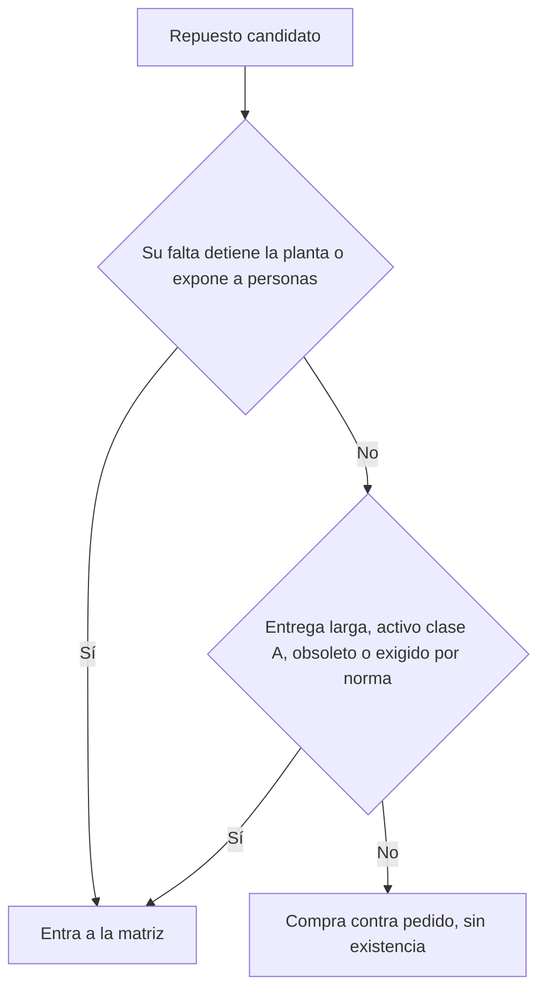

## Qué decide este documento

Tres frases: qué se guarda en bodega, qué no se guarda y con qué argumento se defiende cada renglón delante de dirección.

- Alcance: [subestación, área o familia de equipos; di también qué queda fuera].
- Fuente de la criticidad: [análisis de criticidad de activos, con fecha], no la memoria del turno.
- Decisión que sale de aquí: [presupuesto de inventario, órdenes de compra, contratos de consignación].
- Firman mantenimiento eléctrico, almacén, compras y producción. Sin producción no hay costo de paro; sin compras no hay tiempo de reposición real.

## Criterio de inclusión

Un renglón entra a bodega si cumple al menos uno de estos criterios. Anota cuál en la columna Motivo: el renglón sin motivo escrito se revisa para salir.

1. **Para la planta.** Su falta detiene producción, un servicio de seguridad o un sistema de emergencia, o impide restablecer el servicio en condiciones seguras — [línea, área o planta completa].
2. **Reposición intolerable.** La entrega del proveedor supera lo que la operación aguanta: compara [semanas de entrega] contra [horas o días tolerables sin ese equipo].
3. **Activo de criticidad alta.** El equipo quedó en clase A del análisis de criticidad, con respaldo nulo o parcial.
4. **Obsoleto o de importación.** Fuera de catálogo, proveedor único, importado o sujeto a aduana y tipo de cambio.
5. **Exigido por fuera.** Lo pide la norma que te aplica, la póliza del seguro, el contrato con el cliente o el fabricante como condición de la garantía.

No entra: consumible con proveedor local en [24 horas], repuesto de activo clase C con reposición corta, y lo que ya cubre un contrato de servicio con tiempo de respuesta garantizado por escrito. Aplica las compuertas en este orden: la primera que dé sí basta para incluirlo, y esa es la que se anota como motivo.

## Tabla maestra

Una fila por renglón de bodega. Va partida en dos y se une por el código: la primera dice qué es y dónde va, la segunda cuánto se guarda, cuánto cuesta y quién lo trae.

| Código | Descripción | Equipo y TAG | Cant. instalada | Intercambiable con | Criticidad | Motivo |
| --- | --- | --- | :---: | --- | :---: | :---: |
| [SKU o código de almacén] | [Relé de sobrecorriente, modelo y ajuste] | [Celda de media tensión, TAG] | [3] | [TAG de las otras celdas iguales] | [A] | [1] |
| [SKU] | [Tarjeta de control de variador, número de parte] | [Variador de bomba, TAG] | [1] | [ninguno] | [A] | [4] |

| Código | Reposición | Mínimo | Máximo | Existencia | Costo unitario | Ubicación | Proveedor | Alterno |
| --- | :---: | :---: | :---: | :---: | ---: | --- | --- | --- |
| [SKU] | [12 semanas] | [1] | [2] | [1] | [USD] | [pasillo, estante, nivel] | [fabricante o distribuidor] | [equivalente homologado] |
| [SKU] | [8 semanas] | [1] | [1] | [0] | [USD] | [gabinete con protección electrostática] | [fabricante] | [reacondicionado con garantía] |

- Intercambiabilidad: el renglón que sirve en varios TAG se guarda una vez, no una por equipo. Escribe los TAG, no "varios".
- Criticidad y motivo: la clase sale del análisis de criticidad vigente y el motivo es el número del criterio de inclusión. Si el activo cambia de clase, este renglón se recalcula.

> Datos al [fecha de corte], tomados de [CMMS o sistema de almacén] y confirmados con inventario físico el [fecha].

## Cómo se calcula el mínimo

El mínimo cubre lo que se consume mientras el proveedor entrega; el máximo evita comprar de más. Dos operaciones, en texto plano.

- Consumo esperado durante la reposición = consumo promedio por mes × meses de tiempo de reposición
- Mínimo = consumo esperado durante la reposición + reserva por incertidumbre
- Máximo = mínimo + lote de compra o de fabricación

La reserva sale del historial: cuánto varió el consumo y cuánto se atrasó el proveedor en los últimos [3 a 5 años]. Sin historial no hay fórmula que salve. Dos salidas en cinco años no son estadística, y ninguna hoja de cálculo convierte una corazonada en dato: márcalo como estimado, ponle fecha de revisión y registra cada salida desde hoy.

Para el repuesto que casi nunca se mueve pero que para la planta, la pregunta no es cuánto se consume al año, sino esta comparación:

- Costo de tenerlo un año = costo unitario × cantidad × [tasa de posesión anual][^1]
- Costo de no tenerlo = horas de paro que añade esperar al proveedor × [costo de la hora de paro, dato de producción] × probabilidad de falla en el año

Si el segundo número es mayor, el repuesto entra, y así se defiende delante de dirección: no es inventario, es una póliza contra una parada concreta. El segundo repuesto del mismo renglón se justifica aparte, y solo con la probabilidad de que falle otra vez dentro de la ventana de reposición del primero.

## Repuestos con condiciones de almacenamiento

Guardar mal es pagar dos veces: compraste el repuesto y no sirve el día que lo necesitas. Cada familia lleva responsable y fecha en el plan de mantenimiento, igual que un equipo instalado.

| Familia | Qué le pasa guardado | Qué se le hace | Cada cuánto |
| --- | --- | --- | :---: |
| Baterías y celdas de respaldo | Se autodescargan y se sulfatan sin remedio | Carga de refresco y registro de tensión por celda, según la ficha del fabricante y la práctica IEEE que aplique al tipo | [intervalo del fabricante] |
| Tarjetas electrónicas y módulos de control | Descarga electrostática y humedad; el daño no se ve hasta que arranca | Bolsa apantallada cerrada, manipulación en área controlada y trazabilidad, según ANSI/ESD S20.20 y su norma de empaque | En cada movimiento |
| Variadores y arrancadores suaves de repuesto | Los condensadores del bus de corriente continua se degradan sin tensión | Reformado de condensadores según el manual del fabricante | [según el fabricante; en las series de su guía, ABB lo pide tras más de un año sin operar y lo recomienda cada año] |
| Aceite dieléctrico y transformadores de repuesto | Humedad y contaminación; presión de nitrógeno perdida | Recipiente sellado y bajo techo, control de presión, y ensayo de rigidez dieléctrica antes de usarlo | [según la norma de ensayo que apliques] |
| Empaques, sellos y elastómeros | Endurecen con calor, luz y ozono; vida de anaquel limitada | Rotación por fecha, primero el más viejo, y baja del que venció | [vida de anaquel del fabricante] |

> [!CAUTION]
> No energices un variador, un banco de capacitores ni un interruptor que lleve años en bodega sin hacer antes lo que pida su manual. Sin reformado, los condensadores pueden dañarse al arrancar, y esa falla no se puede predecir ni ver por fuera: aparece con tensión plena y con gente delante del gabinete. Reformar tarda una tarde; reponer la celda e investigar el incidente tarda meses.

## Obsolescencia anunciada y plan de sustitución

El aviso de fin de fabricación llega por correo y se pierde. Aquí se registra y se le pone fecha límite, con la lógica de un plan de obsolescencia: comprar de por vida, sustituir por equivalente o rediseñar.

| Renglón o equipo | Aviso del fabricante | Fin de soporte | Existencia hoy | Opción elegida | Fecha límite |
| --- | --- | --- | :---: | --- | --- |
| [tarjeta, relé o variador] | [fecha y referencia del aviso] | [fecha] | [cantidad] | [compra de por vida / equivalente homologado / reacondicionado con garantía / retrofit del equipo] | [fecha] |

- La compra de por vida se calcula con los años que le queden al activo, no con lo que quepa en el presupuesto de este año.
- El equivalente se homologa antes de comprarlo: dimensiones, curva de disparo, ajustes, protocolo de comunicación y capacidad de interrupción. Un repuesto que no coordina con la protección aguas arriba no es un repuesto, y el reacondicionado entra solo con garantía escrita y protocolo de pruebas del taller.

## Repuestos compartidos y en consignación

Existencia que no controlas no es existencia hasta que esté en tu bodega. Escribe el tiempo real de traslado, no el que dice el correo.

| Renglón | Con quién está | Dónde | Tiempo real hasta esta planta | Quién autoriza el traslado | Documento que lo respalda |
| --- | --- | --- | :---: | --- | --- |
| [SKU] | [planta hermana] | [ciudad] | [horas o días, con aduana si cruza frontera] | [nombre y cargo] | [acuerdo interno firmado] |
| [SKU] | [fabricante o distribuidor] | [bodega del proveedor] | [horas o días] | [nombre y cargo] | [contrato de consignación con cantidad comprometida] |

> [!WARNING]
> La consignación y el inventario administrado por el proveedor funcionan con lo que rota. Para el repuesto crítico que sale una vez cada diez años, el distribuidor no tiene motivo para tenerlo en anaquel, y te enteras el día de la falla. Si el renglón es clase A, exige cantidad comprometida y penalización en el contrato, o guárdalo tú.

## Revisión de la matriz

Se revisa con calendario, y además cada vez que pasa algo de esta lista. Sin revisión, en [dos años] la matriz describe una planta que ya no existe.

- Cadencia: renglones clase A cada [6 meses], el resto cada [12 meses], e inventario físico de críticos [una vez al año].
- [ ] Falla que consumió un repuesto crítico, con o sin paro
- [ ] Cambio de clase de criticidad, alta o baja de equipo, retrofit o ampliación eléctrica
- [ ] Cambio de proveedor, de tiempo de entrega, de condiciones de importación o aviso de obsolescencia
- [ ] Estudio nuevo de cortocircuito o de coordinación que cambie modelos y ajustes

Con lo que lleva [24 meses] sin moverse no se improvisa. Primero comprueba si el activo sigue instalado. Si el activo ya salió de planta, el renglón se da de baja: se ofrece a otra planta, se devuelve al proveedor o se vende. Si el activo sigue y es clase A, el renglón se queda aunque nunca haya rotado, se anota como póliza en el acta de revisión y se le renueva la fecha. Bajar un repuesto crítico solo porque no rota es el ahorro que se paga con una parada.

## Indicadores

Cuatro números, con meta y responsable. Se llevan al informe mensual de mantenimiento y los dos primeros se leen juntos: bajar el inventario sin mirar la rotura no es eficiencia, es mover el costo al día de la falla.

| Indicador | Fórmula | Meta | Fuente |
| --- | --- | :---: | --- |
| Rotura de stock | renglones pedidos y no disponibles ÷ renglones pedidos × 100 | [%] | [CMMS o almacén] |
| Cobertura de activos críticos | activos clase A con repuesto definido y disponible ÷ total de activos clase A × 100 | [%] | Matriz y análisis de criticidad |
| Valor inmovilizado | suma de existencia × costo unitario | [monto] | [sistema de almacén] |
| Inventario sin movimiento | valor de renglones sin salida en [24 meses] ÷ valor total × 100 | [%] | [sistema de almacén] |

## Con qué se conecta esta matriz

Esta matriz no vive sola. Si alguno de estos documentos cambia, este se revisa.

- Gestión de activos, familia ISO 55000: el inventario es dinero inmovilizado para controlar riesgo, y se justifica con el mismo criterio de costo, riesgo y desempeño que el resto del gasto.
- Análisis de criticidad y de modos de falla: de ahí salen la clase de cada activo y la lista de repuestos que la falla exige.
- Plan maestro de mantenimiento: los repuestos con condiciones de almacenamiento llevan tarea programada, responsable y frecuencia; la orden de trabajo reserva el repuesto antes del paro y su consumo dispara la reposición el mismo día.

## Seguridad al retirar y montar el repuesto

Cambiar un repuesto es trabajo eléctrico, aunque el almacén ya lo haya entregado. Esta sección se lee antes de bajar a planta.

> [!WARNING]
> Desenergizar es la regla. Trabajar con tensión es la excepción y exige justificación escrita, análisis de riesgo, permiso autorizado y personal calificado; nunca por prisa ni porque el repuesto ya esté en la mano. Antes de tocar cualquier parte, aplica las cinco reglas de oro: cortar todas las fuentes, bloquear y señalizar el medio de corte, verificar ausencia de tensión con instrumento probado antes y después, poner a tierra y en cortocircuito, y delimitar la zona de trabajo. El EPP y las distancias salen de las tablas de la norma vigente, no de esta plantilla.

Sustituye la norma por la que te aplique: NFPA 70E y NEC (NFPA 70) en buena parte de América, IEC 60364 en el ámbito internacional, y la local que te obligue: NOM-001-SEDE (México), RETIE (Colombia), normas de la CNEE (Guatemala), AEA/IRAM (Argentina).

## Próximos pasos

- [ ] Cerrar la lista de activos clase A con sus repuestos — [responsable] — [fecha]
- [ ] Confirmar por escrito los tiempos de reposición reales con cada proveedor — [responsable] — [fecha]
- [ ] Cargar códigos, mínimos y máximos en el CMMS, y programar las tareas de conservación de repuestos — [responsable] — [fecha]
- [ ] Llevar a dirección el caso de los renglones de compra de por vida — [responsable] — [fecha]

[^1]: La tasa de posesión anual es lo que cuesta tener el repuesto guardado un año, en porcentaje de su valor: dinero inmovilizado, espacio, seguro, conteos, tareas de conservación y pérdida de valor por obsolescencia. Pídele el porcentaje a finanzas y anota de qué fecha es; si lo inventas, todo el cálculo que sigue queda inventado.

## Referencias

*De dónde sale este formato. Borra esta sección al usar la plantilla.*

- [Spare Parts Inventory: An Exercise in Risk Management](https://reliabilityweb.com/articles/entry/spare_parts_inventory_an_exercise_in_risk_management) — el repuesto como póliza y el tiempo de reposición como ventana de riesgo del segundo repuesto.
- [The Role of Critical Spares Analysis in Validating Spare Parts Recommendations](https://reliabilityweb.com/articles/entry/the_role_of_critical_spares_analysis_in_validating_spare_parts) — el análisis parte de la criticidad del activo y del AMEF, y se justifica en dinero, no en opinión.
- [MRO Inventory Rationalization and Optimization](https://reliabilityweb.com/articles/entry/MRO_Inventory_Rationalization_and_Optimization) — mínimos y máximos con historial de demanda, riesgo del inventario administrado por el proveedor y salida del material obsoleto.
- [IEC 62402:2019, Obsolescence management](https://webstore.iec.ch/en/publication/59531) — requisitos y guía de obsolescencia: política, plan (OMP) y métodos de resolución.
- [ABB, Guide for capacitor reforming](https://library.e.abb.com/public/79afb1796ad24a19bf2970771c6892e4/Guide_for_capacitor_reforming_Rev_G.pdf) — en las series que cubre, reformar los condensadores tras más de un año sin operar y una vez al año.
- [An Overview of ANSI/ESD S20.20](https://www.esda.org/news/an-overview-of-ansiesd-s20-20/) — programa de control electrostático, área protegida y empaque para mover componentes sensibles.
