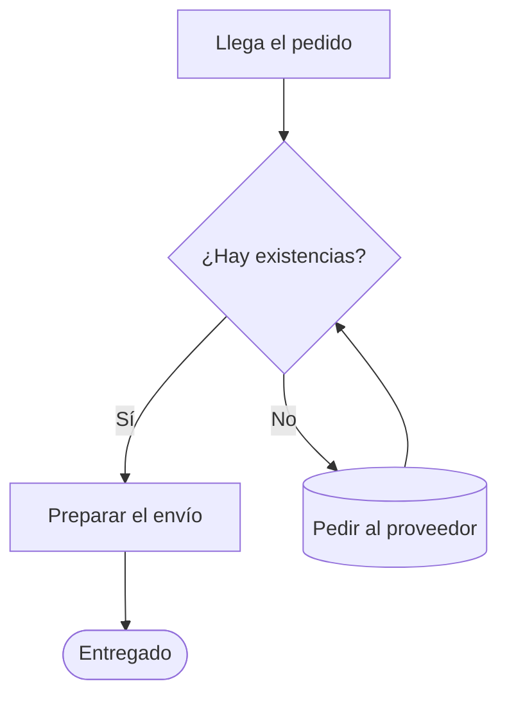
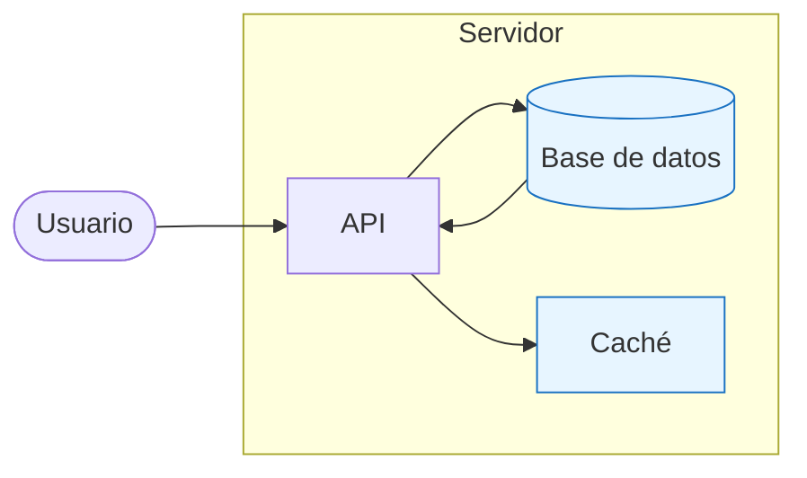
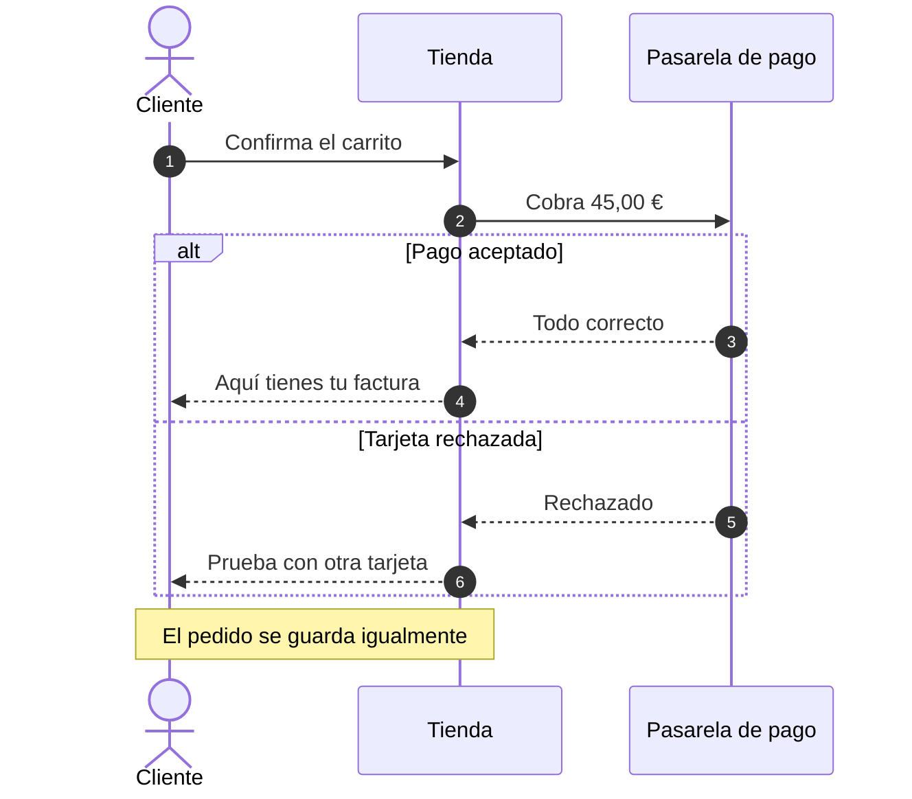
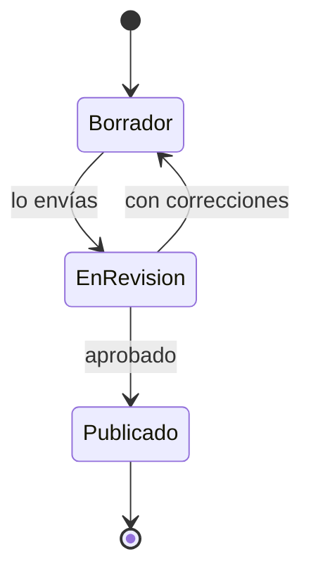
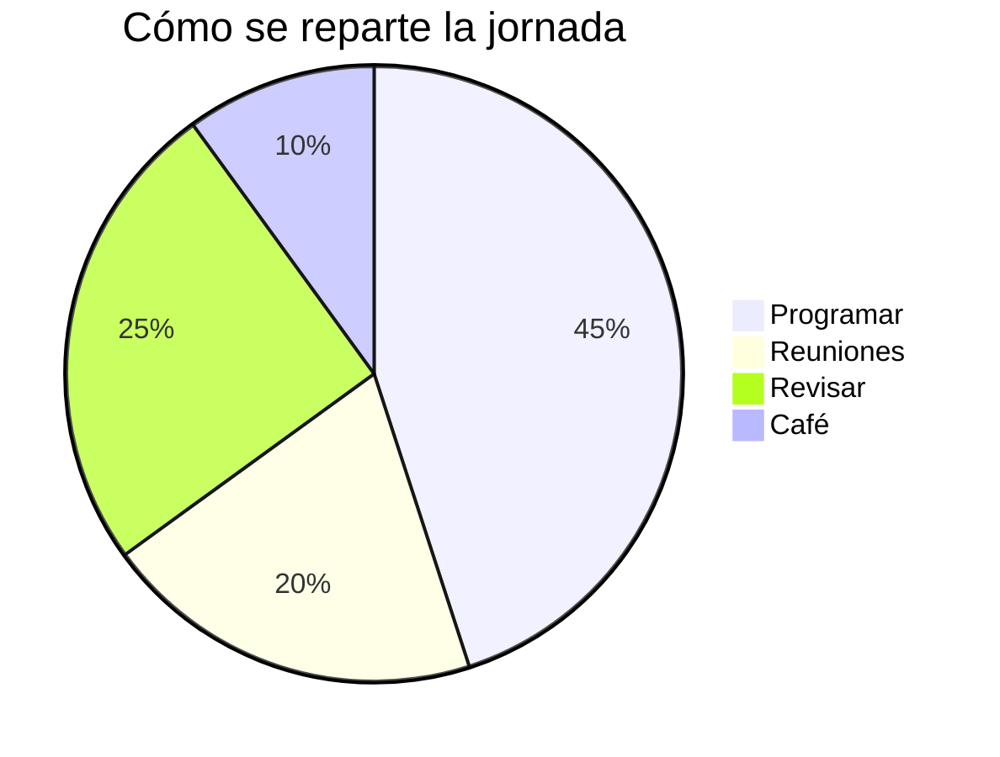

Un catálogo de **toda la sintaxis** de Markdown, cada cosa con su resultado al lado. Búscalo aquí cuando no recuerdes cómo se escribía algo, cópialo y sigue con lo tuyo.

> [!TIP]
> Pulsa **&#9998; Editar** para escribir aquí mismo y ver el resultado al lado. Con **&#10515; .html** te llevas una copia de esta página, con tu texto dentro, que funciona sin internet.

[TOC]

## 1. Cómo usar esta plantilla

### Escribir

1. Pulsa **✎ Editar**: a la izquierda escribes, a la derecha ves el resultado.
2. Lo que escribas se guarda solo en este navegador; al volver, sigue donde lo dejaste.
3. Con **⤓ .md** te llevas el texto; con **⤓ .html**, una copia completa de esta página, con tu documento dentro, que se abre sin internet.

### Imprimir o guardar en PDF

Pulsa **&#128424; Imprimir** (o <kbd>Ctrl</kbd>+<kbd>P</kbd>). La barra de botones, el editor y los enlaces de anclaje desaparecen solos: solo se imprime el documento. En el destino de impresión elige *Guardar como PDF* para obtener un PDF.

### Las cuatro reglas de oro

- **Pega el texto al margen izquierdo.** Cuatro espacios al principio de una línea convierten el texto en un bloque de código.
- **Deja una línea en blanco** entre párrafos, listas, tablas y títulos. Es lo que separa un bloque de otro.
- **No escribas la etiqueta de cierre de script tal cual** dentro de tu texto: cortaría el archivo. Si necesitas mencionarla, escríbela con barra invertida: `<\/script>`.
- **Guarda el archivo en UTF-8** para que los acentos y las eñes se vean bien. El Bloc de notas de Windows lo hace por defecto; si te salen símbolos raros, usa *Archivo → Guardar como → Codificación: UTF-8*.

## 2. Metadatos del documento (front matter)

Las primeras líneas del archivo, entre dos líneas de tres guiones, describen el documento. No son obligatorias, pero si las pones se dibuja una portada y el título aparece en la pestaña del navegador y en la cabecera del PDF.

````yaml
---
titulo: Guía y plantilla completa de Markdown
subtitulo: Toda la sintaxis, con su resultado al lado
autor: Tu nombre
fecha: 21 de agosto de 2026
---
````

Se admiten `titulo`, `subtitulo`, `autor` y `fecha` (también en inglés: `title`, `subtitle`, `author`, `date`). La portada de arriba está generada con ese bloque.

## 3. Encabezados

### Estilo almohadilla

Una a seis almohadillas y un espacio. Es el estilo que conviene usar siempre.

````md
# Título del documento
## Sección
### Apartado
#### Subapartado
##### Nivel cinco
###### Nivel seis
````

### Estilo subrayado

Solo existe para dos niveles. Se subraya el texto con signos igual o con guiones.

````md
Título de nivel 1
=================

Título de nivel 2
-----------------
````

> [!WARNING]
> Una línea de guiones justo debajo de un párrafo lo convierte en título de nivel 2 en vez de dibujar una raya. Si lo que quieres es una raya divisoria, deja una línea en blanco antes.

### Identificador propio

Por defecto cada título recibe un identificador para poder enlazarlo. Puedes fijarlo tú entre llaves al final:

````md
## Presupuesto anual {#presupuesto}
````

Después enlazas con `[ver presupuesto](#presupuesto)`.

### Índice automático

Escribe `[TOC]` en una línea sola y se genera el índice con todos los títulos del documento, cada uno enlazado a su sección. El índice del principio de esta página es exactamente eso.

## 4. Párrafos y saltos de línea

Un párrafo es texto seguido; para empezar otro se deja **una línea en blanco**. Pulsar Intro una sola vez no basta: esas dos líneas se unen en un mismo párrafo.

Para forzar un salto dentro del mismo párrafo hay tres formas: terminar la línea con **dos espacios**, terminarla con una **barra invertida**, o escribir `<br>`.

````md
Primera línea con dos espacios al final.  
Segunda línea del mismo párrafo.

Primera línea con barra invertida.\
Segunda línea.

Primera línea con etiqueta.<br>
Segunda línea.
````

<div class="demo">

Primera línea con dos espacios al final.  
Segunda línea del mismo párrafo.

</div>

Para separar bloques con aire de más, una línea con `&nbsp;` (un espacio duro) funciona como párrafo vacío.

## 5. Énfasis y estilos de texto

| Escribes | Se ve |
| --- | --- |
| `*cursiva*` o `_cursiva_` | *cursiva* |
| `**negrita**` o `__negrita__` | **negrita** |
| `***negrita y cursiva***` | ***negrita y cursiva*** |
| `~~tachado~~` | ~~tachado~~ |
| `==resaltado==` | ==resaltado== |
| `` `código` `` | `código` |
| `H~2~O` (subíndice) | H~2~O |
| `x^2^` (superíndice) | x^2^ |
| `<kbd>Ctrl</kbd>` | <kbd>Ctrl</kbd> |
| `<small>letra pequeña</small>` | <small>letra pequeña</small> |
| `<u>subrayado</u>` | <u>subrayado</u> |

Se pueden combinar sin problema: ``**texto _mezclado_ con `código`**`` se ve como **texto _mezclado_ con `código`**.

> [!NOTE]
> El guión bajo dentro de una palabra no marca cursiva, para no romper nombres como `mi_variable_larga`. Si necesitas cursiva a mitad de palabra, usa asteriscos.

## 6. Listas

### Lista sin orden

Guión, asterisco o signo más; los tres valen, pero conviene no mezclarlos dentro del mismo documento.

````md
- Primer punto
- Segundo punto
- Tercer punto
````

<div class="demo">

- Primer punto
- Segundo punto
- Tercer punto

</div>

### Lista numerada

````md
1. Preparar el material
2. Redactar el borrador
3. Revisar y publicar
````

<div class="demo">

1. Preparar el material
2. Redactar el borrador
3. Revisar y publicar

</div>

Los números que escribes no importan: el navegador renumera solo. Sí importa **el primero**, que fija dónde empieza la cuenta.

````md
5. Este punto es el número cinco
1. y este sale como el seis
1. y este como el siete
````

<div class="demo">

5. Este punto es el número cinco
1. y este sale como el seis
1. y este como el siete

</div>

### Listas anidadas

Se anidan con **dos o cuatro espacios** de sangría respecto al punto padre.

````md
- Frutas
  - Cítricos
    - Naranja
    - Limón
  - Tropicales
- Verduras
  1. Hoja verde
  2. Raíz
````

<div class="demo">

- Frutas
  - Cítricos
    - Naranja
    - Limón
  - Tropicales
- Verduras
  1. Hoja verde
  2. Raíz

</div>

### Lista de tareas

````md
- [x] Comprar el dominio
- [x] Montar la plantilla
- [ ] Escribir el primer documento
- [ ] Imprimirlo
````

<div class="demo">

- [x] Comprar el dominio
- [x] Montar la plantilla
- [ ] Escribir el primer documento
- [ ] Imprimirlo

</div>

### Listas apretadas y listas sueltas

Sin líneas en blanco entre puntos, la lista sale **apretada**. Con una línea en blanco entre ellos, sale **suelta** y cada punto se separa como un párrafo.

<div class="demo">

- Apretada, una línea
- Apretada, otra línea

</div>

<div class="demo">

- Suelta, con aire alrededor

- Suelta, segundo punto

</div>

### Un punto con varios párrafos

Para meter más de un párrafo, una cita o un bloque de código dentro de un mismo punto, se sangra el contenido a la altura del texto del punto.

````md
1. Primer paso del proceso.

   Este párrafo sigue perteneciendo al paso uno porque está sangrado.

   ```
   comando --de --ejemplo
   ```

2. Segundo paso.
````

<div class="demo">

1. Primer paso del proceso.

   Este párrafo sigue perteneciendo al paso uno porque está sangrado.

   ```
   comando --de --ejemplo
   ```

2. Segundo paso.

</div>

## 7. Citas y avisos

### Cita normal

````md
> El buen diseño es tan poco diseño como sea posible.
>
> — Dieter Rams
````

<div class="demo">

> El buen diseño es tan poco diseño como sea posible.
>
> — Dieter Rams

</div>

### Citas anidadas y con contenido

````md
> Nivel uno de la cita.
>
> > Nivel dos, citando a otro.
>
> - También caben listas
> - y `código`
````

<div class="demo">

> Nivel uno de la cita.
>
> > Nivel dos, citando a otro.
>
> - También caben listas
> - y `código`

</div>

### Avisos de colores

Una cita que empieza por una etiqueta entre corchetes con admiración se convierte en un recuadro de color. Sirven `[!NOTE]`, `[!TIP]`, `[!IMPORTANT]`, `[!WARNING]` y `[!CAUTION]` (o en español `[!NOTA]`, `[!CONSEJO]`, `[!IMPORTANTE]`, `[!AVISO]` y `[!PRECAUCION]`).

````md
> [!NOTE]
> Información útil que conviene tener presente.

> [!TIP]
> Un atajo o una recomendación.

> [!IMPORTANT]
> Algo imprescindible para que el resto funcione.

> [!WARNING]
> Cuidado: esto puede dar problemas.

> [!CAUTION]
> Riesgo real de perder datos o romper algo.
````

<div class="demo">

> [!NOTE]
> Información útil que conviene tener presente.

> [!TIP]
> Un atajo o una recomendación.

> [!IMPORTANT]
> Algo imprescindible para que el resto funcione.

> [!WARNING]
> Cuidado: esto puede dar problemas.

> [!CAUTION]
> Riesgo real de perder datos o romper algo.

</div>

## 8. Código

### Código dentro de una frase

Se envuelve entre acentos graves: `` `npm install` `` se ve como `npm install`.

Si el propio código lleva un acento grave, se usan dos por fuera: ``` `` `así` `` ``` da `` `así` ``.

### Bloques de código

Tres acentos graves antes y después. Si escribes el nombre del lenguaje detrás de los primeros, aparece la etiqueta en la esquina y el código se colorea solo (ver el apartado 23).

````md
```js
function saludar(nombre) {
  return `Hola, ${nombre}`;
}
```
````

<div class="demo">

```js
function saludar(nombre) {
  return `Hola, ${nombre}`;
}
```

</div>

Nombres habituales: `js`, `ts`, `html`, `css`, `json`, `python`, `bash`, `sql`, `yaml`, `md`, `diff`, `text`. La lista completa de los que se colorean está en el apartado 23.

### Bloques con virgulillas

Tres virgulillas hacen lo mismo. Sirven para mostrar bloques que contienen acentos graves.

````md
~~~
Aquí dentro pueden ir ``` sin cerrar el bloque.
~~~
````

### Un bloque dentro de otro

Para enseñar un bloque de tres acentos, el bloque de fuera lleva cuatro. Es lo que hace esta guía en cada ejemplo.

### Bloque por sangría

Cuatro espacios al principio de la línea también crean un bloque de código, aunque es la forma antigua y da sustos cuando uno sangra sin querer.

<div class="demo">

    esto es código por llevar cuatro espacios
    segunda línea

</div>

### Marcar diferencias

````md
```diff
- const color = "rojo";
+ const color = "azul";
  const tamano = 12;
```
````

<div class="demo">

```diff
- const color = "rojo";
+ const color = "azul";
  const tamano = 12;
```

</div>

## 9. Enlaces

| Escribes | Se ve |
| --- | --- |
| `[texto del enlace](https://ejemplo.com)` | [texto del enlace](https://ejemplo.com) |
| `[con título](https://ejemplo.com "sale al pasar el ratón")` | [con título](https://ejemplo.com "sale al pasar el ratón") |
| `<https://ejemplo.com>` | <https://ejemplo.com> |
| `<correo@ejemplo.com>` | <correo@ejemplo.com> |
| `[a otra sección](#11-tablas)` | [a otra sección](#11-tablas) |
| `[a un archivo](./informe.pdf)` | [a un archivo](./informe.pdf) |
| `[con **negrita** dentro](https://ejemplo.com)` | [con **negrita** dentro](https://ejemplo.com) |

Una dirección suelta como https://www.ejemplo.com también se convierte en enlace sola.

### Enlaces por referencia

Cuando la misma dirección se repite, o cuando es tan larga que estorba, se pone una etiqueta corta en el texto y la dirección al final del documento.

````md
Consulta la [documentación oficial][doc] y el [repositorio][repo].
También vale la forma corta: [doc].

[doc]: https://ejemplo.com/documentacion "Documentación"
[repo]: https://ejemplo.com/repositorio
````

<div class="demo">

Consulta la [documentación oficial][doc] y el [repositorio][repo]. También vale la forma corta: [doc].

</div>

[doc]: https://ejemplo.com/documentacion "Documentación"
[repo]: https://ejemplo.com/repositorio

Las líneas de definición se pueden colocar donde quieras: no se imprimen.

### Enlaces internos

Cada título tiene un identificador que se forma pasando el texto a minúsculas, quitando acentos y símbolos y cambiando los espacios por guiones. «## 11. Tablas» se convierte en `#11-tablas`. Pasa el ratón por encima de cualquier título de esta página y aparece una almohadilla a la derecha: es su enlace.

## 10. Imágenes y figuras

La sintaxis es la del enlace con una admiración delante. El texto entre corchetes es la descripción alternativa: se lee en voz alta para quien no ve la imagen y aparece si el archivo falta.

````md


[](https://ejemplo.com)
````

<div class="demo">


</div>

Las rutas son relativas al archivo HTML: si tus imágenes están en una carpeta `fotos` junto al documento, escribe `fotos/lo-que-sea.jpg`. También sirve una dirección de internet completa, pero entonces la imagen no se verá sin conexión.

### Controlar el tamaño

Markdown no tiene sintaxis para el tamaño; se usa HTML directamente:

````md

````

### Imagen con pie

````md
<figure>
  
  <figcaption>Figura 1. Texto del pie de la imagen.</figcaption>
</figure>
````

<div class="demo">

<figure>

<figcaption>Figura 1. Texto del pie de la imagen.</figcaption>
</figure>

</div>

## 11. Tablas

Las barras verticales separan las columnas y la segunda línea marca dónde acaba la cabecera. No hace falta que las barras queden alineadas en el archivo: el navegador lo cuadra solo.

````md
| Producto | Cantidad | Precio |
| --- | --- | --- |
| Café | 2 | 8,50 € |
| Té | 1 | 4,20 € |
````

<div class="demo">

| Producto | Cantidad | Precio |
| --- | --- | --- |
| Café | 2 | 8,50 € |
| Té | 1 | 4,20 € |

</div>

### Alineación de columnas

Los dos puntos en la línea de guiones deciden la alineación: a la izquierda, centrada o a la derecha.

````md
| Izquierda | Centrada | Derecha |
| :--- | :---: | ---: |
| Texto | Texto | 1.250,00 |
| Más texto | Más texto | 87,50 |
````

<div class="demo">

| Izquierda | Centrada | Derecha |
| :--- | :---: | ---: |
| Texto | Texto | 1.250,00 |
| Más texto | Más texto | 87,50 |

</div>

### Detalles útiles

- Dentro de las celdas funciona el formato normal: **negrita**, `código`, [enlaces](#11-tablas).
- Una celda vacía se deja sin nada entre las barras.
- Para escribir una barra vertical dentro de una celda, se escapa: `\|`.
- No se pueden partir celdas en varias líneas ni juntar celdas. Si necesitas eso, usa una tabla en HTML.

<div class="demo">

| Concepto | Detalle |
| --- | --- |
| Con formato | **negrita**, *cursiva* y `código` |
| Celda vacía | |
| Con barra | `a \| b` se ve como a \| b |

</div>

## 12. Líneas divisorias

Tres o más guiones, asteriscos o guiones bajos en una línea sola, siempre con una línea en blanco por encima.

````md
---
***
___
````

<div class="demo">

---

</div>

## 13. Notas al pie

Se marca el punto con un corchete y un acento circunflejo, y en cualquier otro sitio del documento se escribe el texto de la nota. Se numeran solas por orden de aparición y se colocan todas juntas al final de la página.

````md
Esto necesita una aclaración[^1] y esto otra[^fuente].

[^1]: El texto de la primera nota.
[^fuente]: Se puede usar una palabra como etiqueta en vez de un número.
````

<div class="demo">

Esto necesita una aclaración[^1] y esto otra[^fuente].

</div>

Baja al final de esta página: ahí están las dos notas, con una flecha para volver al punto exacto donde estabas.

[^1]: El texto de la primera nota. Puede llevar **formato** y [enlaces](#13-notas-al-pie).
[^fuente]: Se puede usar una palabra como etiqueta en vez de un número; el número se calcula solo.

## 14. Listas de definiciones

Un término en una línea y su definición debajo, empezando por dos puntos y un espacio. Un término puede tener varias definiciones.

````md
Markdown
: Lenguaje de marcas ligero para escribir con formato en texto plano.

HTML
: El idioma que entiende el navegador.
: Se puede mezclar con Markdown.
````

<div class="demo">

Markdown
: Lenguaje de marcas ligero para escribir con formato en texto plano.

HTML
: El idioma que entiende el navegador.
: Se puede mezclar con Markdown.

</div>

## 15. Abreviaturas

Se declara una vez en cualquier parte del documento y a partir de ahí, cada vez que la palabra aparezca, sale subrayada con puntitos y con su explicación al pasar el ratón.

````md
*[HTML]: Lenguaje de marcado para páginas web
*[PDF]: Formato de documento portátil

Este archivo es HTML y se puede imprimir en PDF.
````

<div class="demo">

Este archivo es HTML y se puede imprimir en PDF. Pasa el ratón por encima de las siglas.

</div>

*[HTML]: Lenguaje de marcado para páginas web
*[PDF]: Formato de documento portátil

## 16. Emojis

Se pueden pegar tal cual (🚀) o escribir su nombre entre dos puntos.

| Escribes | Se ve | | Escribes | Se ve |
| --- | :---: | --- | --- | :---: |
| `:white_check_mark:` | :white_check_mark: | | `:warning:` | :warning: |
| `:x:` | :x: | | `:bulb:` | :bulb: |
| `:rocket:` | :rocket: | | `:fire:` | :fire: |
| `:star:` | :star: | | `:tada:` | :tada: |
| `:pushpin:` | :pushpin: | | `:memo:` | :memo: |
| `:bug:` | :bug: | | `:zap:` | :zap: |
| `:books:` | :books: | | `:mag:` | :mag: |
| `:thumbsup:` | :thumbsup: | | `:eyes:` | :eyes: |
| `:lock:` | :lock: | | `:gear:` | :gear: |
| `:calendar:` | :calendar: | | `:chart:` | :chart: |

Si el nombre no está en la lista, el texto se queda tal cual, así que no se rompe nada.

## 17. HTML dentro de Markdown

Todo lo que Markdown no cubre se resuelve escribiendo HTML directamente. La única regla es dejar una línea en blanco antes y después del bloque.

### Detalles plegables

````md
<details>
<summary>Pulsa para desplegar</summary>

Aquí dentro se sigue escribiendo **Markdown normal**, siempre que haya
una línea en blanco después de la etiqueta de resumen.

</details>
````

<div class="demo">

<details>
<summary>Pulsa para desplegar</summary>

Aquí dentro se sigue escribiendo **Markdown normal**, siempre que haya una línea en blanco después de la etiqueta de resumen.

</details>

</div>

### Etiquetas útiles

| Escribes | Se ve |
| --- | --- |
| `<kbd>Ctrl</kbd> + <kbd>P</kbd>` | <kbd>Ctrl</kbd> + <kbd>P</kbd> |
| `<mark>resaltado</mark>` | <mark>resaltado</mark> |
| `<abbr title="Por ejemplo">p. ej.</abbr>` | <abbr title="Por ejemplo">p. ej.</abbr> |
| `<sup>arriba</sup>` y `<sub>abajo</sub>` | <sup>arriba</sup> y <sub>abajo</sub> |
| `<u>subrayado</u>` | <u>subrayado</u> |
| `<span style="color:#cf222e">en rojo</span>` | <span style="color:#cf222e">en rojo</span> |
| `<br>` | un salto de línea |

### Centrar y repartir en columnas

Esta plantilla trae tres clases preparadas: `centrado`, `dos-columnas` y `salto-pagina`.

````md
<p class="centrado">Este párrafo va centrado.</p>

<div class="dos-columnas">

Texto largo que se reparte en dos columnas al imprimir...

</div>
````

<div class="demo">

<p class="centrado">Este párrafo va centrado.</p>

<div class="dos-columnas">

El texto que va dentro de este bloque se reparte solo en dos columnas y salta a la segunda cuando la primera se llena, igual que en un periódico. Sirve para listas largas, para notas al pie de un informe o para aprovechar el papel cuando el texto es corto y sobra hueco a la derecha. Si la pantalla es estrecha, o si el papel no da de sí, vuelve a una sola columna sin que haya que tocar nada.

</div>

</div>

Ojo con dos detalles: hay que dejar una línea en blanco después de `<div ...>` y otra antes de `</div>`, porque si no el Markdown de dentro no se convierte; y las columnas solo se notan cuando hay texto suficiente para llenar la primera.

## 18. Escapar caracteres

Delante de un carácter con significado especial se pone una barra invertida y el carácter se escribe tal cual, sin transformarse.

````md
\*esto no va en cursiva\*
\# esto no es un título
2 \* 3 \= 6
````

<div class="demo">

\*esto no va en cursiva\*  
\# esto no es un título

</div>

Se pueden escapar: `\ ` `` ` `` `*` `_` `{ }` `[ ]` `( )` `#` `+` `-` `.` `!` `|` `~` `^` `=` `<` `>` `$` `:` `/` `"` `'`

También funcionan las entidades de HTML: `&copy;` da &copy;, `&nbsp;` da un espacio que no se parte, `&mdash;` da &mdash; y `&hellip;` da &hellip;

## 19. Comentarios ocultos

Un comentario de HTML no se ve en la página ni se imprime, pero queda escrito en el archivo. Sirve para notas al margen, recordatorios o para apagar un trozo sin borrarlo.

````md
<!-- Recordar actualizar las cifras antes de imprimir -->
````

<!-- Este comentario existe en el archivo pero no se ve en la página. -->

## 20. Preparar la impresión

- **Forzar un cambio de página:** `<div class="salto-pagina"></div>` en una línea sola.
- **Márgenes del papel:** se cambian en la hoja de estilo, en la regla `@page`, arriba del archivo.
- Los títulos nunca se quedan solos al final de una página, y las tablas, imágenes y bloques de código no se parten por la mitad: eso ya está resuelto en la hoja de estilo.
- Para que salga el fondo gris de los bloques de código en el PDF, marca la casilla *Gráficos de fondo* en las opciones de impresión del navegador.

## 21. Diagramas

Un bloque marcado como `mermaid` ya no se queda escrito: se dibuja. El dibujo es un SVG que hace la propia plantilla, así que funciona sin conexión, se imprime nítido a cualquier tamaño y se adapta solo al tema claro u oscuro. Debajo de cada dibujo hay un botón **código** para ver el texto que lo generó.

Si el texto tiene un error y no se puede dibujar, no se pierde nada: se muestra tal cual, como un bloque de código.

### Diagrama de flujo

````md

````



**Hacia dónde va:** `graph TD` de arriba abajo, `LR` de izquierda a derecha, `BT` de abajo arriba y `RL` de derecha a izquierda. En lugar de `graph` también vale `flowchart`.

**Formas de las cajas**

| Se escribe | Sale |
| --- | --- |
| `A[Texto]` | rectángulo |
| `A(Texto)` | rectángulo redondeado |
| `A([Texto])` | píldora |
| `A[[Texto]]` | subproceso |
| `A[(Texto)]` | cilindro (base de datos) |
| `A((Texto))` | círculo |
| `A(((Texto)))` | círculo doble |
| `A{Texto}` | rombo (una decisión) |
| `A{{Texto}}` | hexágono |
| `A[/Texto/]` | paralelogramo |
| `A[\Texto\]` | paralelogramo al revés |
| `A[/Texto\]` | trapecio |
| `A>Texto]` | banderín |

Si el texto lleva paréntesis, comas o signos raros, se pone entre comillas: `A["Total (con IVA)"]`.

**Tipos de línea**

| Se escribe | Sale |
| --- | --- |
| `A --> B` | flecha |
| `A --- B` | línea sin punta |
| `A -.-> B` | flecha punteada |
| `A ==> B` | flecha gruesa |
| `A --o B` | termina en círculo |
| `A --x B` | termina en cruz |
| `A <--> B` | flecha en los dos sentidos |

Para escribir algo encima de la línea hay dos maneras, las dos valen: `A -->|texto| B` o `A -- texto --> B`.

### Agrupar y pintar

`subgraph` mete varias cajas dentro de un recuadro con título, y `classDef` + `class` les da color.

````md

````



En `classDef` y en `style` se entienden `fill:` (relleno), `stroke:` (borde), `color:` (texto) y `stroke-width:` (grosor del borde). `style B fill:#ffe3e3` pinta una sola caja.

### Diagrama de secuencia

Para contar quién le habla a quién y en qué orden.

````md

````


`->>` es una llamada, `-->>` es la respuesta (línea de rayas), `-x` termina en cruz y `-)` es un aviso que no espera respuesta. `autonumber` numera los mensajes. `Note left of A:`, `Note right of A:` y `Note over A,B:` pegan una nota amarilla. `loop`, `alt`/`else`, `opt`, `par`/`and` y `critical` abren un recuadro que se cierra con `end`. `activate`/`deactivate` marcan cuándo alguien está ocupado.

### Diagrama de estados

Igual que el de flujo, pero `[*]` es el principio y el final.

````md

````


Para que un estado se llame de otra manera: `state "En revisión" as EnRevision`.

### Tarta

````md

````


Los porcentajes se calculan solos, no hace falta que los números sumen 100.

> [!NOTE]
> Se dibujan estos cinco tipos: flujo, secuencia, estados, tarta y los que se escriben como `flowchart`. Otros tipos de Mermaid (Gantt, clases, ER, mapas mentales) se muestran como bloque de código en lugar de fallar. La palabra `diagrama` funciona igual que `mermaid` si prefieres escribirla en español.

## 22. Fórmulas matemáticas

Entre dos signos de dólar, dentro de una frase: `$a^2 + b^2 = c^2$` se lee $a^2 + b^2 = c^2$. En un párrafo aparte, con dos dólares arriba y dos abajo.

````md
La energía cumple $E = mc^2$, y en grande:

$$
\int_0^\infty e^{-x}\,dx = 1
$$
````

<div class="demo">

La energía cumple $E = mc^2$, y en grande:

$$
\int_0^\infty e^{-x}\,dx = 1
$$

</div>

Se escribe en LaTeX y el navegador lo dibuja solo, sin descargar nada. Lo más usado:

| Se escribe | Sale |
| --- | --- |
| `x^2` y `x_i` | $x^2$ y $x_i$ |
| `\frac{a}{b}` | $\frac{a}{b}$ |
| `\sqrt{x}` y `\sqrt[3]{x}` | $\sqrt{x}$ y $\sqrt[3]{x}$ |
| `\sum_{i=1}^{n} i` | $\sum_{i=1}^{n} i$ |
| `\int_a^b f(x)dx` | $\int_a^b f(x)dx$ |
| `\alpha \beta \pi \Omega` | $\alpha \beta \pi \Omega$ |
| `\leq \geq \neq \approx` | $\leq \geq \neq \approx$ |
| `\to \Rightarrow \infty` | $\to \Rightarrow \infty$ |
| `\left( \frac{a}{b} \right)` | $\left( \frac{a}{b} \right)$ |
| `\text{palabras}` | $\text{palabras}$ |

También hay matrices (`\begin{pmatrix} 1 & 2 \\ 3 & 4 \end{pmatrix}`), casos (`\begin{cases}`) y alineaciones (`\begin{aligned}`).

$$
\begin{pmatrix} 1 & 2 \\ 3 & 4 \end{pmatrix}
\qquad
f(x) = \begin{cases} x & \text{si } x \geq 0 \\ -x & \text{si } x < 0 \end{cases}
$$

Si en un documento no quieres que los dólares se conviertan en fórmulas (por ejemplo, si hablas de dinero), pon `matematicas: no` en los metadatos de arriba.

## 23. Color en el texto y en el código

### El código se colorea solo

Al poner el nombre del lenguaje detrás de los acentos graves, las palabras se pintan según lo que son: los comentarios en gris, los textos en verde, los números en azul... y en la esquina aparece la etiqueta del lenguaje.

<div class="demo">

```python
def saludar(nombre: str) -> str:
    """Devuelve un saludo."""
    total = 42 * 1.5          # un comentario
    return f"Hola, {nombre} ({total})"
```

```json
{ "nombre": "informe", "paginas": 12, "borrador": false, "temas": ["a", "b"] }
```

</div>

Se reconocen: `javascript` `typescript` `json` `python` `css` `html` `bash` `yaml` `sql` `markdown` `diff` `ini` `java` `c` `cpp` `go` `rust` `php` `ruby` `lua`, con los apodos de siempre (`js`, `ts`, `py`, `sh`, `yml`, `jsonc`, `c++`, `golang`, `rb`...). Un lenguaje que no esté en la lista se muestra sin color, pero con su etiqueta.

### Colores en el texto

Markdown por sí solo no tiene colores, pero como admite HTML hay dos maneras. La primera, con las clases que ya trae la plantilla:

````md
Texto en <span class="rojo">rojo</span>, en <span class="verde">verde</span>
y en <span class="azul">azul</span>.

<span class="fondo">resaltado con fondo</span> y <span class="recuadro">en un recuadro</span>
````

<div class="demo">

Texto en <span class="rojo">rojo</span>, en <span class="verde">verde</span>, en <span class="azul">azul</span>, en <span class="naranja">naranja</span>, en <span class="morado">morado</span>, en <span class="rosa">rosa</span>, en <span class="cian">cian</span> y en <span class="gris">gris</span>.

<span class="fondo">con fondo</span> &nbsp; <span class="recuadro">en un recuadro</span> &nbsp; <span class="grande">más grande</span> &nbsp; <span class="pequeno">más pequeño</span>

</div>

Estas clases se llevan bien con el tema oscuro y con la impresión, que es la ventaja de usarlas en vez de escribir el color a mano.

La segunda manera es poner el color directamente, útil para un tono concreto:

````md
<span style="color:#c2255c">rosa fuerte</span>
<span style="background:#fff3bf">fondo amarillo</span>
````

<div class="demo">

<span style="color:#c2255c">rosa fuerte</span> y <span style="background:#fff3bf">fondo amarillo</span>

</div>

> [!TIP]
> Los colores escritos a mano no cambian con el tema oscuro. Si el documento se va a leer de noche o se va a imprimir, es mejor usar las clases.

### Color en las tablas y en los avisos

Dentro de una celda de tabla también valen las clases: escribe `<span class="verde">Al día</span>` en la celda. Y para bloques enteros de color están los avisos del apartado 7 (`> [!NOTE]`, `> [!TIP]`, `> [!WARNING]`...), que ya vienen con su color y su icono.

| Proyecto | Estado |
| --- | --- |
| Portal interno | <span class="verde">Al día</span> |
| Migración | <span class="naranja">En riesgo</span> |
| Facturación | <span class="rojo">Parado</span> |

## 24. Chuleta rápida

| Para... | Se escribe |
| --- | --- |
| Título de nivel 2 | `## Texto` |
| Negrita | `**texto**` |
| Cursiva | `*texto*` |
| Tachado | `~~texto~~` |
| Resaltado | `==texto==` |
| Código en línea | `` `texto` `` |
| Bloque de código | tres acentos graves arriba y abajo |
| Lista | `- punto` |
| Lista numerada | `1. punto` |
| Tarea | `- [ ] pendiente` |
| Cita | `> texto` |
| Aviso de color | `> [!WARNING]` |
| Enlace | `[texto](direccion)` |
| Imagen | `` |
| Tabla | `\| a \| b \|` y debajo `\| --- \| --- \|` |
| Raya divisoria | `---` con una línea en blanco encima |
| Nota al pie | `texto[^1]` y `[^1]: la nota` |
| Salto de línea | dos espacios al final de la línea |
| Índice automático | `[TOC]` |
| Comentario invisible | `<!-- texto -->` |
| Cambio de página | `<div class="salto-pagina"></div>` |

---

## Empieza aquí

Borra desde el primer título de esta página hasta esta línea y escribe lo tuyo. Si te quedas con la duda de cómo se escribía algo, abre el archivo original: sigue estando entero.

