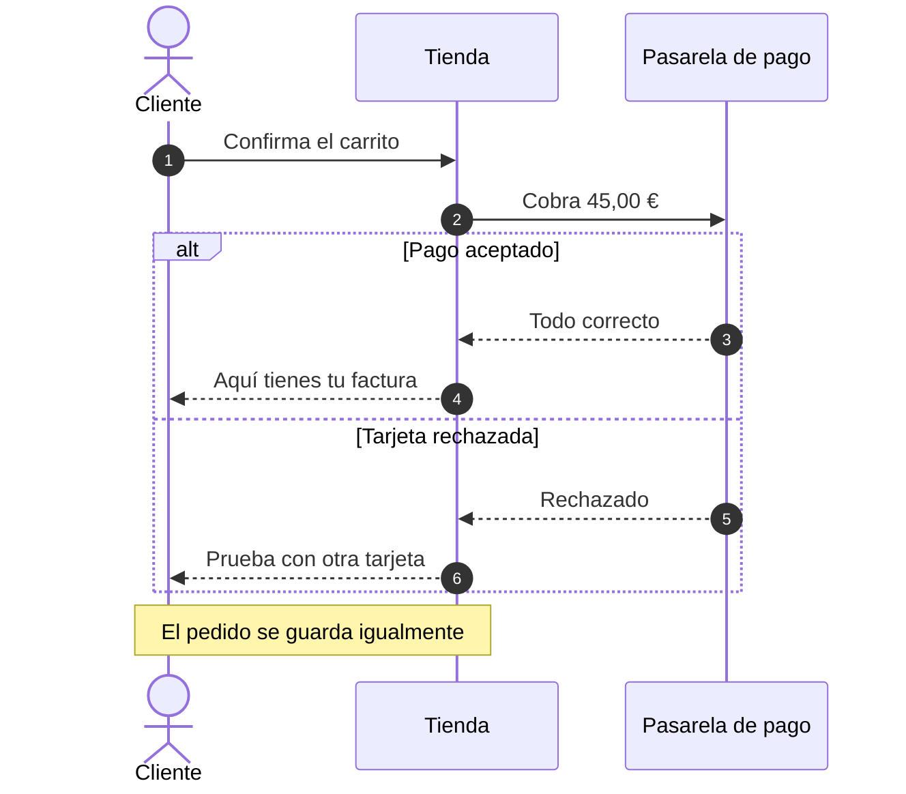
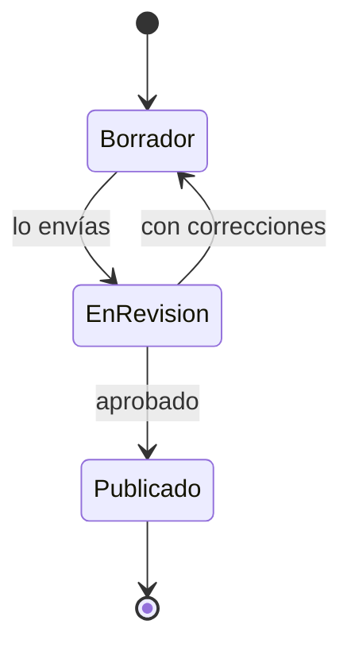
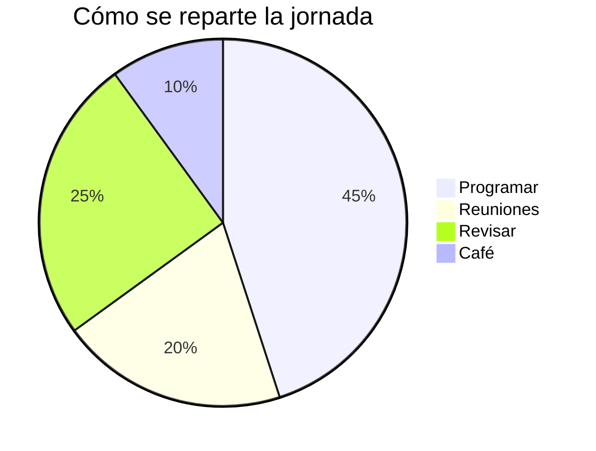
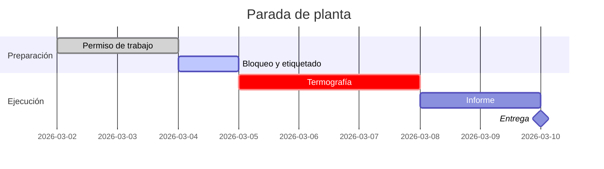
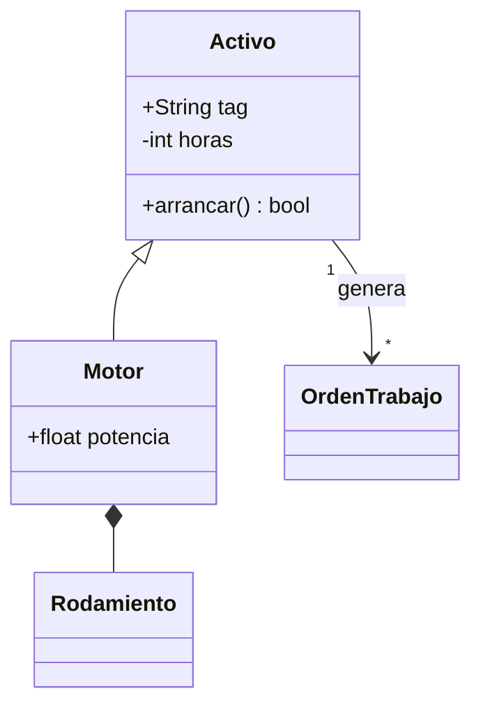
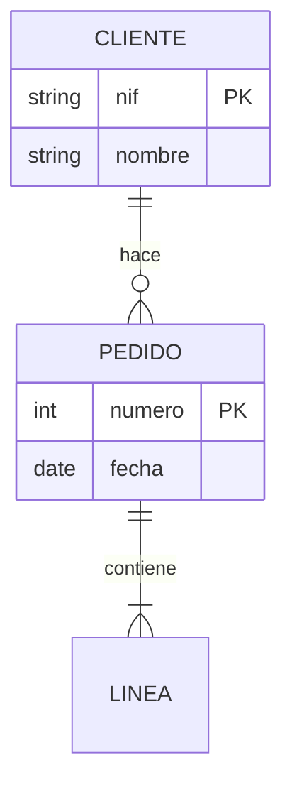
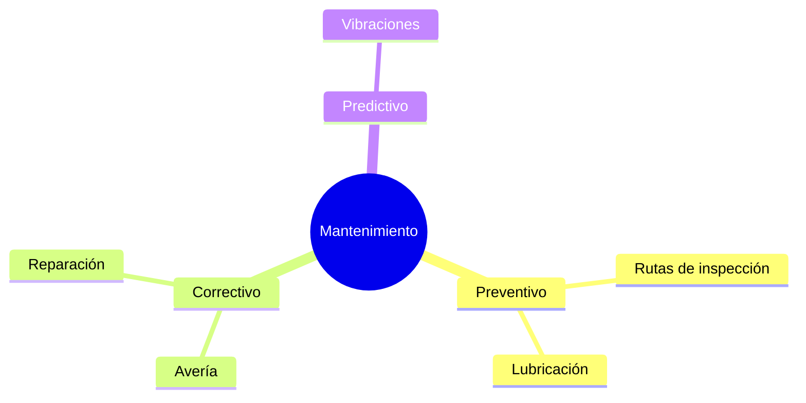

Un catálogo de **toda la sintaxis** de Markdown, cada cosa con su resultado al lado. Búscalo aquí cuando no recuerdes cómo se escribía algo, cópialo y sigue con lo tuyo.

> [!TIP]
> Pulsa **&#9998; Editar** para escribir aquí mismo y ver el resultado al lado. Con **&#10515; .html** te llevas una copia de esta página, con tu texto dentro, que funciona sin internet.

[TOC]

## 1. Cómo usar esta plantilla

### Escribir

1. Pulsa **✎ Editar**: a la izquierda escribes, a la derecha ves el resultado.
2. Lo que escribas se guarda solo en este navegador; al volver, sigue donde lo dejaste.
3. Con **⤓ .md** te llevas el texto; con **⤓ .html**, una copia completa de esta página, con tu documento dentro, que se abre sin internet.
4. En la barra del editor hay botones **↺ Deshacer** / **↻ Rehacer** y **⇥ Tab**: hacen lo mismo que <kbd>Ctrl</kbd>+<kbd>Z</kbd>/<kbd>Ctrl</kbd>+<kbd>Y</kbd> y la tecla Tab, para cuando el teclado no las tiene (por ejemplo, en el móvil).

### Imprimir o guardar en PDF

Pulsa **&#128424; Imprimir** (o <kbd>Ctrl</kbd>+<kbd>P</kbd>). La barra de botones, el editor y los enlaces de anclaje desaparecen solos: solo se imprime el documento. En el destino de impresión elige *Guardar como PDF* para obtener un PDF.

### Las cuatro reglas de oro

- **Pega el texto al margen izquierdo.** Cuatro espacios al principio de una línea convierten el texto en un bloque de código.
- **Deja una línea en blanco** entre párrafos, listas, tablas y títulos. Es lo que separa un bloque de otro.
- **No escribas la etiqueta de cierre de script tal cual** dentro de tu texto: cortaría el archivo. Si necesitas mencionarla, escríbela con barra invertida: `<\/script>`.
- **Guarda el archivo en UTF-8** para que los acentos y las eñes se vean bien. El Bloc de notas de Windows lo hace por defecto; si te salen símbolos raros, usa *Archivo → Guardar como → Codificación: UTF-8*.

## 2. Metadatos del documento (front matter)

Las primeras líneas del archivo, entre dos líneas de tres guiones, describen el documento. No son obligatorias, pero si las pones se dibuja una portada y el título aparece en la pestaña del navegador y en la cabecera del PDF.

````yaml
---
titulo: Guía y plantilla completa de Markdown
subtitulo: Toda la sintaxis, con su resultado al lado
autor: Tu nombre
fecha: 21 de agosto de 2026
---
````

Se admiten `titulo`, `subtitulo`, `autor` y `fecha` (también en inglés: `title`, `subtitle`, `author`, `date`). La portada de arriba está generada con ese bloque.

También se admite `idioma` (o `lang`, `language`, `locale`): pone el documento en ese idioma para que el traductor del navegador parta de ahí y no traduzca el código ni los diagramas. Por ejemplo `idioma: en` para un documento en inglés.

## 3. Encabezados

### Estilo almohadilla

Una a seis almohadillas y un espacio. Es el estilo que conviene usar siempre.

````md
# Título del documento
## Sección
### Apartado
#### Subapartado
##### Nivel cinco
###### Nivel seis
````

### Estilo subrayado

Solo existe para dos niveles. Se subraya el texto con signos igual o con guiones.

````md
Título de nivel 1
=================

Título de nivel 2
-----------------
````

> [!WARNING]
> Una línea de guiones justo debajo de un párrafo lo convierte en título de nivel 2 en vez de dibujar una raya. Si lo que quieres es una raya divisoria, deja una línea en blanco antes.

### Identificador propio

Por defecto cada título recibe un identificador para poder enlazarlo. Puedes fijarlo tú entre llaves al final:

````md
## Presupuesto anual {#presupuesto}
````

Después enlazas con `[ver presupuesto](#presupuesto)`.

### Índice automático

Escribe `[TOC]` en una línea sola y se genera el índice con todos los títulos del documento, cada uno enlazado a su sección. El índice del principio de esta página es exactamente eso.

## 4. Párrafos y saltos de línea

Un párrafo es texto seguido; para empezar otro se deja **una línea en blanco**. Pulsar Intro una sola vez no basta: esas dos líneas se unen en un mismo párrafo.

Para forzar un salto dentro del mismo párrafo hay tres formas: terminar la línea con **dos espacios**, terminarla con una **barra invertida**, o escribir `<br>`.

````md
Primera línea con dos espacios al final.  
Segunda línea del mismo párrafo.

Primera línea con barra invertida.\
Segunda línea.

Primera línea con etiqueta.<br>
Segunda línea.
````

<div class="demo">

Primera línea con dos espacios al final.  
Segunda línea del mismo párrafo.

</div>

Para separar bloques con aire de más, una línea con `&nbsp;` (un espacio duro) funciona como párrafo vacío.

## 5. Énfasis y estilos de texto

| Escribes | Se ve |
| --- | --- |
| `*cursiva*` o `_cursiva_` | *cursiva* |
| `**negrita**` o `__negrita__` | **negrita** |
| `***negrita y cursiva***` | ***negrita y cursiva*** |
| `~~tachado~~` | ~~tachado~~ |
| `==resaltado==` | ==resaltado== |
| `` `código` `` | `código` |
| `H~2~O` (subíndice) | H~2~O |
| `x^2^` (superíndice) | x^2^ |
| `<kbd>Ctrl</kbd>` | <kbd>Ctrl</kbd> |
| `<small>letra pequeña</small>` | <small>letra pequeña</small> |
| `<u>subrayado</u>` | <u>subrayado</u> |

Se pueden combinar sin problema: ``**texto _mezclado_ con `código`**`` se ve como **texto _mezclado_ con `código`**.

> [!NOTE]
> El guión bajo dentro de una palabra no marca cursiva, para no romper nombres como `mi_variable_larga`. Si necesitas cursiva a mitad de palabra, usa asteriscos.

## 6. Listas

### Lista sin orden

Guión, asterisco o signo más; los tres valen, pero conviene no mezclarlos dentro del mismo documento.

````md
- Primer punto
- Segundo punto
- Tercer punto
````

<div class="demo">

- Primer punto
- Segundo punto
- Tercer punto

</div>

### Lista numerada

````md
1. Preparar el material
2. Redactar el borrador
3. Revisar y publicar
````

<div class="demo">

1. Preparar el material
2. Redactar el borrador
3. Revisar y publicar

</div>

Los números que escribes no importan: el navegador renumera solo. Sí importa **el primero**, que fija dónde empieza la cuenta.

````md
5. Este punto es el número cinco
1. y este sale como el seis
1. y este como el siete
````

<div class="demo">

5. Este punto es el número cinco
1. y este sale como el seis
1. y este como el siete

</div>

### Listas anidadas

Se anidan con **dos o cuatro espacios** de sangría respecto al punto padre.

````md
- Frutas
  - Cítricos
    - Naranja
    - Limón
  - Tropicales
- Verduras
  1. Hoja verde
  2. Raíz
````

<div class="demo">

- Frutas
  - Cítricos
    - Naranja
    - Limón
  - Tropicales
- Verduras
  1. Hoja verde
  2. Raíz

</div>

### Lista de tareas

````md
- [x] Comprar el dominio
- [x] Montar la plantilla
- [ ] Escribir el primer documento
- [ ] Imprimirlo
````

<div class="demo">

- [x] Comprar el dominio
- [x] Montar la plantilla
- [ ] Escribir el primer documento
- [ ] Imprimirlo

</div>

### Listas apretadas y listas sueltas

Sin líneas en blanco entre puntos, la lista sale **apretada**. Con una línea en blanco entre ellos, sale **suelta** y cada punto se separa como un párrafo.

<div class="demo">

- Apretada, una línea
- Apretada, otra línea

</div>

<div class="demo">

- Suelta, con aire alrededor

- Suelta, segundo punto

</div>

### Un punto con varios párrafos

Para meter más de un párrafo, una cita o un bloque de código dentro de un mismo punto, se sangra el contenido a la altura del texto del punto.

````md
1. Primer paso del proceso.

   Este párrafo sigue perteneciendo al paso uno porque está sangrado.

   ```
   comando --de --ejemplo
   ```

2. Segundo paso.
````

<div class="demo">

1. Primer paso del proceso.

   Este párrafo sigue perteneciendo al paso uno porque está sangrado.

   ```
   comando --de --ejemplo
   ```

2. Segundo paso.

</div>

## 7. Citas y avisos

### Cita normal

````md
> El buen diseño es tan poco diseño como sea posible.
>
> — Dieter Rams
````

<div class="demo">

> El buen diseño es tan poco diseño como sea posible.
>
> — Dieter Rams

</div>

### Citas anidadas y con contenido

````md
> Nivel uno de la cita.
>
> > Nivel dos, citando a otro.
>
> - También caben listas
> - y `código`
````

<div class="demo">

> Nivel uno de la cita.
>
> > Nivel dos, citando a otro.
>
> - También caben listas
> - y `código`

</div>

### Avisos de colores

Una cita que empieza por una etiqueta entre corchetes con admiración se convierte en un recuadro de color. Sirven `[!NOTE]`, `[!TIP]`, `[!IMPORTANT]`, `[!WARNING]` y `[!CAUTION]` (o en español `[!NOTA]`, `[!CONSEJO]`, `[!IMPORTANTE]`, `[!AVISO]` y `[!PRECAUCION]`).

````md
> [!NOTE]
> Información útil que conviene tener presente.

> [!TIP]
> Un atajo o una recomendación.

> [!IMPORTANT]
> Algo imprescindible para que el resto funcione.

> [!WARNING]
> Cuidado: esto puede dar problemas.

> [!CAUTION]
> Riesgo real de perder datos o romper algo.
````

<div class="demo">

> [!NOTE]
> Información útil que conviene tener presente.

> [!TIP]
> Un atajo o una recomendación.

> [!IMPORTANT]
> Algo imprescindible para que el resto funcione.

> [!WARNING]
> Cuidado: esto puede dar problemas.

> [!CAUTION]
> Riesgo real de perder datos o romper algo.

</div>

## 8. Código

### Código dentro de una frase

Se envuelve entre acentos graves: `` `npm install` `` se ve como `npm install`.

Si el propio código lleva un acento grave, se usan dos por fuera: ``` `` `así` `` ``` da `` `así` ``.

### Bloques de código

Tres acentos graves antes y después. Si escribes el nombre del lenguaje detrás de los primeros, aparece la etiqueta en la esquina y el código se colorea solo (ver el apartado 23).

````md
```js
function saludar(nombre) {
  return `Hola, ${nombre}`;
}
```
````

<div class="demo">

```js
function saludar(nombre) {
  return `Hola, ${nombre}`;
}
```

</div>

Nombres habituales: `js`, `ts`, `html`, `css`, `json`, `python`, `bash`, `sql`, `yaml`, `md`, `diff`, `text`. La lista completa de los que se colorean está en el apartado 23.

### Bloques con virgulillas

Tres virgulillas hacen lo mismo. Sirven para mostrar bloques que contienen acentos graves.

````md
~~~
Aquí dentro pueden ir ``` sin cerrar el bloque.
~~~
````

### Un bloque dentro de otro

Para enseñar un bloque de tres acentos, el bloque de fuera lleva cuatro. Es lo que hace esta guía en cada ejemplo.

### Bloque por sangría

Cuatro espacios al principio de la línea también crean un bloque de código, aunque es la forma antigua y da sustos cuando uno sangra sin querer.

<div class="demo">

    esto es código por llevar cuatro espacios
    segunda línea

</div>

### Marcar diferencias

````md
```diff
- const color = "rojo";
+ const color = "azul";
  const tamano = 12;
```
````

<div class="demo">

```diff
- const color = "rojo";
+ const color = "azul";
  const tamano = 12;
```

</div>

## 9. Enlaces

| Escribes | Se ve |
| --- | --- |
| `[texto del enlace](https://ejemplo.com)` | [texto del enlace](https://ejemplo.com) |
| `[con título](https://ejemplo.com "sale al pasar el ratón")` | [con título](https://ejemplo.com "sale al pasar el ratón") |
| `<https://ejemplo.com>` | <https://ejemplo.com> |
| `<correo@ejemplo.com>` | <correo@ejemplo.com> |
| `[a otra sección](#11-tablas)` | [a otra sección](#11-tablas) |
| `[a un archivo](./informe.pdf)` | [a un archivo](./informe.pdf) |
| `[con **negrita** dentro](https://ejemplo.com)` | [con **negrita** dentro](https://ejemplo.com) |

Una dirección suelta como https://www.ejemplo.com también se convierte en enlace sola.

### Enlaces por referencia

Cuando la misma dirección se repite, o cuando es tan larga que estorba, se pone una etiqueta corta en el texto y la dirección al final del documento.

````md
Consulta la [documentación oficial][doc] y el [repositorio][repo].
También vale la forma corta: [doc].

[doc]: https://ejemplo.com/documentacion "Documentación"
[repo]: https://ejemplo.com/repositorio
````

<div class="demo">

Consulta la [documentación oficial][doc] y el [repositorio][repo]. También vale la forma corta: [doc].

</div>

[doc]: https://ejemplo.com/documentacion "Documentación"
[repo]: https://ejemplo.com/repositorio

Las líneas de definición se pueden colocar donde quieras: no se imprimen.

### Enlaces internos

Cada título tiene un identificador que se forma pasando el texto a minúsculas, quitando acentos y símbolos y cambiando los espacios por guiones. «## 11. Tablas» se convierte en `#11-tablas`. Pasa el ratón por encima de cualquier título de esta página y aparece una almohadilla a la derecha: es su enlace.

## 10. Imágenes y figuras

La sintaxis es la del enlace con una admiración delante. El texto entre corchetes es la descripción alternativa: se lee en voz alta para quien no ve la imagen y aparece si el archivo falta.

````md


[](https://ejemplo.com)
````

<div class="demo">


</div>

Las rutas son relativas al archivo HTML: si tus imágenes están en una carpeta `fotos` junto al documento, escribe `fotos/lo-que-sea.jpg`. También sirve una dirección de internet completa, pero entonces la imagen no se verá sin conexión.

### Controlar el tamaño

Markdown no tiene sintaxis para el tamaño; se usa HTML directamente:

````md

````

### Imagen con pie

````md
<figure>
  
  <figcaption>Figura 1. Texto del pie de la imagen.</figcaption>
</figure>
````

<div class="demo">

<figure>

<figcaption>Figura 1. Texto del pie de la imagen.</figcaption>
</figure>

</div>

## 11. Tablas

Las barras verticales separan las columnas y la segunda línea marca dónde acaba la cabecera. No hace falta que las barras queden alineadas en el archivo: el navegador lo cuadra solo.

````md
| Producto | Cantidad | Precio |
| --- | --- | --- |
| Café | 2 | 8,50 € |
| Té | 1 | 4,20 € |
````

<div class="demo">

| Producto | Cantidad | Precio |
| --- | --- | --- |
| Café | 2 | 8,50 € |
| Té | 1 | 4,20 € |

</div>

### Alineación de columnas

Los dos puntos en la línea de guiones deciden la alineación: a la izquierda, centrada o a la derecha.

````md
| Izquierda | Centrada | Derecha |
| :--- | :---: | ---: |
| Texto | Texto | 1.250,00 |
| Más texto | Más texto | 87,50 |
````

<div class="demo">

| Izquierda | Centrada | Derecha |
| :--- | :---: | ---: |
| Texto | Texto | 1.250,00 |
| Más texto | Más texto | 87,50 |

</div>

### Detalles útiles

- Dentro de las celdas funciona el formato normal: **negrita**, `código`, [enlaces](#11-tablas).
- Una celda vacía se deja sin nada entre las barras.
- Para escribir una barra vertical dentro de una celda, se escapa: `\|`.
- No se pueden partir celdas en varias líneas ni juntar celdas. Si necesitas eso, usa una tabla en HTML.

<div class="demo">

| Concepto | Detalle |
| --- | --- |
| Con formato | **negrita**, *cursiva* y `código` |
| Celda vacía | |
| Con barra | `a \| b` se ve como a \| b |

</div>

## 12. Líneas divisorias

Tres o más guiones, asteriscos o guiones bajos en una línea sola, siempre con una línea en blanco por encima.

````md
---
***
___
````

<div class="demo">

---

</div>

## 13. Notas al pie

Se marca el punto con un corchete y un acento circunflejo, y en cualquier otro sitio del documento se escribe el texto de la nota. Se numeran solas por orden de aparición y se colocan todas juntas al final de la página.

````md
Esto necesita una aclaración[^1] y esto otra[^fuente].

[^1]: El texto de la primera nota.
[^fuente]: Se puede usar una palabra como etiqueta en vez de un número.
````

<div class="demo">

Esto necesita una aclaración[^1] y esto otra[^fuente].

</div>

Baja al final de esta página: ahí están las dos notas, con una flecha para volver al punto exacto donde estabas.

[^1]: El texto de la primera nota. Puede llevar **formato** y [enlaces](#13-notas-al-pie).
[^fuente]: Se puede usar una palabra como etiqueta en vez de un número; el número se calcula solo.

## 14. Listas de definiciones

Un término en una línea y su definición debajo, empezando por dos puntos y un espacio. Un término puede tener varias definiciones.

````md
Markdown
: Lenguaje de marcas ligero para escribir con formato en texto plano.

HTML
: El idioma que entiende el navegador.
: Se puede mezclar con Markdown.
````

<div class="demo">

Markdown
: Lenguaje de marcas ligero para escribir con formato en texto plano.

HTML
: El idioma que entiende el navegador.
: Se puede mezclar con Markdown.

</div>

## 15. Abreviaturas

Se declara una vez en cualquier parte del documento y a partir de ahí, cada vez que la palabra aparezca, sale subrayada con puntitos y con su explicación al pasar el ratón.

````md
*[HTML]: Lenguaje de marcado para páginas web
*[PDF]: Formato de documento portátil

Este archivo es HTML y se puede imprimir en PDF.
````

<div class="demo">

Este archivo es HTML y se puede imprimir en PDF. Pasa el ratón por encima de las siglas.

</div>

*[HTML]: Lenguaje de marcado para páginas web
*[PDF]: Formato de documento portátil

## 16. Emojis

Se pueden pegar tal cual (🚀) o escribir su nombre entre dos puntos.

| Escribes | Se ve | | Escribes | Se ve |
| --- | :---: | --- | --- | :---: |
| `:white_check_mark:` | :white_check_mark: | | `:warning:` | :warning: |
| `:x:` | :x: | | `:bulb:` | :bulb: |
| `:rocket:` | :rocket: | | `:fire:` | :fire: |
| `:star:` | :star: | | `:tada:` | :tada: |
| `:pushpin:` | :pushpin: | | `:memo:` | :memo: |
| `:bug:` | :bug: | | `:zap:` | :zap: |
| `:books:` | :books: | | `:mag:` | :mag: |
| `:thumbsup:` | :thumbsup: | | `:eyes:` | :eyes: |
| `:lock:` | :lock: | | `:gear:` | :gear: |
| `:calendar:` | :calendar: | | `:chart:` | :chart: |

Si el nombre no está en la lista, el texto se queda tal cual, así que no se rompe nada.

## 17. HTML dentro de Markdown

Todo lo que Markdown no cubre se resuelve escribiendo HTML directamente. La única regla es dejar una línea en blanco antes y después del bloque.

### Detalles plegables

````md
<details>
<summary>Pulsa para desplegar</summary>

Aquí dentro se sigue escribiendo **Markdown normal**, siempre que haya
una línea en blanco después de la etiqueta de resumen.

</details>
````

<div class="demo">

<details>
<summary>Pulsa para desplegar</summary>

Aquí dentro se sigue escribiendo **Markdown normal**, siempre que haya una línea en blanco después de la etiqueta de resumen.

</details>

</div>

### Etiquetas útiles

| Escribes | Se ve |
| --- | --- |
| `<kbd>Ctrl</kbd> + <kbd>P</kbd>` | <kbd>Ctrl</kbd> + <kbd>P</kbd> |
| `<mark>resaltado</mark>` | <mark>resaltado</mark> |
| `<abbr title="Por ejemplo">p. ej.</abbr>` | <abbr title="Por ejemplo">p. ej.</abbr> |
| `<sup>arriba</sup>` y `<sub>abajo</sub>` | <sup>arriba</sup> y <sub>abajo</sub> |
| `<u>subrayado</u>` | <u>subrayado</u> |
| `<span style="color:#cf222e">en rojo</span>` | <span style="color:#cf222e">en rojo</span> |
| `<br>` | un salto de línea |

### Centrar y repartir en columnas

Esta plantilla trae tres clases preparadas: `centrado`, `dos-columnas` y `salto-pagina`.

````md
<p class="centrado">Este párrafo va centrado.</p>

<div class="dos-columnas">

Texto largo que se reparte en dos columnas al imprimir...

</div>
````

<div class="demo">

<p class="centrado">Este párrafo va centrado.</p>

<div class="dos-columnas">

El texto que va dentro de este bloque se reparte solo en dos columnas y salta a la segunda cuando la primera se llena, igual que en un periódico. Sirve para listas largas, para notas al pie de un informe o para aprovechar el papel cuando el texto es corto y sobra hueco a la derecha. Si la pantalla es estrecha, o si el papel no da de sí, vuelve a una sola columna sin que haya que tocar nada.

</div>

</div>

Ojo con dos detalles: hay que dejar una línea en blanco después de `<div ...>` y otra antes de `</div>`, porque si no el Markdown de dentro no se convierte; y las columnas solo se notan cuando hay texto suficiente para llenar la primera.

## 18. Escapar caracteres

Delante de un carácter con significado especial se pone una barra invertida y el carácter se escribe tal cual, sin transformarse.

````md
\*esto no va en cursiva\*
\# esto no es un título
2 \* 3 \= 6
````

<div class="demo">

\*esto no va en cursiva\*  
\# esto no es un título

</div>

Se pueden escapar: `\ ` `` ` `` `*` `_` `{ }` `[ ]` `( )` `#` `+` `-` `.` `!` `|` `~` `^` `=` `<` `>` `$` `:` `/` `"` `'`

También funcionan las entidades de HTML: `&copy;` da &copy;, `&nbsp;` da un espacio que no se parte, `&mdash;` da &mdash; y `&hellip;` da &hellip;

## 19. Comentarios ocultos

Un comentario de HTML no se ve en la página ni se imprime, pero queda escrito en el archivo. Sirve para notas al margen, recordatorios o para apagar un trozo sin borrarlo.

````md
<!-- Recordar actualizar las cifras antes de imprimir -->
````

<!-- Este comentario existe en el archivo pero no se ve en la página. -->

## 20. Preparar la impresión

- **Forzar un cambio de página:** `<div class="salto-pagina"></div>` en una línea sola.
- **Márgenes del papel:** se cambian en la hoja de estilo, en la regla `@page`, arriba del archivo.
- Los títulos nunca se quedan solos al final de una página, y las tablas, imágenes y bloques de código no se parten por la mitad: eso ya está resuelto en la hoja de estilo.
- Para que salga el fondo gris de los bloques de código en el PDF, marca la casilla *Gráficos de fondo* en las opciones de impresión del navegador.

## 21. Diagramas

Un bloque marcado como `mermaid` ya no se queda escrito: se dibuja. El dibujo es un SVG que hace la propia plantilla, así que funciona sin conexión, se imprime nítido a cualquier tamaño y se adapta solo al tema claro u oscuro. Debajo de cada dibujo hay un botón **código** para ver el texto que lo generó.

Si el texto tiene un error y no se puede dibujar, no se pierde nada: se muestra tal cual, como un bloque de código.

### Diagrama de flujo

````md

````


**Hacia dónde va:** `graph TD` de arriba abajo, `LR` de izquierda a derecha, `BT` de abajo arriba y `RL` de derecha a izquierda. En lugar de `graph` también vale `flowchart`.

**Formas de las cajas**

| Se escribe | Sale |
| --- | --- |
| `A[Texto]` | rectángulo |
| `A(Texto)` | rectángulo redondeado |
| `A([Texto])` | píldora |
| `A[[Texto]]` | subproceso |
| `A[(Texto)]` | cilindro (base de datos) |
| `A((Texto))` | círculo |
| `A(((Texto)))` | círculo doble |
| `A{Texto}` | rombo (una decisión) |
| `A{{Texto}}` | hexágono |
| `A[/Texto/]` | paralelogramo |
| `A[\Texto\]` | paralelogramo al revés |
| `A[/Texto\]` | trapecio |
| `A>Texto]` | banderín |

Si el texto lleva paréntesis, comas o signos raros, se pone entre comillas: `A["Total (con IVA)"]`.

**Tipos de línea**

| Se escribe | Sale |
| --- | --- |
| `A --> B` | flecha |
| `A --- B` | línea sin punta |
| `A -.-> B` | flecha punteada |
| `A ==> B` | flecha gruesa |
| `A --o B` | termina en círculo |
| `A --x B` | termina en cruz |
| `A <--> B` | flecha en los dos sentidos |

Para escribir algo encima de la línea hay dos maneras, las dos valen: `A -->|texto| B` o `A -- texto --> B`.

### Agrupar y pintar

`subgraph` mete varias cajas dentro de un recuadro con título, y `classDef` + `class` les da color.

````md

````


En `classDef` y en `style` se entienden `fill:` (relleno), `stroke:` (borde), `color:` (texto) y `stroke-width:` (grosor del borde). `style B fill:#ffe3e3` pinta una sola caja.

### Diagrama de secuencia

Para contar quién le habla a quién y en qué orden.

````md

````


`->>` es una llamada, `-->>` es la respuesta (línea de rayas), `-x` termina en cruz y `-)` es un aviso que no espera respuesta. `autonumber` numera los mensajes. `Note left of A:`, `Note right of A:` y `Note over A,B:` pegan una nota amarilla. `loop`, `alt`/`else`, `opt`, `par`/`and` y `critical` abren un recuadro que se cierra con `end`. `activate`/`deactivate` marcan cuándo alguien está ocupado.

### Diagrama de estados

Igual que el de flujo, pero `[*]` es el principio y el final.

````md

````


Para que un estado se llame de otra manera: `state "En revisión" as EnRevision`.

### Tarta

````md

````


Los porcentajes se calculan solos, no hace falta que los números sumen 100.

### Gantt

Un calendario de tareas. Cada línea es `Nombre : etiquetas, id, cuándo empieza, cuánto dura`. La fecha va como `2026-03-02`, la duración como `3d` (también `w` semanas, `h` horas). En vez de una fecha puedes escribir `after otroId` y encadenar la tarea a la anterior.

````md

````


Las etiquetas cambian el color: `done` lo terminado, `active` lo que está en marcha, `crit` lo crítico y `milestone` dibuja un rombo en vez de una barra. Si el día de hoy cae dentro del calendario, se marca con una raya.

### Clases

Cajas con sus atributos y sus métodos, y las líneas que las relacionan.

````md

````


Lo que lleva paréntesis se coloca abajo, como método; lo demás, arriba. `<|--` es herencia, `*--` composición, `o--` agregación, `-->` asociación y `..>` dependencia. Entre comillas antes y después de la línea van las cardinalidades. `<<interface>> Nombre` pone el rótulo encima del nombre.

### Entidad-relación

El mapa de una base de datos: entidades, sus campos y cuántos van con cuántos.

````md

````


Las puntas dicen la cantidad: `||` exactamente uno, `|o` cero o uno, `}|` uno o varios y `}o` cero o varios. Dentro de las llaves, cada campo es `tipo nombre` y detrás puede ir `PK`, `FK` o `UK`.

### Mapa mental

Una idea en el centro y las ramas que salen de ella. Manda la sangría: cada nivel, dos espacios más.

````md

````


Las ramas se reparten solas a un lado y a otro, cada una con su color. `((así))` hace la burbuja redonda, `(así)` la esquina suave y `[así]` el rectángulo.

> [!NOTE]
> Se dibujan ocho tipos: flujo (`graph` o `flowchart`), secuencia, estados, tarta, Gantt, clases, entidad-relación y mapa mental. Cualquier otro tipo de Mermaid se muestra como bloque de código en lugar de fallar. La palabra `diagrama` funciona igual que `mermaid` si prefieres escribirla en español.

## 22. Fórmulas matemáticas

Entre dos signos de dólar, dentro de una frase: `$a^2 + b^2 = c^2$` se lee $a^2 + b^2 = c^2$. En un párrafo aparte, con dos dólares arriba y dos abajo.

````md
La energía cumple $E = mc^2$, y en grande:

$$
\int_0^\infty e^{-x}\,dx = 1
$$
````

<div class="demo">

La energía cumple $E = mc^2$, y en grande:

$$
\int_0^\infty e^{-x}\,dx = 1
$$

</div>

Se escribe en LaTeX y el navegador lo dibuja solo, sin descargar nada. Lo más usado:

| Se escribe | Sale |
| --- | --- |
| `x^2` y `x_i` | $x^2$ y $x_i$ |
| `\frac{a}{b}` | $\frac{a}{b}$ |
| `\sqrt{x}` y `\sqrt[3]{x}` | $\sqrt{x}$ y $\sqrt[3]{x}$ |
| `\sum_{i=1}^{n} i` | $\sum_{i=1}^{n} i$ |
| `\int_a^b f(x)dx` | $\int_a^b f(x)dx$ |
| `\alpha \beta \pi \Omega` | $\alpha \beta \pi \Omega$ |
| `\leq \geq \neq \approx` | $\leq \geq \neq \approx$ |
| `\to \Rightarrow \infty` | $\to \Rightarrow \infty$ |
| `\left( \frac{a}{b} \right)` | $\left( \frac{a}{b} \right)$ |
| `\text{palabras}` | $\text{palabras}$ |

También hay matrices (`\begin{pmatrix} 1 & 2 \\ 3 & 4 \end{pmatrix}`), casos (`\begin{cases}`) y alineaciones (`\begin{aligned}`).

$$
\begin{pmatrix} 1 & 2 \\ 3 & 4 \end{pmatrix}
\qquad
f(x) = \begin{cases} x & \text{si } x \geq 0 \\ -x & \text{si } x < 0 \end{cases}
$$

Si en un documento no quieres que los dólares se conviertan en fórmulas (por ejemplo, si hablas de dinero), pon `matematicas: no` en los metadatos de arriba.

## 23. Color en el texto y en el código

### El código se colorea solo

Al poner el nombre del lenguaje detrás de los acentos graves, las palabras se pintan según lo que son: los comentarios en gris, los textos en verde, los números en azul... y en la esquina aparece la etiqueta del lenguaje.

<div class="demo">

```python
def saludar(nombre: str) -> str:
    """Devuelve un saludo."""
    total = 42 * 1.5          # un comentario
    return f"Hola, {nombre} ({total})"
```

```json
{ "nombre": "informe", "paginas": 12, "borrador": false, "temas": ["a", "b"] }
```

</div>

Se reconocen: `javascript` `typescript` `json` `python` `css` `html` `bash` `yaml` `sql` `markdown` `diff` `ini` `java` `c` `cpp` `go` `rust` `php` `ruby` `lua`, con los apodos de siempre (`js`, `ts`, `py`, `sh`, `yml`, `jsonc`, `c++`, `golang`, `rb`...). Un lenguaje que no esté en la lista se muestra sin color, pero con su etiqueta.

### Colores en el texto

Markdown por sí solo no tiene colores, pero como admite HTML hay dos maneras. La primera, con las clases que ya trae la plantilla:

````md
Texto en <span class="rojo">rojo</span>, en <span class="verde">verde</span>
y en <span class="azul">azul</span>.

<span class="fondo">resaltado con fondo</span> y <span class="recuadro">en un recuadro</span>
````

<div class="demo">

Texto en <span class="rojo">rojo</span>, en <span class="verde">verde</span>, en <span class="azul">azul</span>, en <span class="naranja">naranja</span>, en <span class="morado">morado</span>, en <span class="rosa">rosa</span>, en <span class="cian">cian</span> y en <span class="gris">gris</span>.

<span class="fondo">con fondo</span> &nbsp; <span class="recuadro">en un recuadro</span> &nbsp; <span class="grande">más grande</span> &nbsp; <span class="pequeno">más pequeño</span>

</div>

Estas clases se llevan bien con el tema oscuro y con la impresión, que es la ventaja de usarlas en vez de escribir el color a mano.

La segunda manera es poner el color directamente, útil para un tono concreto:

````md
<span style="color:#c2255c">rosa fuerte</span>
<span style="background:#fff3bf">fondo amarillo</span>
````

<div class="demo">

<span style="color:#c2255c">rosa fuerte</span> y <span style="background:#fff3bf">fondo amarillo</span>

</div>

> [!TIP]
> Los colores escritos a mano no cambian con el tema oscuro. Si el documento se va a leer de noche o se va a imprimir, es mejor usar las clases.

### Color en las tablas y en los avisos

Dentro de una celda de tabla también valen las clases: escribe `<span class="verde">Al día</span>` en la celda. Y para bloques enteros de color están los avisos del apartado 7 (`> [!NOTE]`, `> [!TIP]`, `> [!WARNING]`...), que ya vienen con su color y su icono.

| Proyecto | Estado |
| --- | --- |
| Portal interno | <span class="verde">Al día</span> |
| Migración | <span class="naranja">En riesgo</span> |
| Facturación | <span class="rojo">Parado</span> |

## 24. Formularios: recuadros que se rellenan

Un documento puede pedir datos sin que haga falta abrir el editor. Se escribe la etiqueta entre
dos corchetes y aparece un recuadro: pulsas encima, escribes, y lo escrito se guarda dentro del
propio texto.

```md
Responsable: [[Nombre y apellidos]]
Fecha: [[Fecha de la visita =fecha]]
Turno: [[Turno =Mañana/Tarde/Noche]]
```

Responsable: [[Nombre y apellidos]] · Fecha: [[Fecha de la visita =fecha]] · Turno: [[Turno =Mañana/Tarde/Noche]]

Después de la etiqueta, un espacio y `=` con el tipo: `=fecha`, `=hora`, `=numero`, `=larga`,
`=firma`, o varias opciones separadas por barras. Sin tipo, es texto corto.

Un valor que ya viene escrito va detrás de dos puntos dobles — `[[Ciudad::Panamá]]` — nunca detrás
de una barra, porque la barra corta la fila de una tabla.

Las casillas `[ ]` y `[x]` también se marcan con el ratón, tanto en una lista como dentro de una
celda:

| Punto | Bien | Mal |
| --- | :-: | :-: |
| Nivel de aceite | [ ] | [ ] |
| Fugas | [ ] | [ ] |

Cuando un documento tiene recuadros aparece arriba el botón **Rellenar**, que los resalta, activa
los huecos sencillos como `[este]` y trae un botón para vaciarlo todo y volver a usar la hoja.
Un formulario vacío se imprime con renglones para escribirlo a mano.

Hay una categoría entera de hojas ya hechas — actas, permisos, inspecciones — en el catálogo de
plantillas, y una que explica el formato paso a paso: **Cómo se hace un formulario**.

## 25. Chuleta rápida

| Para... | Se escribe |
| --- | --- |
| Título de nivel 2 | `## Texto` |
| Negrita | `**texto**` |
| Cursiva | `*texto*` |
| Tachado | `~~texto~~` |
| Resaltado | `==texto==` |
| Código en línea | `` `texto` `` |
| Bloque de código | tres acentos graves arriba y abajo |
| Lista | `- punto` |
| Lista numerada | `1. punto` |
| Tarea | `- [ ] pendiente` |
| Cita | `> texto` |
| Aviso de color | `> [!WARNING]` |
| Enlace | `[texto](direccion)` |
| Imagen | `` |
| Tabla | `\| a \| b \|` y debajo `\| --- \| --- \|` |
| Raya divisoria | `---` con una línea en blanco encima |
| Nota al pie | `texto[^1]` y `[^1]: la nota` |
| Salto de línea | dos espacios al final de la línea |
| Índice automático | `[TOC]` |
| Comentario invisible | `<!-- texto -->` |
| Recuadro para rellenar | `[[Etiqueta]]` |
| Recuadro con tipo | `[[Fecha =fecha]]` o `[[Estado =Bueno/Malo]]` |
| Recuadro ya escrito | `[[Ciudad::Panamá]]` |
| Cambio de página | `<div class="salto-pagina"></div>` |
| Ruta GPX | ` ```gpx ` con el archivo `.gpx` dentro |
| Plano 2D | ` ```plano ` con `muro`, `puerta`, `ventana`... |
| Vista isométrica | ` ```iso ` con `caja x,y,z ancho,fondo,alto` |
| Alámbrico 3D | ` ```3d ` con `v`, `arista`, `caja` |
| SVG propio | ` ```svg ` con el SVG dentro |
| Pizarra a mano | botón **✎ Pizarrón**, o el lápiz dentro de Presentar |

## 26. Mapas y dibujo técnico

Cuatro bloques para dibujar sin salir del documento — sin fotos, sin archivos aparte, todo como texto que se puede editar, versionar y buscar. El botón **➕ Insertar → Mapas y dibujo técnico** trae un ejemplo listo de cada uno para editar desde ahí; esta sección explica la sintaxis completa.

### Plano 2D

````md
```plano
escala 1m = 40px
muro 0,0 → 10,0 → 10,8 → 0,8 → 0,0
muro 6,0 → 6,8
puerta 2,0 ancho 1
puerta 6,4 ancho 0.9
ventana 10,3 ancho 1.5
texto 3,4 Sala
texto 8,4 Dormitorio
cota 0,0 → 10,0
```
````

<div class="demo">

```plano
escala 1m = 40px
muro 0,0 → 10,0 → 10,8 → 0,8 → 0,0
muro 6,0 → 6,8
puerta 2,0 ancho 1
puerta 6,4 ancho 0.9
ventana 10,3 ancho 1.5
texto 3,4 Sala
texto 8,4 Dormitorio
cota 0,0 → 10,0
```

</div>

| Instrucción | Qué dibuja |
| --- | --- |
| `escala 1m = 40px` | cuántos píxeles vale un metro (opcional, por defecto ya trae uno razonable) |
| `muro x,y → x,y → ...` | una polilínea de muro; una cadena que vuelve al punto de partida cierra un recinto |
| `puerta x,y ancho N` | se coloca sobre el muro más cercano a ese punto y abre el hueco sola: no hace falta calcular el ángulo |
| `ventana x,y ancho N` | igual que la puerta, dibujada como línea triple |
| `texto x,y Lo que sea` | una etiqueta de texto en ese punto |
| `cota x,y → x,y` | una línea de medida con flechas y el valor en metros |

Debajo del dibujo aparece una tabla con los metros lineales de muro, el área de cada recinto cerrado y el conteo de puertas y ventanas — una base para calcular materiales. El área solo se calcula sobre un `muro` cuyo último punto vuelve al primero: varias líneas de `muro` no se combinan entre sí para formar un recinto.

> [!NOTE]
> Todas las coordenadas están en **metros** — `escala 1m = 40px` solo controla cuántos píxeles ocupa un metro al dibujar, nunca cambia los números que escribes debajo. `texto` y `cota` se ubican exactamente donde dices; `puerta` y `ventana`, en cambio, se **enganchan solas** al tramo recto de muro más cercano a ese punto (se proyectan sobre él y el hueco queda centrado ahí, recortado si no cabe entero) — si hay dos muros próximos, una puerta puede engancharse al que no esperabas, y moverla un poco no cambia nada mientras siga más cerca del mismo tramo. Un `muro x,y → x,y → x,y` es una cadena de tramos rectos independientes entre sí: una puerta cerca de una esquina se pega al tramo que quede más cerca, no «a la esquina» como conjunto. Si `cota` recibe más de dos puntos, solo cuentan el primero y el último — los del medio se ignoran.

### Vista isométrica

````md
```iso
caja 0,0,0 4,3,2.5 Sala
caja 4,0,0 3,3,2.5 Cocina
```
````

<div class="demo">

```iso
caja 0,0,0 4,3,2.5 Sala
caja 4,0,0 3,3,2.5 Cocina
```

</div>

Cada línea es `caja x,y,z ancho,fondo,alto Etiqueta`: la posición de una esquina, el tamaño de la caja y, al final, un texto opcional. Sirve para plantas, volúmenes de almacenaje o distribución de espacios en 2.5D, sin tener que rotar nada.

### Alámbrico 3D

````md
```3d
v A 0 0 0
v B 4 0 0
v C 4 3 0
arista A B
arista B C
caja 0,0,0 4,3,2.5
```
````

<div class="demo">

```3d
v A 0 0 0
v B 4 0 0
v C 4 3 0
arista A B
arista B C
caja 0,0,0 4,3,2.5
```

</div>

`v Nombre x y z` declara un vértice, `arista Nombre1 Nombre2` los une con una línea, y `caja x,y,z ancho,fondo,alto` es un atajo que arma las 8 esquinas y las 12 aristas de un cubo de una sola vez, sin declarar cada vértice a mano. Se arrastra para rotar y se usa la rueda o el pellizco para acercar — el mismo control que la vista 3D de una ruta GPX.

### SVG propio

````md
```svg
<svg viewBox="0 0 200 100">
  <rect x="10" y="10" width="80" height="80" fill="#1a73e8" rx="8"/>
  <circle cx="150" cy="50" r="40" fill="#e5484d"/>
</svg>
```
````

<div class="demo">

```svg
<svg viewBox="0 0 200 100">
  <rect x="10" y="10" width="80" height="80" fill="#1a73e8" rx="8"/>
  <circle cx="150" cy="50" r="40" fill="#e5484d"/>
</svg>
```

</div>

El contenido pasa directo al documento, sin ninguna sintaxis intermedia: si sabes SVG, tienes el control completo. Por seguridad se limpia antes de mostrarse — se quitan `<script>`, los atributos `onclick` y similares, y cualquier enlace que empiece por `javascript:` — así que un SVG copiado de cualquier lado no puede ejecutar código ni robar datos, aunque sí puede perder alguna parte si dependía de eso.

> [!NOTE]
> Los cuatro bloques de esta sección respetan el tema claro y oscuro, y se exportan igual de nítidos en el PNG (`⤓ Descargar → Imagen`) y en la impresión.

## 27. Rutas GPX

````md
```gpx vista=2d
<?xml version="1.0"?>
<gpx version="1.1"><trk><trkseg>
<trkpt lat="40.4168" lon="-3.7038"><ele>650</ele><time>2026-01-01T08:00:00Z</time></trkpt>
<trkpt lat="40.4178" lon="-3.7028"><ele>660</ele><time>2026-01-01T08:05:00Z</time></trkpt>
<trkpt lat="40.4188" lon="-3.7018"><ele>655</ele><time>2026-01-01T08:10:00Z</time></trkpt>
</trkseg></trk></gpx>
```
````

<div class="demo">

```gpx vista=2d
<?xml version="1.0"?>
<gpx version="1.1"><trk><trkseg>
<trkpt lat="40.4168" lon="-3.7038"><ele>650</ele><time>2026-01-01T08:00:00Z</time></trkpt>
<trkpt lat="40.4178" lon="-3.7028"><ele>660</ele><time>2026-01-01T08:05:00Z</time></trkpt>
<trkpt lat="40.4188" lon="-3.7018"><ele>655</ele><time>2026-01-01T08:10:00Z</time></trkpt>
</trkseg></trk></gpx>
```

</div>

Pega dentro el archivo `.gpx` que exporta cualquier reloj, app de rutas o GPS — el mismo que ya tengas guardado, sin tocarlo. Debajo del mapa aparecen la distancia, la velocidad media, el desnivel y, si el archivo trae hora en cada punto, la pendiente media y máxima y cómo cambia la velocidad en las cuestas.

La forma más fácil de traerlo es **`+ Insertar` → `Mapas y dibujo técnico` → `Importar archivo .gpx…`**: elegís el archivo de vuestro equipo o teléfono y el bloque `​```gpx` se arma solo, en el cursor. No hace falta copiar y pegar el XML a mano — y de paso, se queda solo con lo que el mapa realmente necesita (puntos, elevación, hora, notas), sin la metadata ni las extensiones propias del fabricante del reloj o la app (nombres de sesión, enlaces, campos internos) que un archivo real siempre trae y que solo ocupan espacio en el documento.

| Parámetro (después de ` ```gpx `) | Valores | Qué hace |
| --- | --- | --- |
| `vista=` | `2d`, `3d`, `perfil`, `2d+perfil` | qué vista se ve al abrir el documento — el lector puede cambiarla igual con los botones; `2d+perfil` apila el mapa y el perfil, y recorrer el perfil con el dedo marca el punto correspondiente en el mapa |
| `color=` | `velocidad`, `pendiente`, `altitud`, `ruta` | de qué depende el color de la línea; el botón **Color** bajo el mapa cicla entre los modos que el archivo permita (`altitud` pide `<ele>`, `velocidad` pide `<time>`, `ruta` pide varios `<trk>`) |
| `exageracion=` | un número, por defecto `3` | cuánto se exagera la altura en la vista 3D (el desnivel real es minúsculo junto a la distancia recorrida) |

Si el archivo trae **varios `<trk>`** (la ida y la vuelta, o los días de un viaje), cada uno se dibuja como ruta aparte — sin conectores inventados entre el final de una y el inicio de la otra — con su color y su distancia en la leyenda; el modo de color `ruta` se activa solo. Y como cortesía, el bloque también acepta **GeoJSON** pegado tal cual (`FeatureCollection`, `Feature` o la geometría pelada): las `LineString` se vuelven rutas y los `Point` se vuelven puntos con nombre y nota.

### Simular la ruta

El botón **▶ Simular ruta** recorre el trayecto con un carrito sobre el mapa (en 2D, 3D, Perfil y 2D+Perfil). Si el archivo trae `<time>`, el recorrido entero dura unos 3 minutos **respetando el ritmo real** — acelera donde ibas rápido, frena en las cuestas y se detiene donde te detuviste — y un **velocímetro** en la esquina marca la velocidad de cada momento. El botón **×1** cambia la velocidad de reproducción (×2, ×4, ×8, ×0.5) y la barra permite saltar a cualquier punto. En la vista 3D, la cámara **Persecución** clava la flecha al centro de la pantalla y hace que el mapa gire y se incline debajo, siguiendo el rumbo — como un videojuego de carreras.

Los puntos `<wpt>` del archivo (notas, paradas, sitios) se dibujan con su color según `<type>` — `combustible`, `incidente`, `cliente`, `parada`, o azul si no lleva tipo — y su `<name>`/`<desc>` aparecen al tocarlos. Cada punto lleva además una **letra de referencia (A, B, C…) asignada por su orden a lo largo de la ruta**, la misma en el mapa, en la lista de notas y al imprimir — así el papel y el mapa se corresponden. Si un punto lleva `<link>` con la dirección de una imagen, la miniatura aparece al pasar el mouse por encima. Si el GPX trae también una `<rte>` (ruta planificada, no el track real), se dibuja punteada debajo del recorrido real para comparar plan contra realidad.

### Mapa sin archivo GPX: puntos escritos a mano

No hace falta un track grabado para tener mapa — basta una lista de coordenadas, una por línea:

````md
```gpx
- 15.5041, -88.0250 Salida bodega | tipo=parada
- 15.5089, -88.0198 Cliente 1 | tipo=cliente | nota=entrega programada
- 15.5170, -88.0300 Combustible | tipo=combustible | enlace=https://ejemplo.com/foto.jpg
```
````

Cada línea es `lat, lon` y un nombre; los extras van después de `|` en cualquier orden: `tipo=` (el color), `nota=` (la descripción), `enlace=` (imagen o página) y `ele=` (altura en metros). Las líneas se unen en orden con la línea de la ruta, y todo lo demás — estadísticas, letras, contexto de OpenStreetMap, dividir en tramos — funciona igual que con un GPX real. Hacen falta al menos dos líneas.

### Botones bajo el mapa

- **+ Agregar punto**: se activa y el siguiente clic sobre el mapa 2D crea un punto ahí, preguntando nombre y enlace opcional. Se escribe solo dentro del bloque, en el mismo formato que ya tenga (XML o lista).
- **Puntos cada N km**: crea puntos automáticos a intervalos regulares ("Km 10", "Km 20"…) — útiles como referencia o para dividir después.
- **📷 Punto desde foto**: elegís una o varias fotos del recorrido y cada una se vuelve un punto donde fue tomada — con el GPS de la foto si lo trae, o casando la hora de la cámara contra las horas del track (preguntando el desfase del reloj una sola vez). Solo se leen los datos EXIF del archivo: la foto en sí nunca se mete al documento.
- **Hoja de ruta**: inserta debajo del bloque una tabla Markdown con letra, kilómetro, hora (si el track trae horas), nombre y nota de cada punto, en orden de ruta — la hoja de giros que se imprime y se lleva en papel.
- **Dividir ruta en tramos**: corta la ruta en los puntos existentes y crea un bloque de mapa por tramo.

> [!TIP]
> El botón **"Obtener contexto del mapa"** que aparece bajo la ruta trae, una sola vez, las calles y ríos de alrededor (vía OpenStreetMap) y los deja guardados dentro del propio documento: desde ese momento el mapa se ve igual sin conexión, para siempre. Y si prefieres tu propia captura de pantalla de cualquier mapa, "Usar captura como fondo" la calibra con dos puntos conocidos de la ruta.

## 28. Pizarra, pizarrón y el modo Presentar

### Dibujar a mano dentro del documento

El bloque ` ```pizarra ` guarda trazos hechos a mano como texto plano — no se crea escribiéndolo, sino dibujando con el botón **✎ Pizarrón** (lienzo en blanco a pantalla completa) o con el lápiz dentro de **▶ Presentar** (ver más abajo) y luego pulsando **insertar**. Una vez insertado se ve, se descarga, se imprime y se versiona como cualquier otra figura del documento:

```md
tamaño 800x500
trazo #1a73e8 4 M120,80 L340,210
```

Cada línea `trazo COLOR GROSOR ...` es un trazo; borrar la línea borra el trazo, igual que borrar cualquier otro texto.

En ambos lugares (el bloque dentro del documento y el Pizarrón global de abajo) hay, junto al color y el grosor, un selector de **herramienta**: además del lápiz de trazo libre de siempre, una **línea** recta (clic, arrastra y suelta: une el punto donde empezaste con el punto donde soltaste, sin curvarse) y cinco sellos de figura cerrada — **círculo, cuadrado, triángulo, pentágono y rombo** — que se dibujan arrastrando en diagonal, igual que en cualquier editor de dibujo: el rectángulo que arrastres es la caja donde queda inscrita la figura. Un simple toque sin arrastrar deja una figura de tamaño mínimo centrada en ese punto, en vez de nada. El borrador funciona igual sobre cualquier figura, no solo sobre trazos de lápiz.

### El Pizarrón global

Botón **✎ Pizarrón**, junto a **▶ Presentar**: un lienzo en blanco a pantalla completa, independiente de cualquier documento. Al salir, tres opciones: **descartar**, **insertar** como bloque ` ```pizarra ` al final del documento actual, o **descargar** como imagen PNG.

### Lápiz y anotaciones dentro de Presentar

Dentro de **▶ Presentar**, un botón de lápiz activa una capa de dibujo sobre la diapositiva actual:

| Tecla | Qué hace |
| --- | --- |
| `L` | activar o apagar el lápiz |
| `B` | borrador |
| `C` | limpiar la diapositiva actual |
| `O` | abrir o cerrar el índice de títulos |
| `→` / espacio / `Av Pág` | siguiente diapositiva |
| `←` / `Re Pág` | diapositiva anterior |
| `Esc` | cerrar lo que esté abierto encima (miniaturas, índice) y, si no hay nada abierto, salir de Presentar |

Junto al lápiz hay cuatro muestras de color para elegir con qué se dibuja. Los trazos son **temporales por defecto** — se pierden al salir de Presentar — salvo que pulses **Guardar anotaciones**, que los añade como un bloque ` ```pizarra ` al final de esa diapositiva en el propio Markdown.

Tres botones más, todos sin salir de la presentación:

- **⊞ Miniaturas:** una grilla con todas las diapositivas; un clic en cualquiera salta ahí.
- **☰ Índice:** la lista de títulos del documento (tecla `O`); un clic en un título salta a su diapositiva.
- **✎ Pizarrón:** abre el Pizarrón global sin cerrar la presentación — al salir de él (descartar, insertar o descargar) vuelves exactamente a la misma diapositiva, con el mismo dibujo.

---

## 29. Lógica y electricidad

Dos bloques que se calculan o se dibujan solos a partir de texto plano. El botón **➕ Insertar → Lógica y electricidad** trae un ejemplo listo de cada uno; la categoría **Lógica y electricidad** del catálogo de plantillas (➕ Plantillas) trae la referencia completa, con más ejemplos y el detalle de «lo que no hace».

### Tabla de verdad

````md
```verdad
entradas: A, B
salida S = A Y B
salida T = A O-EXCLUSIVA B
```
````

<div class="demo">

```verdad
entradas: A, B
salida S = A Y B
salida T = A O-EXCLUSIVA B
```

</div>

`entradas:` se declara una sola vez, con los nombres separados por comas; cada `salida NOMBRE = expresión` agrega una columna calculada, y el bloque genera solo las 2ⁿ combinaciones posibles (no más de 8 entradas — 256 filas). Los operadores se escriben en español y no distinguen mayúsculas: `Y` (AND), `O` (OR), `NO` (NOT), `O-EXCLUSIVA` (XOR), `NI` (NOR), `NO-Y` (NAND). La precedencia es `NO` > `Y` > `O`, igual que `* /` antes de `+ -` en las fórmulas de una hoja de cálculo — usa paréntesis para forzar otro orden, como en `(A O B) Y NO C`.

### Escalera PLC

````md
```ladder norma=iec
| [PARO/] [ARRANQUE] ---------------- (M1)  | arranque-paro con sello
| [M1] ----+                                |
| [M1] ------------ [TON T1 5s] ----- (L1)  | piloto retardado
```
````

<div class="demo">

```ladder norma=iec
| [PARO/] [ARRANQUE] ---------------- (M1)  | arranque-paro con sello
| [M1] ----+                                |
| [M1] ------------ [TON T1 5s] ----- (L1)  | piloto retardado
```

</div>

Cada línea es un peldaño: `| contenido | comentario opcional`. `[X]` es un contacto normalmente abierto, `[X/]` normalmente cerrado, `(Y)` una bobina, `[TON Tn t]` un temporizador a la conexión (`t` en segundos). Un `+` al final de un tramo lo conecta hacia arriba en vez de al riel derecho (rama de sello, sin bobina propia); un `+` al principio lo conecta hacia arriba en vez de al riel izquierdo (otra salida en paralelo, con su propia bobina) — **la columna importa**: un `+` se ancla al peldaño completo más cercano arriba, justo en la posición donde queda escrito. Una misma fila puede tener más de un `+`: cada uno de más cierra el tramo en curso y abre uno nuevo al lado, así que en una sola línea caben una rama a la izquierda, otra a la derecha y un puente al centro, todas juntas (ver la plantilla "Escalera PLC: varias ramas en una fila" en Comunidad de plantillas). El parámetro `norma=iec` (por defecto) o `norma=nema`, en la primera línea del bloque, solo cambia el símbolo dibujado — nunca el texto de entrada.

## Empieza aquí

Borra desde el primer título de esta página hasta esta línea y escribe lo tuyo. Si te quedas con la duda de cómo se escribía algo, abre el archivo original: sigue estando entero.

