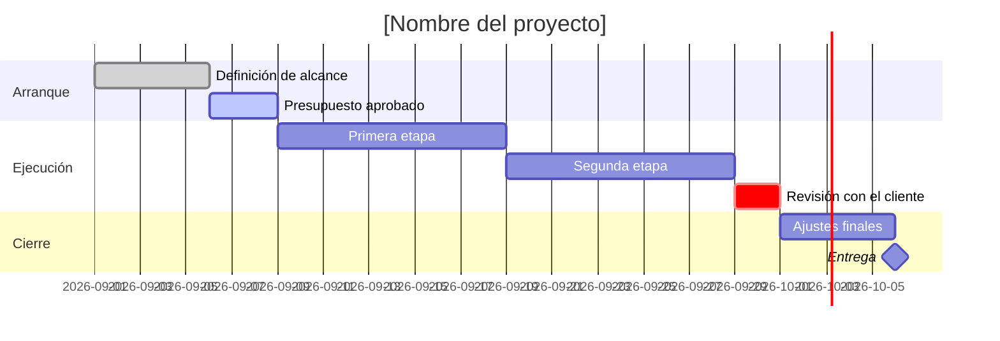

**Proyecto:** [[Proyecto]]

Un diagrama de Gantt es un calendario de tareas: cada línea dice cuándo empieza, cuánto dura y —
lo más útil — a qué otra tarea sigue, sin tener que calcular la fecha a mano.

## Cómo se lee cada línea

`Nombre : etiquetas, id, cuándo empieza, cuánto dura`

| Parte | Qué escribir |
| --- | --- |
| Cuándo empieza | una fecha (`2026-09-01`) o `after otroId` para encadenarla a otra tarea |
| Cuánto dura | `5d` (días), también `w` de semanas u `h` de horas |
| Etiqueta `done` | ya terminada — sale con relleno sólido |
| Etiqueta `active` | en marcha ahora mismo |
| Etiqueta `crit` | tramo crítico — si se atrasa, atrasa todo lo que sigue |
| Etiqueta `milestone` | un hito puntual (duración `0d`), sale como un rombo en vez de una barra |

Si el día de hoy cae dentro del rango del cronograma, aparece marcado con una raya vertical — así
se ve de un vistazo qué va atrasado y qué va a tiempo.

## Hitos con fecha exacta

Para los hitos que hay que anunciar por su cuenta — a un cliente, a dirección — una lista aparte,
más fácil de copiar a un correo que el diagrama:

| Hito | Fecha | Responsable |
| --- | --- | --- |
| [[Hito]] | [[ =fecha]] | [[Responsable]] |
| [[Hito]] | [[ =fecha]] | [[Responsable]] |
| [[Hito]] | [[ =fecha]] | [[Responsable]] |

## Cómo ajustarlo

- Añade `section` nuevas para separar etapas grandes del proyecto; cada `section` empieza su
  propia franja de color en el diagrama.
- Un `id` (`alc`, `pre`, `eta1`...) solo hace falta en las tareas de las que *depende* otra tarea
  más adelante con `after`. Si nadie va a encadenarse a una tarea, el `id` se puede omitir.
- Para el detalle de quién hace cada tarea y si ya está lista o no, usa junto con este cronograma
  la plantilla **Gestor de proyectos** del mismo apartado — el Gantt ordena el tiempo, la tabla
  ordena a la gente.
